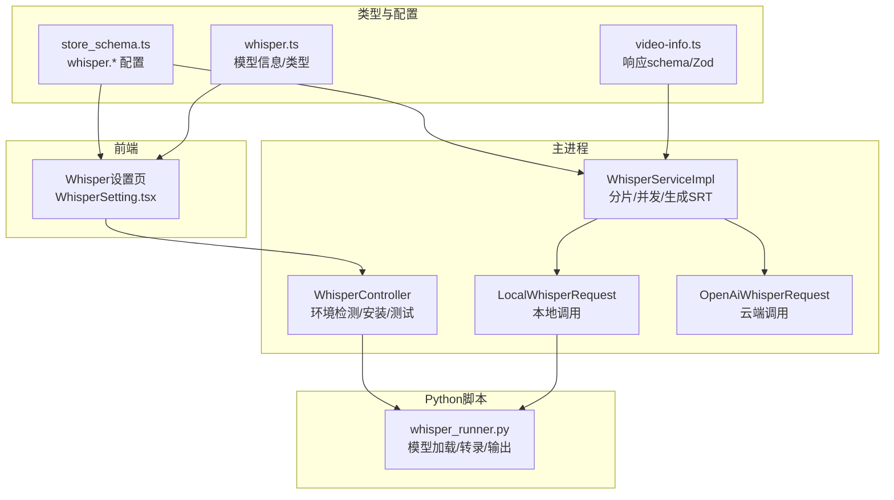
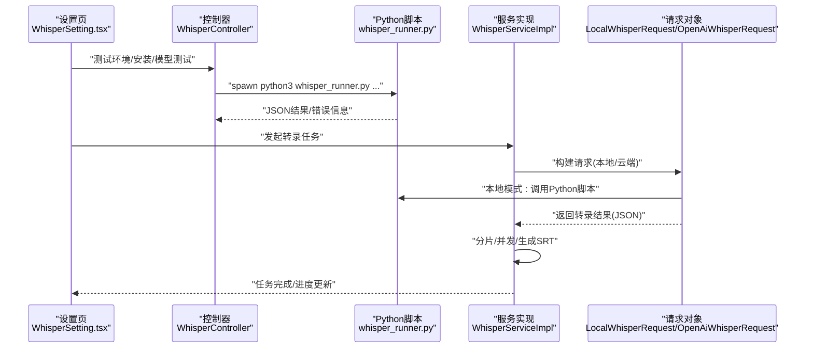
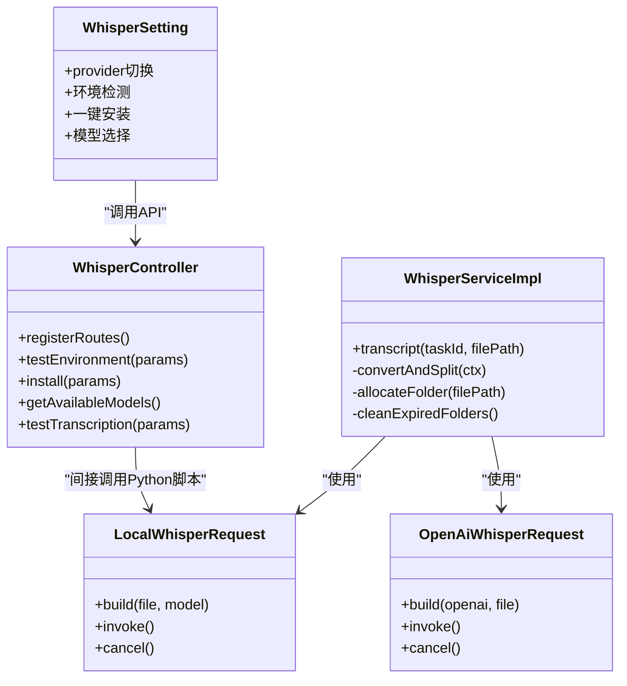

# 本地Whisper语音识别

<cite>
**本文引用的文件**
- [LOCAL_WHISPER_README.md](file://LOCAL_WHISPER_README.md)
- [WHISPER_IMPLEMENTATION_SUMMARY.md](file://WHISPER_IMPLEMENTATION_SUMMARY.md)
- [whisper本地部署替代openai服务的方案.txt](file://whisper本地部署替代openai服务的方案.txt)
- [test_whisper_local.py](file://test_whisper_local.py)
- [src/backend/controllers/WhisperController.ts](file://src/backend/controllers/WhisperController.ts)
- [src/backend/objs/LocalWhisperRequest.ts](file://src/backend/objs/LocalWhisperRequest.ts)
- [src/backend/objs/OpenAiWhisperRequest.ts](file://src/backend/objs/OpenAiWhisperRequest.ts)
- [src/backend/services/impl/WhisperServiceImpl.ts](file://src/backend/services/impl/WhisperServiceImpl.ts)
- [src/backend/scripts/whisper_runner.py](file://src/backend/scripts/whisper_runner.py)
- [src/fronted/pages/setting/WhisperSetting.tsx](file://src/fronted/pages/setting/WhisperSetting.tsx)
- [src/common/types/store_schema.ts](file://src/common/types/store_schema.ts)
- [src/common/types/whisper.ts](file://src/common/types/whisper.ts)
- [src/app.tsx](file://src/app.tsx)
- [src/backend/utils/validation.ts](file://src/backend/utils/validation.ts)
- [src/backend/errors/errors.ts](file://src/backend/errors/errors.ts)
- [src/common/types/video-info.ts](file://src/common/types/video-info.ts)
</cite>

## 目录
1. [简介](#简介)
2. [项目结构](#项目结构)
3. [核心组件](#核心组件)
4. [架构总览](#架构总览)
5. [详细组件分析](#详细组件分析)
6. [依赖关系分析](#依赖关系分析)
7. [性能考量](#性能考量)
8. [故障排除指南](#故障排除指南)
9. [结论](#结论)
10. [附录](#附录)

## 简介
本文件面向DashPlayer的“本地Whisper语音识别”能力，系统性梳理其架构、实现、数据流与使用流程，帮助开发者与用户理解如何在本地离线环境下高效、稳定地进行语音转文字，并提供可操作的配置、测试与排障建议。本地Whisper通过Electron主进程调用Python脚本，结合Apple Silicon GPU加速与模型缓存，实现高性能与隐私保护。

## 项目结构
围绕本地Whisper的关键文件分布如下：
- 后端控制器与服务：负责路由注册、环境检测、安装、转录调度与分片处理
- 请求对象：封装OpenAI与本地Whisper调用，统一Cancel接口
- Python脚本：封装OpenAI Whisper调用、设备检测与结果格式化
- 前端设置页：提供服务提供商切换、模型选择、环境检测与安装入口
- 类型与配置：定义Whisper配置项、模型信息、Zod校验schema
- 工具与错误：输入验证、错误类型与响应格式校验

图表来源
- [src/fronted/pages/setting/WhisperSetting.tsx](file://src/fronted/pages/setting/WhisperSetting.tsx#L1-L345)
- [src/backend/controllers/WhisperController.ts](file://src/backend/controllers/WhisperController.ts#L1-L237)
- [src/backend/services/impl/WhisperServiceImpl.ts](file://src/backend/services/impl/WhisperServiceImpl.ts#L1-L324)
- [src/backend/objs/LocalWhisperRequest.ts](file://src/backend/objs/LocalWhisperRequest.ts#L1-L149)
- [src/backend/objs/OpenAiWhisperRequest.ts](file://src/backend/objs/OpenAiWhisperRequest.ts#L1-L80)
- [src/backend/scripts/whisper_runner.py](file://src/backend/scripts/whisper_runner.py#L1-L206)
- [src/common/types/store_schema.ts](file://src/common/types/store_schema.ts#L1-L45)
- [src/common/types/whisper.ts](file://src/common/types/whisper.ts#L1-L90)
- [src/common/types/video-info.ts](file://src/common/types/video-info.ts#L1-L61)

章节来源
- [src/app.tsx](file://src/app.tsx#L150-L210)
- [src/common/types/store_schema.ts](file://src/common/types/store_schema.ts#L32-L43)
- [src/common/types/whisper.ts](file://src/common/types/whisper.ts#L1-L90)

## 核心组件
- 后端控制器WhisperController：提供环境检测、安装、模型列表查询、转录测试等API；通过子进程调用Python脚本，统一超时与资源管理。
- 服务实现WhisperServiceImpl：负责视频转音频分片、并发转录、结果聚合与SRT生成；根据配置选择OpenAI或本地Whisper。
- 请求对象LocalWhisperRequest/OpenAiWhisperRequest：封装具体调用，支持取消、速率限制与响应格式校验。
- Python脚本whisper_runner.py：自动检测设备（MPS/CUDA/CPU）、加载模型、执行转录并输出标准JSON。
- 前端WhisperSetting：提供服务提供商切换、模型选择、Python路径与并发数配置、环境检测与一键安装。
- 类型与配置：store_schema.ts定义whisper.*配置键；whisper.ts定义模型信息；video-info.ts定义响应schema与Zod校验。

章节来源
- [src/backend/controllers/WhisperController.ts](file://src/backend/controllers/WhisperController.ts#L1-L237)
- [src/backend/services/impl/WhisperServiceImpl.ts](file://src/backend/services/impl/WhisperServiceImpl.ts#L1-L324)
- [src/backend/objs/LocalWhisperRequest.ts](file://src/backend/objs/LocalWhisperRequest.ts#L1-L149)
- [src/backend/objs/OpenAiWhisperRequest.ts](file://src/backend/objs/OpenAiWhisperRequest.ts#L1-L80)
- [src/backend/scripts/whisper_runner.py](file://src/backend/scripts/whisper_runner.py#L1-L206)
- [src/fronted/pages/setting/WhisperSetting.tsx](file://src/fronted/pages/setting/WhisperSetting.tsx#L1-L345)
- [src/common/types/store_schema.ts](file://src/common/types/store_schema.ts#L32-L43)
- [src/common/types/whisper.ts](file://src/common/types/whisper.ts#L1-L90)
- [src/common/types/video-info.ts](file://src/common/types/video-info.ts#L1-L61)

## 架构总览
本地Whisper整体采用“前端设置—主进程控制器—服务层—请求对象—Python脚本”的分层架构，配合Electron主进程的子进程管理与资源回收，保证稳定性与可扩展性。

图表来源
- [src/fronted/pages/setting/WhisperSetting.tsx](file://src/fronted/pages/setting/WhisperSetting.tsx#L1-L345)
- [src/backend/controllers/WhisperController.ts](file://src/backend/controllers/WhisperController.ts#L1-L237)
- [src/backend/services/impl/WhisperServiceImpl.ts](file://src/backend/services/impl/WhisperServiceImpl.ts#L1-L324)
- [src/backend/objs/LocalWhisperRequest.ts](file://src/backend/objs/LocalWhisperRequest.ts#L1-L149)
- [src/backend/objs/OpenAiWhisperRequest.ts](file://src/backend/objs/OpenAiWhisperRequest.ts#L1-L80)
- [src/backend/scripts/whisper_runner.py](file://src/backend/scripts/whisper_runner.py#L1-L206)

## 详细组件分析

### 后端控制器：WhisperController
- 职责
  - 环境检测：验证Python路径、导入whisper/torch、检测MPS/CUDA可用性
  - 安装：一键安装openai-whisper、torch、torchaudio
  - 模型列表：返回可用模型集合与当前模型
  - 转录测试：调用Python脚本执行一次转录并返回JSON
  - 子进程管理：统一超时、资源清理与错误处理
- 关键点
  - 参数校验：validatePythonPath/validateWhisperModel/validateConcurrency
  - 资源管理：ResourceManager管理ChildProcess与定时器
  - 错误处理：BusinessError/ValidationError分类返回

章节来源
- [src/backend/controllers/WhisperController.ts](file://src/backend/controllers/WhisperController.ts#L1-L237)
- [src/backend/utils/validation.ts](file://src/backend/utils/validation.ts#L90-L140)
- [src/backend/errors/errors.ts](file://src/backend/errors/errors.ts#L1-L14)

### 服务实现：WhisperServiceImpl
- 职责
  - 视频转音频分片：按60秒切分，记录offset
  - 并发转录：Promise.allSettled并发执行，最多重试3次
  - 结果聚合：按offset拼接时间轴，生成SRT
  - 状态持久化：info.json记录上下文，过期清理临时目录
  - Provider选择：根据whisper.provider选择OpenAI或本地Whisper
- 关键点
  - WaitLock防抖：同一任务串行避免冲突
  - 进度估算：前40%音频转换，后60%转录
  - SRT生成：toSrt按offset累加起止时间

章节来源
- [src/backend/services/impl/WhisperServiceImpl.ts](file://src/backend/services/impl/WhisperServiceImpl.ts#L1-L324)
- [src/common/types/video-info.ts](file://src/common/types/video-info.ts#L1-L61)

### 请求对象：LocalWhisperRequest
- 职责
  - 构建本地请求：校验文件与Python环境
  - 执行转录：spawn python3 whisper_runner.py，解析JSON输出
  - 取消任务：SIGTERM终止子进程
  - 格式校验：Zod校验WhisperResponse
- 关键点
  - 速率限制：@WaitRateLimit('local-whisper')
  - 设备选择：默认language=en，task=transcribe，output-format=json

章节来源
- [src/backend/objs/LocalWhisperRequest.ts](file://src/backend/objs/LocalWhisperRequest.ts#L1-L149)
- [src/common/types/video-info.ts](file://src/common/types/video-info.ts#L1-L61)

### 请求对象：OpenAiWhisperRequest
- 职责
  - 构建云端请求：从store读取OpenAI密钥与endpoint
  - 执行转录：OpenAI SDK调用audio.transcriptions.create
  - 取消任务：AbortController.abort
  - 格式校验：Zod校验WhisperResponse
- 关键点
  - 速率限制：@WaitRateLimit('whisper')
  - 响应格式：verbose_json + timestamp_granularities=['segment']

章节来源
- [src/backend/objs/OpenAiWhisperRequest.ts](file://src/backend/objs/OpenAiWhisperRequest.ts#L1-L80)
- [src/common/types/video-info.ts](file://src/common/types/video-info.ts#L1-L61)

### Python脚本：whisper_runner.py
- 职责
  - 设备检测：优先MPS（Apple Silicon），其次CUDA，最后CPU
  - 模型加载：根据设备选择compute_type（MPS用float32）
  - 转录执行：transcribe(language/enforce-language/task/output-format)
  - 结果格式化：标准化输出字段（language/duration/text/segments）
- 关键点
  - 错误输出：stderr输出JSON错误，便于前端捕获
  - 性能提示：stderr输出耗时与实时率

章节来源
- [src/backend/scripts/whisper_runner.py](file://src/backend/scripts/whisper_runner.py#L1-L206)

### 前端设置页：WhisperSetting
- 功能
  - 服务提供商切换：OpenAI/本地
  - 环境检测：测试Python与依赖
  - 一键安装：调用后端安装API
  - 模型选择：tiny/base/small/medium/large-v3/large-v3-turbo
  - 高级设置：Python路径、并发数、设备、缓存开关
- 关键点
  - 与后端API对接：electron.invoke('whisper:*')
  - 立即保存：每次变更调用submit()

章节来源
- [src/fronted/pages/setting/WhisperSetting.tsx](file://src/fronted/pages/setting/WhisperSetting.tsx#L1-L345)
- [src/app.tsx](file://src/app.tsx#L186-L190)

### 类型与配置
- store_schema.ts
  - whisper.provider: 'openai' | 'local' | 'aliyun'
  - whisper.local.model: 模型枚举
  - whisper.local.pythonPath: Python路径
  - whisper.local.device: auto/cpu/mps/cuda
  - whisper.local.enableCache: 布尔
  - whisper.local.maxConcurrency: 数字
- whisper.ts
  - WHISPER_MODELS：模型信息与推荐
- video-info.ts
  - WhisperResponseVerifySchema：标准化响应结构

章节来源
- [src/common/types/store_schema.ts](file://src/common/types/store_schema.ts#L32-L43)
- [src/common/types/whisper.ts](file://src/common/types/whisper.ts#L1-L90)
- [src/common/types/video-info.ts](file://src/common/types/video-info.ts#L1-L61)

## 依赖关系分析
- 组件耦合
  - WhisperServiceImpl依赖FfmpegService进行分片，依赖DpTaskService进行任务状态管理
  - LocalWhisperRequest与OpenAiWhisperRequest实现统一Cancel接口，便于统一调度
  - WhisperController仅负责与Python脚本交互与环境管理，职责清晰
- 外部依赖
  - Python生态：openai-whisper、torch、torchaudio
  - Electron子进程：spawn、stdout/stderr、SIGTERM
  - Zod：响应格式校验
- 潜在风险
  - Python路径与环境隔离：需确保pythonPath指向正确解释器
  - 并发与内存：large模型在CPU上可能OOM，建议限制并发或选择更小模型

图表来源
- [src/backend/controllers/WhisperController.ts](file://src/backend/controllers/WhisperController.ts#L1-L237)
- [src/backend/services/impl/WhisperServiceImpl.ts](file://src/backend/services/impl/WhisperServiceImpl.ts#L1-L324)
- [src/backend/objs/LocalWhisperRequest.ts](file://src/backend/objs/LocalWhisperRequest.ts#L1-L149)
- [src/backend/objs/OpenAiWhisperRequest.ts](file://src/backend/objs/OpenAiWhisperRequest.ts#L1-L80)
- [src/fronted/pages/setting/WhisperSetting.tsx](file://src/fronted/pages/setting/WhisperSetting.tsx#L1-L345)

## 性能考量
- 设备选择
  - Apple Silicon优先MPS，CPU fallback；CUDA优先于CPU
  - MPS在float32下通常性能更优
- 模型选择
  - medium.en在准确率与速度间平衡，推荐日常使用
  - large-v3/large-v3-turbo适合专业场景，但内存占用更高
- 并发与缓存
  - 并发数建议1-2，避免GPU/CPU过载
  - 启用模型缓存减少重复下载
- 分片策略
  - 60秒分片避免内存溢出，适合长视频
- 性能基准
  - 不同模型在M4 Pro上的转录耗时与实时率可参考官方文档

章节来源
- [src/backend/scripts/whisper_runner.py](file://src/backend/scripts/whisper_runner.py#L30-L66)
- [LOCAL_WHISPER_README.md](file://LOCAL_WHISPER_README.md#L164-L182)
- [WHISPER_IMPLEMENTATION_SUMMARY.md](file://WHISPER_IMPLEMENTATION_SUMMARY.md#L135-L144)

## 故障排除指南
- 环境检测失败
  - 检查pythonPath是否正确，确认python3可用
  - 确认已安装openai-whisper与torch
  - 若MPS不可用，检查系统版本与驱动
- 安装失败
  - 使用一键安装或手动pip安装
  - 注意网络与代理设置
- 转录失败
  - 本地模式：检查whisper_runner.py输出的stderr错误
  - 云端模式：检查OpenAI密钥与endpoint
- 性能问题
  - 降低并发数或选择更小模型
  - 确保GPU可用（Apple Silicon）
- 常用排查脚本
  - 使用test_whisper_local.py创建测试音频并验证环境

章节来源
- [src/backend/controllers/WhisperController.ts](file://src/backend/controllers/WhisperController.ts#L34-L107)
- [src/backend/scripts/whisper_runner.py](file://src/backend/scripts/whisper_runner.py#L140-L206)
- [test_whisper_local.py](file://test_whisper_local.py#L1-L199)
- [LOCAL_WHISPER_README.md](file://LOCAL_WHISPER_README.md#L125-L164)

## 结论
DashPlayer的本地Whisper语音识别通过清晰的分层设计与严格的类型校验，实现了离线、隐私友好且高性能的语音转文字能力。前端设置页简化了环境配置与模型选择，后端控制器与服务层提供了稳定的并发与分片处理，Python脚本则充分利用Apple Silicon GPU加速。建议在生产环境中优先使用medium.en模型，并根据硬件条件合理设置并发与缓存策略。

## 附录
- 快速开始
  - 在设置页选择“本地 Whisper 模型”，配置Python路径与模型，点击“测试环境”
  - 选择视频文件，开始转录，系统自动生成SRT字幕
- 模型推荐
  - M4 Pro：large-v3-turbo或medium.en
  - M2/M3：medium.en或large-v3
  - M1：small.en或medium.en
  - Intel Mac：small.en
- 相关资源
  - OpenAI Whisper与PyTorch Apple Silicon支持
  - FFmpeg音频转换

章节来源
- [LOCAL_WHISPER_README.md](file://LOCAL_WHISPER_README.md#L27-L51)
- [WHISPER_IMPLEMENTATION_SUMMARY.md](file://WHISPER_IMPLEMENTATION_SUMMARY.md#L183-L193)