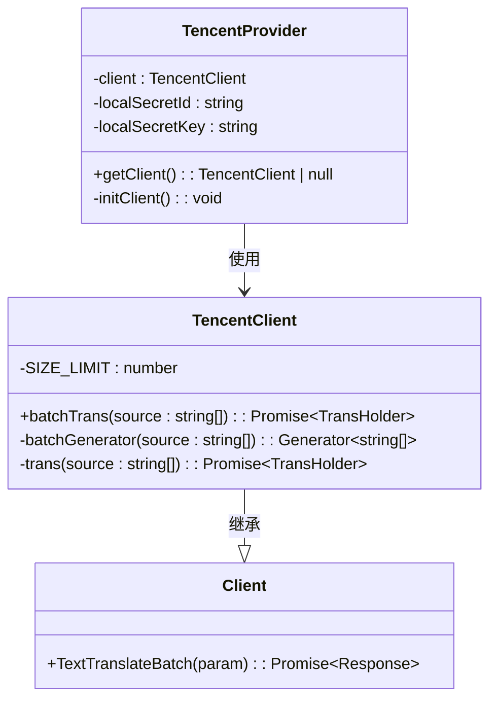

# 腾讯云 AI 配置

<cite>
**本文档引用文件**  
- [TencentProvider.ts](file://src/backend/services/impl/clients/TencentProvider.ts)
- [TencentClient.ts](file://src/backend/objs/TencentClient.ts)
- [SettingType.ts](file://src/common/types/SettingType.ts)
</cite>

## 目录
1. [简介](#简介)
2. [腾讯云服务配置参数详解](#腾讯云服务配置参数详解)
3. [服务开通与凭证获取指引](#服务开通与凭证获取指引)
4. [TencentClient 请求封装机制](#tencentclient-请求封装机制)
5. [依赖注入与 TencentProvider 实现](#依赖注入与-tencentprovider-实现)
6. [错误处理与常见错误码](#错误处理与常见错误码)
7. [性能调优与最佳实践](#性能调优与最佳实践)

## 简介
本文档旨在为集成腾讯云 AI 服务（包括语音识别 ASR、文本翻译和 TTS）提供完整的配置指南。基于项目中的 `SettingType.ts`、`TencentClient.ts` 和 `TencentProvider.ts` 实现，详细说明关键参数的配置方式、安全存储机制、请求封装逻辑以及系统集成方式。文档还涵盖错误处理、区域选择影响、并发限制及性能优化建议。

## 腾讯云服务配置参数详解
腾讯云 AI 服务的核心配置参数在系统中通过全局设置进行管理，主要包含以下字段：

- **SecretId**: 用户的身份标识，用于标识调用者的身份。
- **SecretKey**: 用户的密钥，用于生成请求签名，必须严格保密。
- **Region**: 服务区域，如 `ap-shanghai`，影响请求延迟和可用性。
- **AppId**: 应用唯一标识，在部分服务中用于资源隔离。

这些参数通过 `storeGet('apiKeys.tencent.secretId')` 和 `storeGet('apiKeys.tencent.secretKey')` 从安全存储中读取，确保敏感信息不硬编码于代码中。

**Section sources**
- [SettingType.ts](file://src/common/types/SettingType.ts#L0-L59)

## 服务开通与凭证获取指引
要使用腾讯云 AI 服务，请按以下步骤操作：

1. 登录 [腾讯云控制台](https://console.cloud.tencent.com/)。
2. 进入“访问管理” > “API 密钥管理”，创建或查看已有的 SecretId 和 SecretKey。
3. 根据所需功能开通对应服务：
   - 实时语音识别：进入“语音识别”服务页面，启用实时语音识别功能。
   - 机器翻译：进入“机器翻译”服务，开通文本翻译 API。
   - 语音合成（TTS）：进入“语音合成”服务，启用相应接口。
4. 在 DashPlayer 的设置界面中，导航至“腾讯云设置”页面，填入获取的 SecretId、SecretKey 和选择合适的区域（默认为 `ap-shanghai`）。

配置完成后，系统将自动初始化客户端并准备调用服务。

## TencentClient 请求封装机制
`TencentClient` 类继承自基础 `Client` 类，负责封装所有腾讯云 API 的请求逻辑，主要包括：

- **请求签名**: 使用腾讯云标准签名算法（结合 `hi-base32` 等库），基于 SecretId 和 SecretKey 对请求进行签名，确保请求合法性。
- **HTTP 请求构造**: 自动构造符合腾讯云 API 规范的 HTTP 请求，包括头部、参数序列化和端点路由。
- **响应处理**: 统一处理响应数据，提取目标字段（如 `TargetTextList`），并封装为 `TransHolder` 结果对象。
- **批量处理**: 实现 `batchGenerator` 生成器方法，将大文本分批处理，单批大小限制为 1500 字符，避免超限错误。

所有请求均通过 `RateLimiter.wait('tencent')` 进行限流控制，防止触发平台并发限制。

**Section sources**
- [TencentClient.ts](file://src/backend/objs/TencentClient.ts#L7-L65)

## 依赖注入与 TencentProvider 实现
`TencentProvider` 是 `AiProviderServiceImpl` 的具体实现类，遵循依赖注入（DI）设计模式，路径为 `src/backend/services/impl/clients/TencentProvider.ts`。

其实现要点如下：

- 使用 `@injectable()` 装饰器注册为可注入服务。
- 实现 `ClientProviderService<TencentClient>` 接口，提供 `getClient()` 方法。
- 内部维护 `client` 实例缓存，仅当 `SecretId` 或 `SecretKey` 变更时重新初始化客户端。
- 初始化时构建 `clientConfig` 对象，包含 `credential` 和 `region` 配置项，并创建新的 `TencentClient` 实例。

该设计确保了客户端的单例性和配置变更的动态响应能力。

**Diagram sources**
- [TencentProvider.ts](file://src/backend/services/impl/clients/TencentProvider.ts#L7-L42)
- [TencentClient.ts](file://src/backend/objs/TencentClient.ts#L7-L65)

**Section sources**
- [TencentProvider.ts](file://src/backend/services/impl/clients/TencentProvider.ts#L7-L42)

## 错误处理与常见错误码
系统对腾讯云 API 的调用进行了统一的错误处理，常见错误码包括：

- **AuthFailure**: 认证失败，通常由于 SecretId 或 SecretKey 错误或过期导致。
- **InvalidParameter**: 参数无效，如 `SourceTextList` 超出长度限制或语言代码不支持。
- **LimitExceeded**: 请求频率超限，需等待限流窗口结束。
- **InternalError**: 服务端内部错误，建议重试。

在 `TencentClient` 中，若 `TextTranslateBatch` 返回空结果，则返回空的 `TransHolder`，避免程序崩溃。前端应结合用户提示进行友好展示。

**Section sources**
- [TencentClient.ts](file://src/backend/objs/TencentClient.ts#L7-L65)

## 性能调优与最佳实践
为提升腾讯云 AI 服务的使用效率和稳定性，建议采取以下措施：

- **使用持久连接**: 复用 HTTP 连接，减少握手开销。
- **合理设置超时阈值**: 建议设置请求超时为 10-30 秒，避免长时间阻塞。
- **选择合适区域**: 尽量选择离用户地理位置最近的区域（如华南 `ap-shanghai`），以降低延迟。
- **批量处理优化**: 利用 `batchTrans` 方法合并多个小请求，减少网络往返次数。
- **启用重试策略**: 对于临时性错误（如网络抖动），实现指数退避重试机制。
- **本地缓存翻译结果**: 对于重复内容，可在本地缓存翻译结果，减少 API 调用次数和成本。

通过上述优化，可显著提升用户体验和系统稳定性。