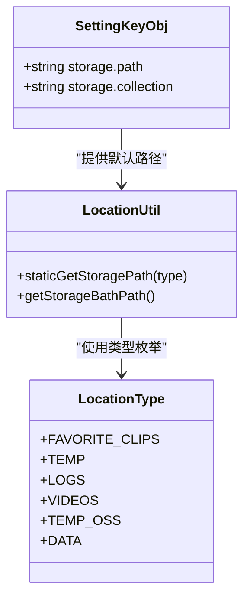
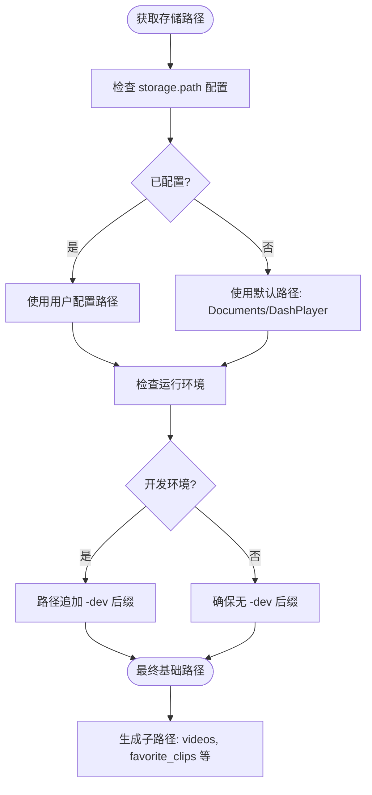
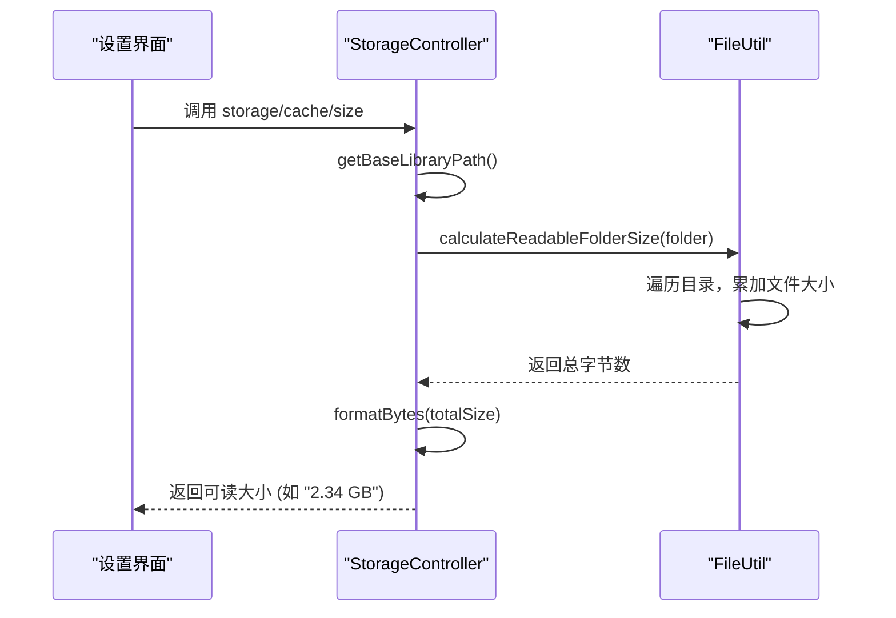

# 存储与路径配置

<cite>
**本文档引用的文件**
- [storage.md](file://Writerside/topics/storage.md)
- [SettingType.ts](file://src/common/types/SettingType.ts)
- [LocationServiceImpl.ts](file://src/backend/services/impl/LocationServiceImpl.ts)
- [LocationUtil.ts](file://src/backend/utils/LocationUtil.ts)
- [StorageSetting.tsx](file://src/fronted/pages/setting/StorageSetting.tsx)
- [store_schema.ts](file://src/common/types/store_schema.ts)
- [SettingServiceImpl.ts](file://src/backend/services/impl/SettingServiceImpl.ts)
- [StorageController.ts](file://src/backend/controllers/StorageController.ts)
- [FileUtil.ts](file://src/backend/utils/FileUtil.ts)
</cite>

## 目录
1. [存储配置概述](#存储配置概述)
2. [核心存储路径配置项](#核心存储路径配置项)
3. [路径解析与跨平台兼容性](#路径解析与跨平台兼容性)
4. [存储空间监控与自动清理](#存储空间监控与自动清理)
5. [用户界面与路径管理](#用户界面与路径管理)
6. [配置最佳实践](#配置最佳实践)
7. [常见错误与修复指南](#常见错误与修复指南)

## 存储配置概述

DashPlayer 的存储系统负责管理所有下载视频、收藏片段、缓存数据和用户配置。系统通过统一的路径管理机制，确保数据在不同操作系统（Windows、macOS）上的一致性与可靠性。用户可通过设置界面修改核心存储路径，所有路径变更均通过中央配置服务持久化并广播至各组件。

**Section sources**
- [storage.md](file://Writerside/topics/storage.md#L1-L8)

## 核心存储路径配置项

基于 `SettingType` 中的 `'storage'` 类型定义，系统提供以下关键存储配置项：

| 配置项名称 | 默认值 | 作用域 | 说明 |
|----------|-------|-------|------|
| `storage.path` | 系统文档目录下的 `DashPlayer` 文件夹 | 全局 | 主存储路径（Library Path），包含所有子目录 |
| `storage.collection` | `default` | 收藏夹 | 当前激活的收藏夹名称，对应 `favorite_clips` 下的子目录 |

这些配置项的默认值定义于 `store_schema.ts` 中的 `SettingKeyObj` 对象，确保首次启动时能生成合理路径。

**Diagram sources**
- [store_schema.ts](file://src/common/types/store_schema.ts#L0-L35)
- [LocationType.ts](file://src/backend/services/LocationService.ts#L0-L7)
- [LocationUtil.ts](file://src/backend/utils/LocationUtil.ts#L6-L34)

**Section sources**
- [SettingType.ts](file://src/common/types/SettingType.ts#L15-L22)

## 路径解析与跨平台兼容性

路径解析逻辑由 `LocationServiceImpl` 和 `LocationUtil` 协同实现，确保跨平台兼容性。

### 路径生成流程

1. **基础路径获取**：`getStorageBathPath()` 首先检查用户配置的 `storage.path`，若为空则默认使用系统“文档”目录下的 `DashPlayer` 文件夹。
2. **开发/生产环境适配**：在开发环境下，路径自动追加 `-dev` 后缀，避免与生产环境数据冲突。
3. **子路径派生**：通过 `staticGetStoragePath(type)` 将基础路径与 `LocationType` 枚举组合，生成具体子目录（如 `videos`、`favorite_clips`）。

### 跨平台处理

- **路径分隔符**：使用 Node.js `path` 模块进行路径拼接，自动适配 Windows (`\`) 与 macOS/Linux (`/`) 的分隔符差异。
- **特殊目录访问**：通过 `app.getPath('documents')` 获取系统标准“文档”目录，确保路径符合各平台规范。

**Diagram sources**
- [LocationServiceImpl.ts](file://src/backend/services/impl/LocationServiceImpl.ts#L9-L54)
- [LocationUtil.ts](file://src/backend/utils/LocationUtil.ts#L6-L34)

**Section sources**
- [LocationServiceImpl.ts](file://src/backend/services/impl/LocationServiceImpl.ts#L9-L54)
- [LocationUtil.ts](file://src/backend/utils/LocationUtil.ts#L6-L34)

## 存储空间监控与自动清理

系统提供存储空间监控功能，并通过 API 支持手动清理。

### 空间监控

- **实时计算**：`StorageController` 的 `queryCacheSize()` 方法调用 `FileUtil.calculateReadableFolderSize()` 递归遍历主存储目录，累加所有文件大小。
- **格式化输出**：`FileUtil.formatBytes()` 将字节数转换为可读的 `KB`、`MB`、`GB` 等单位，保留两位小数。

### 自动清理机制

- **无自动清理策略**：当前系统未实现自动清理。用户需通过设置界面手动触发“重置数据库”来清除所有数据。
- **手动清理**：点击“重置数据库”按钮会调用 `system/reset-db` API，删除数据库和缓存文件。

**Diagram sources**
- [StorageController.ts](file://src/backend/controllers/StorageController.ts#L9-L37)
- [FileUtil.ts](file://src/backend/utils/FileUtil.ts#L104-L159)

**Section sources**
- [StorageController.ts](file://src/backend/controllers/StorageController.ts#L9-L37)
- [FileUtil.ts](file://src/backend/utils/FileUtil.ts#L104-L159)

## 用户界面与路径管理

`StorageSetting.tsx` 组件提供用户友好的路径管理界面。

### 核心功能

- **路径显示与修改**：显示当前存储路径和占用空间，支持手动输入或通过“文件夹选择”按钮弹出系统对话框选取新路径。
- **收藏夹管理**：下拉框列出 `favorite_clips` 目录下的所有子文件夹作为收藏夹选项，支持切换和重新同步。
- **操作按钮**：
  - **重置数据库**：清除所有数据。
  - **打开 Library 文件夹**：在系统文件管理器中打开主存储目录。
  - **Apply**：保存路径变更，并触发收藏夹数据重新同步。

### 配置更新流程

1. 用户修改路径后，调用 `storeSet('storage.path', newValue)`。
2. `SettingServiceImpl` 更新 `store` 并通过 `store-update` 事件通知前端。
3. 建议用户重启软件以确保所有服务使用新路径。

**Diagram sources**
- [StorageSetting.tsx](file://src/fronted/pages/setting/StorageSetting.tsx#L23-L173)
- [SettingServiceImpl.ts](file://src/backend/services/impl/SettingServiceImpl.ts#L9-L21)
- [StorageController.ts](file://src/backend/controllers/StorageController.ts#L14-L16)

**Section sources**
- [StorageSetting.tsx](file://src/fronted/pages/setting/StorageSetting.tsx#L23-L173)

## 配置最佳实践

为确保系统稳定高效运行，建议遵循以下最佳实践：

- **使用 SSD 存储**：将主存储路径 (`storage.path`) 设置在 SSD 上，可显著提升视频加载、缓存读写和数据库查询性能。
- **定期备份收藏数据**：`favorite_clips` 目录包含用户的重要收藏。建议定期将其备份到外部存储或云盘，防止数据丢失。
- **保持路径简洁**：避免在路径中使用中文或特殊字符，以防某些工具或脚本出现兼容性问题。
- **预留充足空间**：视频文件体积较大，建议为主存储目录预留至少 50GB 以上空间。

## 常见错误与修复指南

### 路径无效

- **症状**：软件无法启动或报错“路径不存在”。
- **原因**：配置的路径已被删除或移动。
- **修复**：进入设置界面，重新选择一个有效的文件夹作为 `storage.path`。

### 权限不足

- **症状**：无法写入文件，收藏夹同步失败。
- **原因**：目标目录无写入权限（常见于系统目录或网络驱动器）。
- **修复**：将存储路径修改为用户有完全控制权的目录（如“文档”或“桌面”）。

### 收藏夹不显示

- **症状**：下拉框中无收藏夹选项。
- **原因**：`favorite_clips` 目录下无子文件夹，或当前收藏夹名称配置错误。
- **修复**：
  1. 检查 `storage.path/favorite_clips/` 目录是否存在。
  2. 在该目录下创建子文件夹（如 `my_collection`）。
  3. 在设置中将 `storage.collection` 修改为该子文件夹名。

**Section sources**
- [storage.md](file://Writerside/topics/storage.md#L1-L8)
- [StorageSetting.tsx](file://src/fronted/pages/setting/StorageSetting.tsx#L23-L173)
- [LocationServiceImpl.ts](file://src/backend/services/impl/LocationServiceImpl.ts#L9-L54)