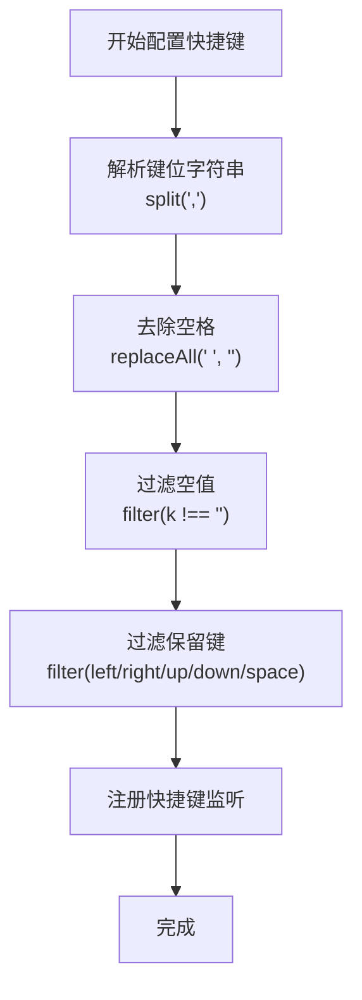
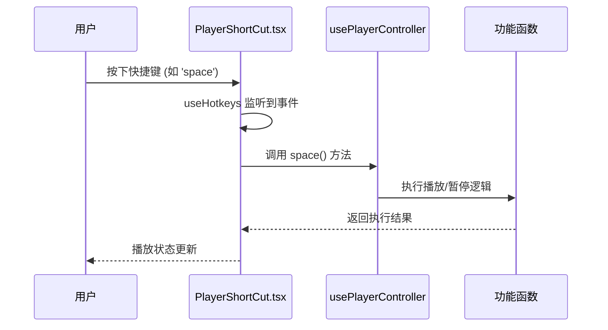
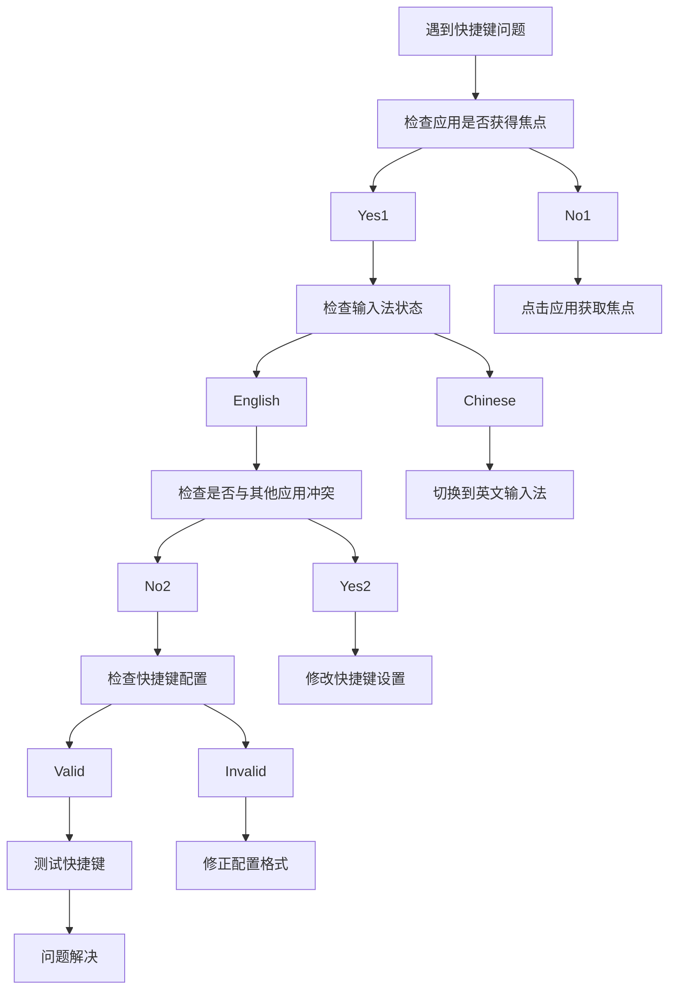

# 快捷键配置

<cite>
**本文档引用的文件**  
- [Config-Shortcut.md](file://Writerside/topics/Config-Shortcut.md)
- [SettingType.ts](file://src/common/types/SettingType.ts)
- [GlobalShortCut.tsx](file://src/fronted/components/short-cut/GlobalShortCut.tsx)
- [PlayerShortCut.tsx](file://src/fronted/components/short-cut/PlayerShortCut.tsx)
- [useSetting.ts](file://src/fronted/hooks/useSetting.ts)
- [usePlayerController.ts](file://src/fronted/hooks/usePlayerController.ts)
- [useSubtitleScroll.ts](file://src/fronted/hooks/useSubtitleScroll.ts)
- [useChatPanel.ts](file://src/fronted/hooks/useChatPanel.ts)
- [useCopyModeController.ts](file://src/fronted/hooks/useCopyModeController.ts)
- [useFavouriteClip.ts](file://src/fronted/hooks/useFavouriteClip.ts)
</cite>

## 目录
1. [简介](#简介)
2. [预设快捷键列表](#预设快捷键列表)
3. [快捷键自定义配置](#快捷键自定义配置)
4. [快捷键注册与监听机制](#快捷键注册与监听机制)
5. [操作系统适配策略](#操作系统适配策略)
6. [常见问题与调试建议](#常见问题与调试建议)

## 简介
DashPlayer 提供了丰富的快捷键功能，支持全局快捷键和播放器专用快捷键。用户可以通过配置文件自定义键位组合，实现播放控制、字幕显示切换、AI分析触发等操作。本文档详细说明快捷键的配置方法、实现机制和使用技巧。

**Section sources**
- [Config-Shortcut.md](file://Writerside/topics/Config-Shortcut.md)

## 预设快捷键列表
以下是 DashPlayer 的默认快捷键配置及其对应功能：

| 功能 | 快捷键（默认值） | 说明 |
|------|------------------|------|
| 上一句 | `left,a` | 跳转到上一句字幕 |
| 下一句 | `right,d` | 跳转到下一句字幕 |
| 重复播放 | `down,s` | 重复当前句子 |
| 播放/暂停 | `space,up,w` | 控制播放状态 |
| 单句重复 | `r` | 开启单句重复模式 |
| 显示/隐藏英文 | `e` | 切换英文显示 |
| 显示/隐藏中文 | `c` | 切换中文显示 |
| 显示/隐藏中英双语 | `b` | 切换双语显示 |
| 显示/隐藏单词等级 | `l` | 切换单词等级显示 |
| 下一主题 | `t` | 切换到下一个主题 |
| 上一主题 | `y` | 切换到上一个主题 |

**Section sources**
- [SettingType.ts](file://src/common/types/SettingType.ts#L1-L59)

## 快捷键自定义配置
用户可以通过 `SettingType.ts` 中的 `shortcut` 类型进行快捷键自定义修改。

### 键位组合格式规范
- 多个键位使用英文逗号 `,` 分隔
- 支持修饰键（如 `ctrl`, `shift`, `alt`）与普通键组合
- 不区分大小写
- 空格键表示为 `space`
- 方向键表示为 `left`, `right`, `up`, `down`

### 冲突检测机制
系统在注册快捷键时会自动检测键位冲突：
1. 使用 `process` 函数对配置值进行预处理，去除空格并过滤空值
2. 通过 `useHotkeys` 钩子注册监听器，框架层自动处理重复绑定
3. 全局快捷键与播放器快捷键分离，避免作用域冲突

**Diagram sources**
- [PlayerShortCut.tsx](file://src/fronted/components/short-cut/PlayerShortCut.tsx#L1-L147)
- [GlobalShortCut.tsx](file://src/fronted/components/short-cut/GlobalShortCut.tsx#L1-L16)

**Section sources**
- [SettingType.ts](file://src/common/types/SettingType.ts#L1-L59)
- [PlayerShortCut.tsx](file://src/fronted/components/short-cut/PlayerShortCut.tsx#L1-L147)

## 快捷键注册与监听机制
DashPlayer 使用 `react-hotkeys-hook` 库实现快捷键监听，分为全局快捷键和播放器专用快捷键两个组件。

### 组件职责划分
- **GlobalShortCut.tsx**: 处理与播放器无关的全局操作（如主题切换）
- **PlayerShortCut.tsx**: 处理播放控制、字幕操作、AI功能等播放器相关操作

### 执行流程
1. 通过 `useSetting` 钩子获取当前快捷键配置
2. 使用 `useHotkeys` 注册键盘事件监听
3. 触发对应的功能函数（通过 `usePlayerController` 等 hooks 调用）
4. 更新 UI 状态

**Diagram sources**
- [PlayerShortCut.tsx](file://src/fronted/components/short-cut/PlayerShortCut.tsx#L1-L147)
- [usePlayerController.ts](file://src/fronted/hooks/usePlayerController.ts#L28-L46)

**Section sources**
- [PlayerShortCut.tsx](file://src/fronted/components/short-cut/PlayerShortCut.tsx#L1-L147)
- [GlobalShortCut.tsx](file://src/fronted/components/short-cut/GlobalShortCut.tsx#L1-L16)

## 操作系统适配策略
DashPlayer 的快捷键系统在不同操作系统下保持一致的行为，但有以下适配考虑：

### Windows 与 macOS 差异处理
- **修饰键映射**：自动将 `cmd` 键映射为 macOS 上的等效操作
- **系统快捷键避让**：避免使用与操作系统冲突的组合键（如 `cmd+Q`, `ctrl+Alt+Del`）
- **输入法兼容**：确保在中文输入法状态下仍能正确识别快捷键

### 跨平台一致性保障
- 使用抽象的键名（如 `space` 而非具体 keyCode）
- 通过 `useSetting` 统一管理配置，确保设置跨平台同步
- 在 `process` 函数中标准化输入，消除平台差异

**Section sources**
- [PlayerShortCut.tsx](file://src/fronted/components/short-cut/PlayerShortCut.tsx#L1-L147)
- [GlobalShortCut.tsx](file://src/fronted/components/short-cut/GlobalShortCut.tsx#L1-L16)

## 常见问题与调试建议
### 常见问题解决方案

| 问题现象 | 可能原因 | 解决方案 |
|---------|---------|---------|
| 快捷键无响应 | 1. 键位被其他应用占用 2. 输入法处于激活状态 3. 浏览器焦点不在播放器 | 1. 关闭冲突应用 2. 切换到英文输入法 3. 点击播放器区域获取焦点 |
| 快捷键与其他应用冲突 | 系统级快捷键冲突 | 修改 DashPlayer 快捷键配置，避开常用系统快捷键 |
| 自定义快捷键不生效 | 配置格式错误 | 检查键位格式是否符合规范，确保使用英文逗号分隔 |

### 调试建议
1. **日志查看**：在开发者工具控制台查看快捷键事件是否被正确捕获
2. **重新绑定**：通过设置界面重新配置快捷键，触发配置更新
3. **逐步排查**：从默认配置开始，逐步修改键位，定位问题配置
4. **使用测试工具**：利用键盘事件测试工具验证键码输出

**Diagram sources**
- [PlayerShortCut.tsx](file://src/fronted/components/short-cut/PlayerShortCut.tsx#L1-L147)
- [useSetting.ts](file://src/fronted/hooks/useSetting.ts#L16-L36)

**Section sources**
- [PlayerShortCut.tsx](file://src/fronted/components/short-cut/PlayerShortCut.tsx#L1-L147)
- [useSetting.ts](file://src/fronted/hooks/useSetting.ts#L16-L36)
- [usePlayerController.ts](file://src/fronted/hooks/usePlayerController.ts#L28-L46)