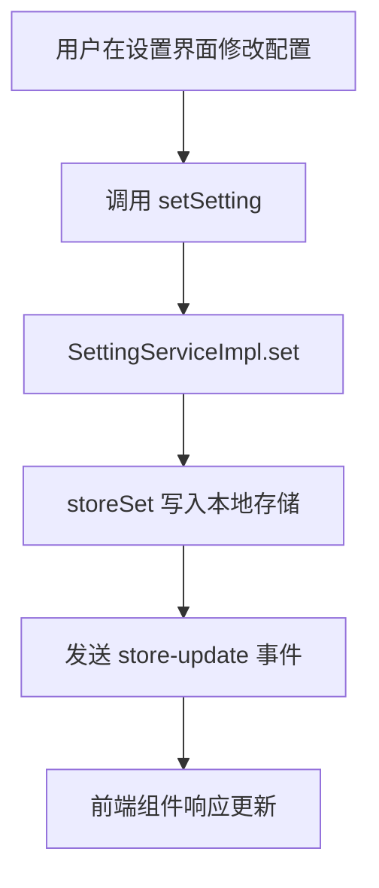
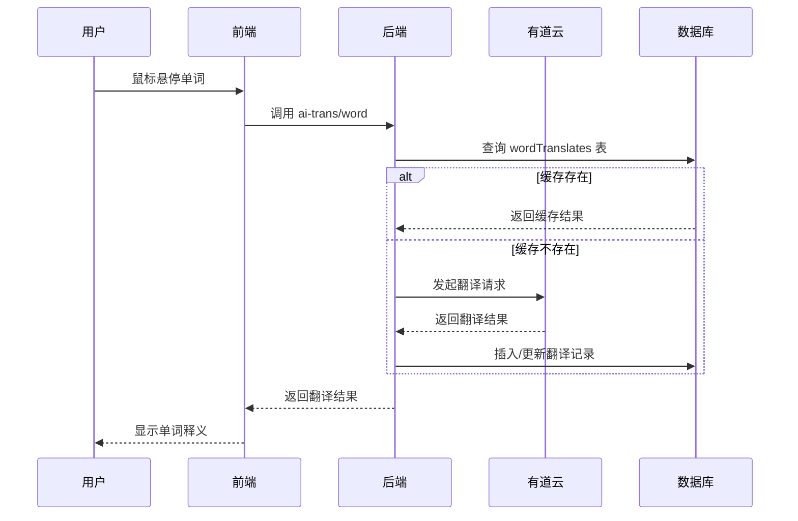
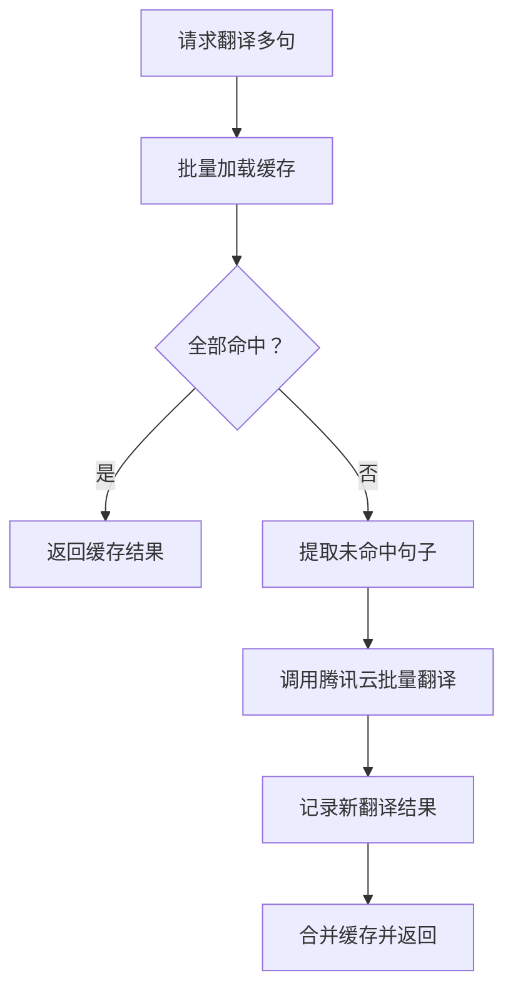
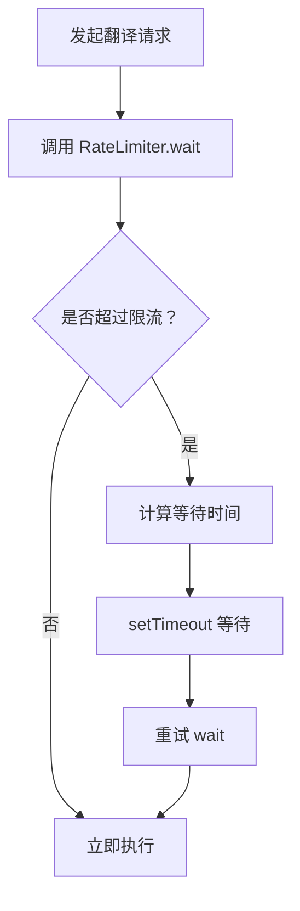

# 翻译服务配置

<cite>
**本文档中引用的文件**  
- [Config-Translate.md](file://Writerside/topics/Config-Translate.md)
- [SettingType.ts](file://src/common/types/SettingType.ts)
- [TranslateServiceImpl.ts](file://src/backend/services/impl/TranslateServiceImpl.ts)
- [AiTransController.ts](file://src/backend/controllers/AiTransController.ts)
- [YouDaoProvider.ts](file://src/backend/services/impl/clients/YouDaoProvider.ts)
- [TencentProvider.ts](file://src/backend/services/impl/clients/TencentProvider.ts)
- [TencentClient.ts](file://src/backend/objs/TencentClient.ts)
- [YouDaoClient.ts](file://src/backend/objs/YouDaoClient.ts)
- [RateLimiter.ts](file://src/common/utils/RateLimiter.ts)
- [store_schema.ts](file://src/common/types/store_schema.ts)
</cite>

## 目录
1. [简介](#简介)
2. [翻译配置项结构](#翻译配置项结构)
3. [翻译服务工作机制](#翻译服务工作机制)
4. [API调用策略](#api调用策略)
5. [配置示例](#配置示例)
6. [常见问题诊断与优化](#常见问题诊断与优化)
7. [结论](#结论)

## 简介

DashPlayer 是一款专为英语学习设计的视频播放器，支持多语言翻译功能，帮助用户在观看英文视频时实现高效学习。该系统集成了腾讯云、有道云和 OpenAI 等多种翻译引擎，支持字幕翻译、单词释义、双语显示等多种学习场景。

本文档详细说明 DashPlayer 中翻译服务的配置机制，涵盖源语言与目标语言设置、默认翻译引擎选择、翻译质量偏好配置、API调用策略（包括缓存、重试与速率限制）以及实际应用场景的工作流程。

**Section sources**
- [Config-Translate.md](file://Writerside/topics/Config-Translate.md#L0-L11)

## 翻译配置项结构

DashPlayer 的翻译配置通过 `SettingService` 接口进行管理，所有配置项均以键值对形式存储于本地状态系统中。核心配置项定义在 `store_schema.ts` 文件中，主要涉及 API 密钥和翻译服务相关设置。

### 核心配置项

| 配置键 | 说明 | 默认值 |
|--------|------|--------|
| `apiKeys.tencent.secretId` | 腾讯云翻译服务 SecretId | 空字符串 |
| `apiKeys.tencent.secretKey` | 腾讯云翻译服务 SecretKey | 空字符串 |
| `apiKeys.youdao.secretId` | 有道云翻译服务 AppKey | 空字符串 |
| `apiKeys.youdao.secretKey` | 有道云翻译服务 SecretKey | 空字符串 |

这些配置项由前端设置页面（如 `TenantSetting.tsx` 和 `YouDaoSetting.tsx`）通过 `useSettingForm` Hook 进行读取与更新，并通过 `SettingServiceImpl` 持久化到本地存储。

### 配置存储机制

配置的读写由 `SettingService` 接口统一管理：

```ts
export default interface SettingService {
    set(key: SettingKey, value: string): Promise<void>;
    get(key: SettingKey): Promise<string>;
}
```

具体实现 `SettingServiceImpl` 在设置变更时会触发主窗口的 `store-update` 事件，通知前端界面同步更新。



**Diagram sources**
- [SettingService.ts](file://src/backend/services/SettingService.ts#L2-L5)
- [SettingServiceImpl.ts](file://src/backend/services/impl/SettingServiceImpl.ts#L9-L21)
- [store_schema.ts](file://src/common/types/store_schema.ts#L0-L36)

**Section sources**
- [SettingType.ts](file://src/common/types/SettingType.ts#L0-L59)
- [store_schema.ts](file://src/common/types/store_schema.ts#L0-L36)

## 翻译服务工作机制

DashPlayer 的翻译服务分为**单词翻译**和**句子翻译**两类，分别用于鼠标悬停查词和字幕双语显示场景。

### 单词翻译流程（有道云）

单词翻译由 `YouDaoClient` 实现，工作流程如下：

1. **缓存检查**：首先查询本地数据库 `wordTranslates` 表，判断是否已有该单词的翻译记录。
2. **在线翻译**：若无缓存，则调用有道云 API 进行翻译。
3. **结果缓存**：将返回结果（JSON 格式）存入数据库，供后续使用。



**Diagram sources**
- [AiTransController.ts](file://src/backend/controllers/AiTransController.ts#L7-L25)
- [TranslateServiceImpl.ts](file://src/backend/services/impl/TranslateServiceImpl.ts#L18-L42)
- [YouDaoClient.ts](file://src/backend/objs/YouDaoClient.ts#L10-L77)

### 句子翻译流程（腾讯云）

句子翻译用于字幕双语显示，由 `TencentClient` 批量处理：

1. **批量缓存加载**：一次性从 `sentenceTranslates` 表中加载所有句子的缓存结果。
2. **缺失项翻译**：仅对未缓存的句子调用腾讯云 `TextTranslateBatch` 接口。
3. **结果合并与持久化**：将新翻译结果与缓存合并，并批量写回数据库。



**Diagram sources**
- [TranslateServiceImpl.ts](file://src/backend/services/impl/TranslateServiceImpl.ts#L45-L85)
- [TencentClient.ts](file://src/backend/objs/TencentClient.ts#L7-L65)

## API调用策略

### 缓存机制

系统采用两级缓存策略：

- **内存缓存**：使用 `TransHolder<T>` 类封装 `Map<string, T>`，提供 `add`、`get`、`merge` 等便捷操作。
- **持久化缓存**：翻译结果存储于 SQLite 数据库的 `wordTranslates` 和 `sentenceTranslates` 表中，避免重复请求。

```ts
class TransHolder<T> {
    private result: Map<string, T> = new Map<string, T>();
    // ...
}
```

### 失败重试逻辑

在 `TranslateServiceImpl.transSentences` 方法中，系统通过 `try-catch` 捕获腾讯云翻译异常。若请求失败，将直接返回已有缓存结果，保证用户体验不中断。

```ts
try {
    const transResult = await tencentClient.batchTrans(retries);
    await this.sentenceRecordBatch(transResult);
    return cache.merge(transResult).getMapping();
} catch (e) {
    dpLog.error(e);
    return cache.getMapping(); // 返回缓存，避免阻塞
}
```

### 速率限制处理

为防止 API 调用过于频繁，系统通过 `RateLimiter` 实现限流：

- **腾讯云**：每秒最多 4 次请求
- **有道云/OpenAI**：每秒最多 10 次请求

```ts
const RateLimitConfig: Record<RATE_LIMIT_KEY, { maxRequests: number; timeWindow: number }> = {
    tencent: {maxRequests: 4, timeWindow: 1000},
    gpt: {maxRequests: 10, timeWindow: 1000},
    whisper: {maxRequests: 10, timeWindow: 1000},
    tts: {maxRequests: 10, timeWindow: 1000}
};
```

每次调用前需执行 `RateLimiter.wait('tencent')`，自动计算等待时间并暂停执行。



**Diagram sources**
- [RateLimiter.ts](file://src/common/utils/RateLimiter.ts#L14-L43)
- [TencentClient.ts](file://src/backend/objs/TencentClient.ts#L44-L65)

**Section sources**
- [RateLimiter.ts](file://src/common/utils/RateLimiter.ts#L0-L43)
- [TencentClient.ts](file://src/backend/objs/TencentClient.ts#L0-L65)

## 配置示例

### 英译中配置（字幕翻译）

1. 登录腾讯云控制台，创建子账号并获取 `SecretId` 和 `SecretKey`。
2. 在 DashPlayer 设置界面的“字幕翻译”部分填入密钥。
3. 系统将自动使用腾讯云翻译引擎将英文字幕翻译为中文。

```json
{
  "apiKeys.tencent.secretId": "your-secret-id",
  "apiKeys.tencent.secretKey": "your-secret-key"
}
```

### 中译英配置（单词查询）

1. 注册有道云 AI 平台账号，获取应用密钥。
2. 在“有道翻译”设置页面填入 `AppKey` 和 `SecretKey`。
3. 悬停中文字幕单词时，系统将调用有道云返回英文释义。

```json
{
  "apiKeys.youdao.secretId": "your-app-key",
  "apiKeys.youdao.secretKey": "your-secret-key"
}
```

**Section sources**
- [Config-Tencent-API.md](file://Writerside/topics/Config-Tencent-API.md#L12-L20)
- [TenantSetting.tsx](file://src/fronted/pages/setting/TenantSetting.tsx#L15-L46)
- [YouDaoSetting.tsx](file://src/fronted/pages/setting/YouDaoSetting.tsx#L40-L73)

## 常见问题诊断与优化

### 翻译延迟高

**可能原因**：
- 网络延迟或 API 响应慢
- 未命中缓存，需实时调用远程 API
- 速率限制导致请求排队

**优化建议**：
- 确保网络连接稳定
- 提前加载字幕并批量翻译，利用缓存
- 检查密钥是否正确，避免因认证失败重试

### 翻译结果不准确

**可能原因**：
- 有道/腾讯翻译引擎本身准确性限制
- 输入文本包含特殊符号或格式错误

**优化建议**：
- 使用 `p()` 函数规范化文本（去除空格、标点等）
- 结合上下文理解，人工校对关键内容
- 考虑未来支持多引擎结果对比

### 缓存未生效

**诊断方法**：
- 检查数据库 `sentenceTranslates` 和 `wordTranslates` 表是否写入数据
- 查看日志中 `cacheRes` 和 `retries` 输出，确认缓存命中情况

**解决方案**：
- 确保 `storeSet` 正常写入
- 检查 `p()` 函数是否影响键值一致性
- 验证数据库连接正常

**Section sources**
- [TranslateServiceImpl.ts](file://src/backend/services/impl/TranslateServiceImpl.ts#L112-L153)
- [TransHolder.ts](file://src/common/utils/TransHolder.ts#L0-L43)

## 结论

DashPlayer 的翻译服务通过模块化设计实现了高可用性与可维护性。系统结合本地缓存与远程 API，支持腾讯云、有道云等多种翻译引擎，满足字幕双语显示与单词释义生成等学习需求。通过合理的速率限制与失败降级策略，保障了服务的稳定性。用户可根据学习目标灵活配置翻译引擎与语言方向，提升英语学习效率。