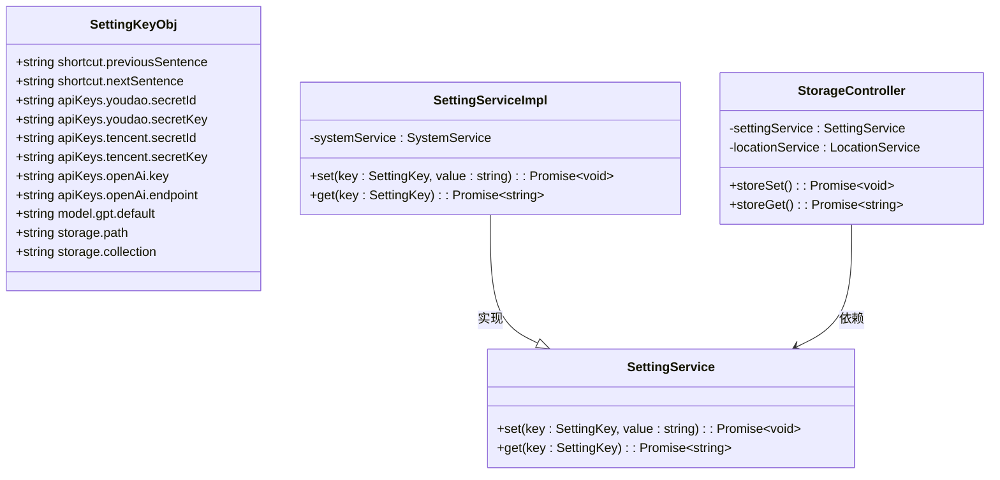

# 配置指南

<cite>
**本文档中引用的文件**  
- [store_schema.ts](file://src/common/types/store_schema.ts)
- [SettingServiceImpl.ts](file://src/backend/services/impl/SettingServiceImpl.ts)
- [store.ts](file://src/backend/store.ts)
- [StorageController.ts](file://src/backend/controllers/StorageController.ts)
- [useSetting.ts](file://src/fronted/hooks/useSetting.ts)
- [useSettingForm.ts](file://src/fronted/hooks/useSettingForm.ts)
- [StorageSetting.tsx](file://src/fronted/pages/setting/StorageSetting.tsx)
- [SettingInput.tsx](file://src/fronted/components/setting/SettingInput.tsx)
</cite>

## 目录
1. [简介](#简介)
2. [AI服务配置](#ai服务配置)
3. [翻译服务配置逻辑](#翻译服务配置逻辑)
4. [快捷键系统自定义](#快捷键系统自定义)
5. [存储路径管理](#存储路径管理)
6. [配置项类型定义](#配置项类型定义)
7. [配置文件存储位置与重置方法](#配置文件存储位置与重置方法)
8. [配置错误诊断与修复建议](#配置错误诊断与修复建议)

## 简介
DashPlayer 是一款支持多AI服务集成的视频播放器，提供智能字幕、翻译、语音识别等功能。本配置指南旨在全面覆盖 DashPlayer 所有可配置选项，帮助用户正确设置各项功能，包括三大AI服务（OpenAI、腾讯云、有道）的API密钥与端点、翻译服务参数、快捷键自定义以及存储路径管理等。

**Section sources**  
- [store_schema.ts](file://src/common/types/store_schema.ts#L0-L37)

## AI服务配置

### OpenAI 配置
要使用 OpenAI 服务，需配置以下两个关键参数：

- **API密钥**：对应配置项 `apiKeys.openAi.key`，用于身份验证。
- **自定义端点**：对应配置项 `apiKeys.openAi.endpoint`，支持非官方API代理服务。
- **流式响应**：`apiKeys.openAi.stream` 控制是否启用流式输出，默认为 `on`。

获取API密钥步骤：
1. 登录 [OpenAI 官网](https://platform.openai.com/)
2. 进入 "API Keys" 页面
3. 创建新密钥并复制保存

**Section sources**  
- [store_schema.ts](file://src/common/types/store_schema.ts#L24-L27)

### 腾讯云 配置
腾讯云服务需要配置 SecretId 和 SecretKey：

- **SecretId**：对应 `apiKeys.tencent.secretId`
- **SecretKey**：对应 `apiKeys.tencent.secretKey`

获取步骤：
1. 登录 [腾讯云控制台](https://console.cloud.tencent.com/)
2. 进入“访问管理” > “API密钥管理”
3. 创建或查看现有密钥对

支持区域：中国大陆及国际区域均可使用，需确保服务已开通。

**Section sources**  
- [store_schema.ts](file://src/common/types/store_schema.ts#L22-L23)

### 有道 配置
有道AI服务同样需要 SecretId 和 SecretKey：

- **SecretId**：对应 `apiKeys.youdao.secretId`
- **SecretKey**：对应 `apiKeys.youdao.secretKey`

获取步骤：
1. 访问 [有道智云开放平台](https://ai.youdao.com/)
2. 注册并登录账号
3. 创建应用并获取密钥信息

**Section sources**  
- [store_schema.ts](file://src/common/types/store_schema.ts#L20-L21)

## 翻译服务配置逻辑
DashPlayer 支持多翻译提供商协同工作，其配置逻辑如下：

- **默认翻译提供商**：通过 `model.gpt.default` 指定，默认值为 `gpt-4o-mini`，可替换为其他支持的模型。
- **源语言与目标语言**：当前未在 `SettingKeyObj` 中显式定义，但由AI服务内部根据上下文自动判断或通过前端界面动态选择。
- **翻译优先级**：系统优先尝试使用已配置的AI服务（如OpenAI），若失败则可能降级至本地或备用服务。

**Section sources**  
- [store_schema.ts](file://src/common/types/store_schema.ts#L28)

## 快捷键系统自定义

### 预设快捷键列表
DashPlayer 提供丰富的默认快捷键，均以 `shortcut.` 为前缀：

| 功能 | 快捷键（默认值） |
|------|------------------|
| 上一句 | left,a |
| 下一句 | right,d |
| 重复当前句 | down,s |
| 播放/暂停 | space,up,w |
| 单句重复 | r |
| 自动暂停 | u |
| 切换英文显示 | e |
| 切换中文显示 | c |
| 切换单词级显示 | l |
| 切换双语显示 | b |
| 下一主题 | t |
| 时间轴调整（减） | z,n |
| 时间轴调整（加） | x,m |
| 清除调整 | v |
| 下一播放速率 | p |
| AI聊天 | slash |
| 切换复制模式 | shift+y |
| 添加剪辑 | shift+l |
| 打开控制面板 | shift+p |

### 修改方式
用户可通过设置界面修改任意快捷键绑定，输入多个键时用逗号分隔。修改后实时生效，并通过 `store-update` 事件通知前端组件刷新。

**Section sources**  
- [store_schema.ts](file://src/common/types/store_schema.ts#L0-L19)

## 存储路径管理

### 视频下载目录
- 配置项：`storage.path`
- 作用：指定视频下载的默认保存路径
- 默认值：空字符串，表示使用系统默认库路径

### 缓存位置
- 基础路径：由 `LocationService` 通过 `getBaseLibraryPath()` 动态生成
- 缓存大小查询：通过 `queryCacheSize()` 方法获取可读性格式的缓存占用

### 集合路径管理
- 配置项：`storage.collection`，默认为 `default`
- 支持多集合管理，可通过 `listCollectionPaths()` 查询所有集合路径

**Section sources**  
- [store_schema.ts](file://src/common/types/store_schema.ts#L35-L36)
- [StorageSetting.tsx](file://src/fronted/pages/setting/StorageSetting.tsx#L0-L20)

## 配置项类型定义
所有配置项基于 `SettingKey` 类型定义，来源于 `SettingKeyObj` 常量对象。

- **类型定义文件**：`store_schema.ts`
- **核心类型**：
  - `SettingKey`: `keyof typeof SettingKeyObj`
  - 所有值均以字符串形式存储
- **默认值机制**：当配置为空时，自动回退到 `SettingKeyObj` 中定义的默认值

**Diagram sources**  
- [store_schema.ts](file://src/common/types/store_schema.ts#L0-L37)
- [SettingServiceImpl.ts](file://src/backend/services/impl/SettingServiceImpl.ts#L9-L21)
- [StorageController.ts](file://src/backend/controllers/StorageController.ts#L0-L38)

**Section sources**  
- [store_schema.ts](file://src/common/types/store_schema.ts#L36-L37)

## 配置文件存储位置与重置方法

### 存储位置
DashPlayer 使用 `electron-store` 模块进行持久化存储，实际数据保存在 SQLite 的 `kvs` 表中（由 Electron Store 内部管理）。

- **底层存储**：`electron-store` 默认使用 JSON 文件，路径由 Electron 决定（通常位于用户数据目录）
- **键值对表**：所有配置以键值对形式存入 `kvs` 表，键为 `SettingKey`，值为字符串

### 重置方法
1. **通过界面重置**：进入设置页面，手动清空各字段并保存
2. **手动删除配置文件**：
   - 找到 `electron-store` 的配置文件（通常为 `config.json`）
   - 删除该文件或清除其中相关内容
3. **程序级重置**：调用 `store.set(key, undefined)` 将触发默认值恢复机制

**Section sources**  
- [store.ts](file://src/backend/store.ts#L7-L21)
- [StorageController.ts](file://src/backend/controllers/StorageController.ts#L14-L20)

## 配置错误诊断与修复建议

### 常见问题与解决方案

| 问题现象 | 可能原因 | 修复建议 |
|--------|--------|--------|
| AI功能无响应 | API密钥未配置或错误 | 检查 `apiKeys.*` 配置项，确认密钥正确 |
| 翻译失败 | 端点不可达或模型名错误 | 验证 `apiKeys.openAi.endpoint` 是否可达，检查 `model.gpt.default` 是否支持 |
| 快捷键无效 | 键绑定格式错误 | 确保使用英文逗号分隔多个键，如 `space,up` |
| 存储路径无效 | 路径不存在或无权限 | 检查目录权限，确保路径存在且可写 |
| 配置不保存 | 存储服务异常 | 重启应用，检查 `electron-store` 是否正常初始化 |

### 诊断工具
- 日志监控：通过 `console.log('onStoreUpdate', key, value)` 监听配置变更事件
- 接口测试：使用开发者工具调用 `storage/get` 和 `storage/put` API 验证读写能力
- 缓存查询：通过 `storage/cache/size` 接口检查缓存状态

**Section sources**  
- [store.ts](file://src/backend/store.ts#L7-L17)
- [useSetting.ts](file://src/fronted/hooks/useSetting.ts#L16-L36)
- [StorageController.ts](file://src/backend/controllers/StorageController.ts#L31-L36)