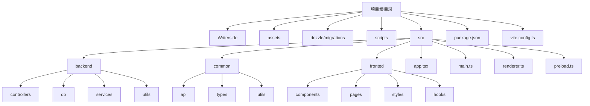
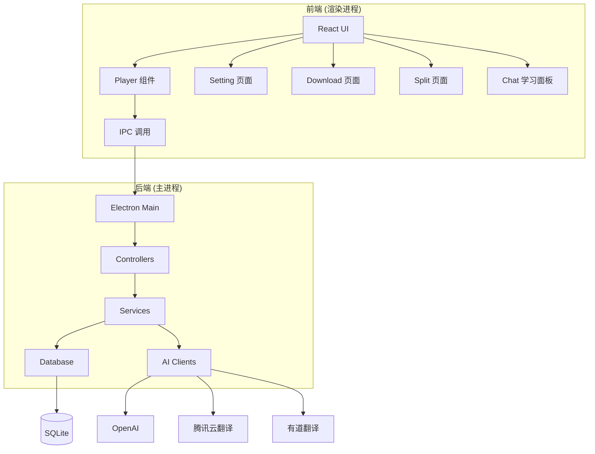
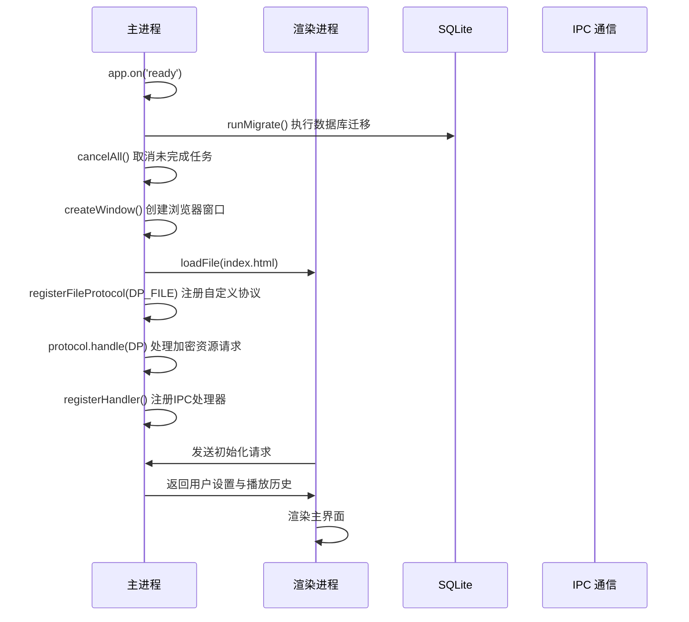

# 项目概述

<cite>
**本文档引用的文件**  
- [README.md](file://README.md)
- [main.ts](file://src/main.ts)
- [AiFuncController.ts](file://src/backend/controllers/AiFuncController.ts)
- [SubtitleController.ts](file://src/backend/controllers/SubtitleController.ts)
- [DownloadVideoController.ts](file://src/backend/controllers/DownloadVideoController.ts)
- [SplitVideoServiceImpl.ts](file://src/backend/services/impl/SplitVideoServiceImpl.ts)
- [DlVideoServiceImpl.ts](file://src/backend/services/impl/DlVideoServiceImpl.ts)
- [OpenAIServiceImpl.ts](file://src/backend/services/OpenAiService.ts)
- [TencentProvider.ts](file://src/backend/services/impl/clients/TencentProvider.ts)
- [YouDaoProvider.ts](file://src/backend/services/impl/clients/YouDaoProvider.ts)
- [dpTask.ts](file://src/backend/db/tables/dpTask.ts)
- [videoClip.ts](file://src/backend/db/tables/videoClip.ts)
- [watchHistory.ts](file://src/backend/db/tables/watchHistory.ts)
- [app.tsx](file://src/app.tsx)
- [Player.tsx](file://src/fronted/components/Player.tsx)
- [SettingLayout.tsx](file://src/fronted/pages/setting/SettingLayout.tsx)
- [HomePage.tsx](file://src/fronted/pages/HomePage.tsx)
</cite>

## 目录

1. [引言](#引言)
2. [项目结构](#项目结构)
3. [核心功能与目标用户](#核心功能与目标用户)
4. [架构设计](#架构设计)
5. [前后端技术栈](#前后端技术栈)
6. [AI服务集成](#ai服务集成)
7. [本地数据库与数据管理](#本地数据库与数据管理)
8. [项目启动流程](#项目启动流程)
9. [典型使用场景](#典型使用场景)
10. [项目愿景与技术优势](#项目愿景与技术优势)

## 引言

DashPlayer 是一款专为英语学习者设计的桌面级视频学习工具，旨在通过集成视频播放、AI字幕生成、语言分析、视频下载与切割等功能，提升用户在真实语境中学习英语的效率与体验。该项目基于 Electron 框架构建，采用全栈 TypeScript 技术栈，实现了前后端分离的现代化桌面应用架构。其核心价值在于将 AI 技术深度融入语言学习流程，帮助用户从“被动观看”转向“主动学习”。

本项目不仅适用于个人英语学习者，也适合教师和内容创作者用于教学资源准备与语言分析。通过开源方式，DashPlayer 希望构建一个可持续进化的语言学习工具生态。

## 项目结构

DashPlayer 的项目结构清晰，遵循功能模块化原则，主要分为前端、后端、公共组件、数据库迁移与静态资源等部分。

**图示来源**  
- [src/main.ts](file://src/main.ts)
- [src/backend](file://src/backend)
- [src/fronted](file://src/fronted)

**本节来源**  
- [src](file://src)
- [README.md](file://README.md)

## 核心功能与目标用户

### 核心功能亮点

DashPlayer 提供以下核心功能，全面支持英语学习全流程：

- **智能双语字幕**：支持自动翻译与AI生成字幕，用户可自由切换中英显示模式。
- **AI字幕生成**：集成 OpenAI Whisper 模型，为无字幕视频自动生成高质量英文转录。
- **语言深度分析**：通过右键选词或整句，调用 AI 分析语法、短语、例句、同义句等。
- **视频下载与切割**：内置视频下载器，支持从链接下载视频；可将长视频按章节或时间切割为学习片段。
- **播放控制优化**：支持按字幕跳转、重复播放、倍速调节、蓝牙手柄控制等，提升学习流畅度。
- **学习记录与收藏**：自动记录播放历史、收藏精彩片段，支持标签管理。
- **极速查词**：鼠标悬停字幕单词即可查询释义，点击可播放发音，不打断学习节奏。

### 目标用户群体

- **英语学习者**：希望利用真实视频内容（如YouTube、纪录片、课程）提升听力与词汇能力的用户。
- **英语教师**：用于准备教学材料、分析语言结构、生成练习题。
- **内容创作者**：需要快速获取视频字幕、翻译内容或进行语音转录的创作者。

## 架构设计

DashPlayer 采用典型的 Electron 桌面应用架构，结合前后端分离设计，确保高可维护性与扩展性。

**图示来源**  
- [main.ts](file://src/main.ts)
- [AiFuncController.ts](file://src/backend/controllers/AiFuncController.ts)
- [SubtitleController.ts](file://src/backend/controllers/SubtitleController.ts)
- [OpenAIServiceImpl.ts](file://src/backend/services/OpenAiService.ts)

**本节来源**  
- [src/main.ts](file://src/main.ts)
- [src/backend](file://src/backend)
- [src/fronted](file://src/fronted)

## 前后端技术栈

### 前端技术栈

- **框架**：React + TypeScript
- **构建工具**：Vite
- **样式**：Tailwind CSS + SCSS
- **状态管理**：Zustand（通过自定义 Hook 实现模块化状态）
- **UI 组件库**：基于 Shadcn UI 定制的组件系统（`ui/` 目录）
- **路由**：前端页面通过 Electron 窗口加载，使用 React Router 风格组织

### 后端技术栈

- **运行环境**：Node.js（Electron 主进程）
- **依赖注入**：InversifyJS（`ioc/` 目录）
- **数据库**：Drizzle ORM + SQLite
- **API 调度**：自定义 IPC 调度器（`dispatcher.ts`）
- **日志**：自定义 Logger 实现
- **任务管理**：基于数据库的任务队列（`DpTask` 表）

**本节来源**  
- [package.json](file://package.json)
- [vite.renderer.config.ts](file://vite.renderer.config.ts)
- [vite.main.config.ts](file://vite.main.config.ts)
- [inversify.config.ts](file://src/backend/ioc/inversify.config.ts)
- [db.ts](file://src/backend/db/db.ts)

## AI服务集成

DashPlayer 通过集成多个第三方 AI 服务，实现语言学习的智能化：

### OpenAI 服务

- **功能**：AI字幕生成（Whisper）、整句语法分析、短语解释、例句生成、同义句改写、文本润色。
- **实现**：通过 `OpenAiService` 和 `WhisperService` 调用 OpenAI API，使用预设 Prompt 模板（`prompts/` 目录）引导模型输出结构化结果。
- **调用方式**：用户在播放器中右键选中文本，触发 IPC 请求至后端，后端调用 OpenAI 并返回分析结果至前端展示。

### 腾讯云翻译

- **功能**：字幕全文翻译（英译中）。
- **实现**：`TencentProvider` 封装腾讯云翻译 API，支持批量翻译字幕行。
- **优势**：成本低、响应快，适合长文本翻译。

### 有道翻译

- **功能**：单词级即时查询（悬停查词）。
- **实现**：`YouDaoProvider` 调用有道词典 API，返回单词释义、音标、发音音频。
- **体验优化**：查词结果缓存，避免重复请求。

**本节来源**  
- [OpenAIServiceImpl.ts](file://src/backend/services/OpenAiService.ts)
- [TencentProvider.ts](file://src/backend/services/impl/clients/TencentProvider.ts)
- [YouDaoProvider.ts](file://src/backend/services/impl/clients/YouDaoProvider.ts)
- [prompts](file://src/backend/services/prompts)

## 本地数据库与数据管理

DashPlayer 使用 SQLite 作为本地持久化存储，通过 Drizzle ORM 进行数据建模与操作。

### 核心数据表

| 表名 | 功能描述 |
|------|----------|
| `watchHistory` | 记录用户播放历史，包括视频路径、播放位置、最后播放时间 |
| `videoClip` | 存储用户收藏的视频片段，包括起止时间、标题、标签 |
| `tag` | 用户自定义标签，用于分类管理收藏片段 |
| `clipTagRelation` | 视频片段与标签的多对多关系表 |
| `dpTask` | 后台任务队列，如视频下载、字幕生成、视频切割等 |
| `kvs` | 键值存储，用于保存用户设置（如API密钥、播放偏好） |

### 数据流设计

- 用户操作（如收藏片段）触发前端事件。
- 前端通过 IPC 调用后端 Controller。
- Controller 调用 Service 层处理业务逻辑。
- Service 层通过 Drizzle ORM 操作数据库。
- 数据变更后，通知前端更新 UI。

**本节来源**  
- [db/tables](file://src/backend/db/tables)
- [DpTaskServiceImpl.ts](file://src/backend/services/impl/DpTaskServiceImpl.ts)
- [WatchHistoryServiceImpl.ts](file://src/backend/services/WatchHistoryServiceImpl.ts)

## 项目启动流程

DashPlayer 的启动流程体现了 Electron 应用的典型生命周期：

**图示来源**  
- [main.ts](file://src/main.ts#L1-L98)
- [migrate.ts](file://src/backend/db/migrate.ts)
- [dispatcher.ts](file://src/backend/dispatcher.ts)

**本节来源**  
- [main.ts](file://src/main.ts)

## 典型使用场景

### 场景一：学习无字幕视频

1. 用户粘贴 YouTube 视频链接，使用“视频下载”功能获取本地文件。
2. 导入视频后，点击“AI生成字幕”，调用 OpenAI Whisper 生成英文 SRT。
3. 播放视频，开启双语字幕，通过“按句跳转”精听。
4. 遇到生词，鼠标悬停查看有道释义。
5. 选中整句，右键“AI分析”，获取语法解释与例句。

### 场景二：切割长视频为学习片段

1. 用户导入一小时讲座视频。
2. 进入“视频切割”页面，设置切割规则（如每10分钟一段）。
3. 后端创建 `DpTask` 任务，调用 FFmpeg 执行切割。
4. 切割完成后，用户可在“收藏”页面管理各片段，添加标签。

### 场景三：复习收藏内容

1. 用户打开“收藏”页面，查看按标签分类的视频片段。
2. 点击播放，自动加载对应视频并跳转至片段起始时间。
3. 可再次调用 AI 分析功能，深化理解。

**本节来源**  
- [DownloadVideoController.ts](file://src/backend/controllers/DownloadVideoController.ts)
- [SplitVideoServiceImpl.ts](file://src/backend/services/impl/SplitVideoServiceImpl.ts)
- [FavoriteClipsController.ts](file://src/backend/controllers/FavoriteClipsController.ts)

## 项目愿景与技术优势

### 项目愿景

DashPlayer 致力于成为“最懂语言学习者的视频播放器”，通过 AI 技术降低语言学习门槛，让用户在享受内容的同时自然提升语言能力。未来计划支持更多语言、集成更多 AI 模型（如本地化 Whisper）、构建学习数据分析面板。

### 技术优势

- **全栈 TypeScript**：前后端统一类型系统，提升开发效率与代码健壮性。
- **模块化架构**：清晰的分层（Controller → Service → DB）与依赖注入，便于维护与测试。
- **本地优先**：所有数据存储于本地 SQLite，保障用户隐私与数据安全。
- **可扩展 AI 集成**：通过 `AiProviderService` 抽象层，可轻松接入新 AI 服务。
- **Electron + React + Vite**：现代化技术栈，兼顾桌面应用能力与 Web 开发体验。

DashPlayer 不仅是一个工具，更是一种“以内容驱动学习”的理念实践。通过开源，项目希望吸引更多开发者共同打造下一代语言学习平台。