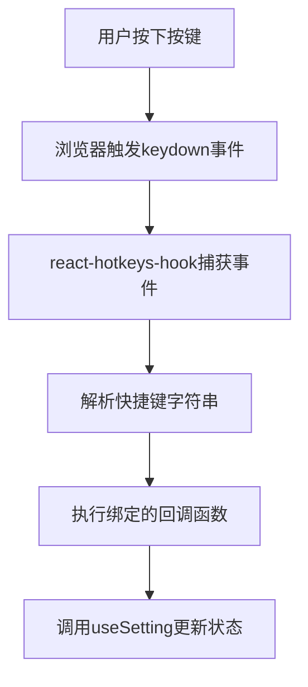
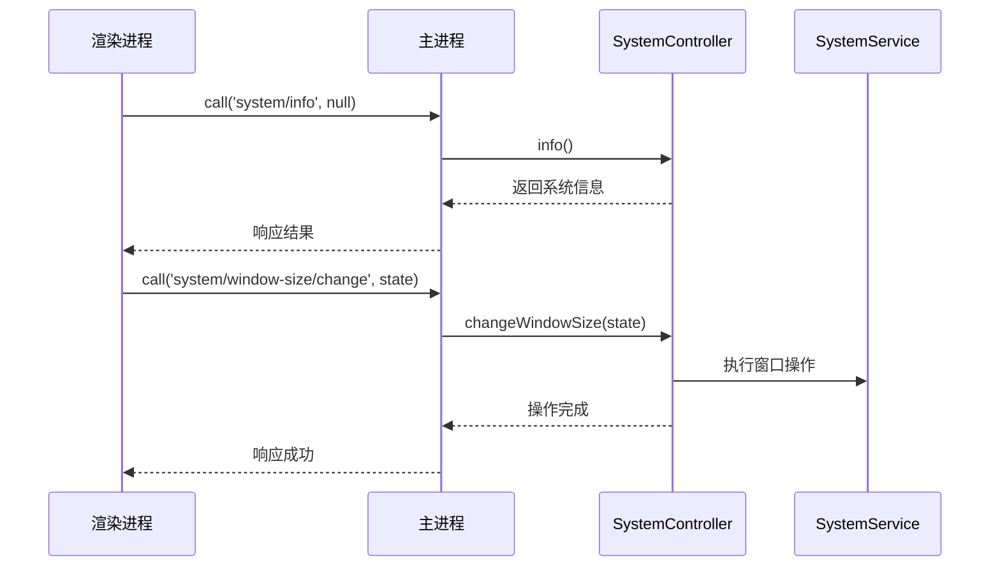

# 外设集成与控制

<cite>
**本文档引用文件**  
- [Use-Bluetooth-Game-Controller.md](file://Writerside/topics/Use-Bluetooth-Game-Controller.md)
- [GlobalShortCut.tsx](file://src/fronted/components/short-cut/GlobalShortCut.tsx)
- [usePlayerController.ts](file://src/fronted/hooks/usePlayerController.ts)
- [SystemController.ts](file://src/backend/controllers/SystemController.ts)
</cite>

## 目录
1. [简介](#简介)
2. [蓝牙手柄集成原理](#蓝牙手柄集成原理)
3. [系统权限与兼容性要求](#系统权限与兼容性要求)
4. [按键映射配置方法](#按键映射配置方法)
5. [前端事件监听机制分析](#前端事件监听机制分析)
6. [IPC通信与播放控制流程](#ipc通信与播放控制流程)
7. [调试技巧与常见问题解决](#调试技巧与常见问题解决)
8. [实际配置示例](#实际配置示例)
9. [推荐手柄型号列表](#推荐手柄型号列表)
10. [结论](#结论)

## 简介
本文档全面指导如何将蓝牙游戏手柄集成到DashPlayer中实现播放控制。基于项目文档《Use-Bluetooth-Game-Controller.md》，详细说明手柄按键映射配置方法、系统权限设置及兼容性要求。结合`GlobalShortCut.tsx`和`usePlayerController.ts`分析前端事件监听机制，揭示按键输入如何通过IPC通信传递至`SystemController.ts`并触发播放、暂停、快进等操作。提供调试技巧，帮助用户解决连接失败或响应延迟问题。包含实际配置示例和推荐的手柄型号列表，确保不同操作系统下的稳定运行。

## 蓝牙手柄集成原理
蓝牙手柄通过模拟键盘输入的方式与DashPlayer进行交互。支持“键盘模式”的蓝牙手柄（如八位堂Micro和Zero2）在连接电脑后会被识别为HID（Human Interface Device）键盘设备，其按键操作将被系统转换为标准键盘事件。DashPlayer通过Electron的IPC机制接收这些输入事件，并将其绑定到预设的播放控制功能上。

该集成方式无需额外驱动程序，依赖操作系统原生的蓝牙HID协议支持。当用户按下手柄按键时，操作系统将其解释为对应的键盘按键码（Keycode），DashPlayer的快捷键系统捕获该事件并执行相应操作。

**Section sources**
- [Use-Bluetooth-Game-Controller.md](file://Writerside/topics/Use-Bluetooth-Game-Controller.md#L1-L58)

## 系统权限与兼容性要求
### 操作系统兼容性
- **Windows**: 支持Windows 10及以上版本，需启用蓝牙服务并允许应用访问输入设备。
- **macOS**: 支持macOS 10.15及以上版本，需在“系统设置”中授权蓝牙配对和辅助功能访问。
- **Linux**: 需安装bluez蓝牙协议栈，并确保用户具有访问`/dev/hidraw*`设备的权限。

### 权限配置
- **Windows**: 无需特殊权限，但建议关闭“快速启动”以避免蓝牙唤醒问题。
- **macOS**: 必须在“系统设置 > 隐私与安全性 > 辅助功能”中添加DashPlayer并允许其控制电脑。
- **第三方映射软件权限**:
  - Windows平台使用PowerToys时需以管理员权限运行。
  - macOS平台使用Karabiner-Elements需安装内核扩展并重启。

**Section sources**
- [Use-Bluetooth-Game-Controller.md](file://Writerside/topics/Use-Bluetooth-Game-Controller.md#L55-L58)

## 按键映射配置方法
### 配置步骤
1. 将蓝牙手柄切换至“键盘模式”并与电脑配对。
2. 启动DashPlayer，进入“设置 > 快捷键”界面。
3. 点击目标功能的快捷键输入框。
4. 按下希望绑定的手柄按键。
5. 系统自动记录按键码，支持多个按键用英文逗号`,`分隔。
6. 完成所有映射后点击“保存”。

### 默认快捷键参考
| 功能 | 默认按键 |
|------|----------|
| 上一句 | ←, a |
| 下一句 | →, d |
| 暂停/播放 | ↑, w, space |
| 单句重复 | r |
| 切换主题 | t |

> 多个按键可绑定同一功能，提升操作容错性。

**Section sources**
- [Use-Bluetooth-Game-Controller.md](file://Writerside/topics/Use-Bluetooth-Game-Controller.md#L20-L45)

## 前端事件监听机制分析
DashPlayer使用`react-hotkeys-hook`库实现全局快捷键监听。`GlobalShortCut.tsx`组件通过`useHotkeys`钩子注册快捷键回调函数，其核心逻辑如下：

`usePlayerController.ts`使用Zustand状态管理库创建全局播放控制器，通过`subscribeWithSelector`实现细粒度状态监听。关键状态包括：
- `playing`: 播放状态
- `playTime`: 当前播放时间
- `duration`: 视频总时长

状态变更通过订阅机制自动同步到UI组件和后台服务。

**Diagram sources**
- [GlobalShortCut.tsx](file://src/fronted/components/short-cut/GlobalShortCut.tsx#L7-L15)
- [usePlayerController.ts](file://src/fronted/hooks/usePlayerController.ts#L28-L46)

**Section sources**
- [GlobalShortCut.tsx](file://src/fronted/components/short-cut/GlobalShortCut.tsx#L1-L16)
- [usePlayerController.ts](file://src/fronted/hooks/usePlayerController.ts#L1-L235)

## IPC通信与播放控制流程
按键事件通过Electron的IPC（Inter-Process Communication）机制在渲染进程与主进程间传递。`SystemController.ts`作为主进程控制器，暴露RESTful风格的API路由供前端调用。

具体流程：
1. 前端调用`window.electron.call(apiPath, params)`发起IPC请求。
2. 主进程通过`ipcMain.handle`监听并路由到对应控制器方法。
3. `SystemController`执行业务逻辑（如窗口大小调整）。
4. 结果返回前端，完成闭环。

**Diagram sources**
- [SystemController.ts](file://src/backend/controllers/SystemController.ts#L25-L127)

**Section sources**
- [SystemController.ts](file://src/backend/controllers/SystemController.ts#L1-L128)

## 调试技巧与常见问题解决
### 连接失败排查
1. **确认手柄模式**：确保手柄处于“键盘模式”而非“XInput模式”。
2. **系统蓝牙日志**：
   - Windows: 使用“设备管理器”查看HID设备状态
   - macOS: 使用`Console.app`过滤`bluetoothd`日志
3. **权限检查**：验证应用是否被授予辅助功能权限。

### 响应延迟优化
- 减少快捷键组合复杂度，避免使用修饰键（Ctrl/Alt）。
- 关闭后台冲突软件（如游戏平台Overlay）。
- 在DashPlayer设置中降低“播放进度同步频率”。

### 事件捕获测试
使用在线工具（如https://keyboard-test.com）验证手柄按键是否被正确识别为键盘输入。若网页能捕获按键，则DashPlayer也可正常响应。

**Section sources**
- [Use-Bluetooth-Game-Controller.md](file://Writerside/topics/Use-Bluetooth-Game-Controller.md#L1-L58)

## 实际配置示例
### 八位堂Zero2手柄映射方案
| 手柄按键 | 映射功能 | 配置值 |
|--------|--------|------|
| D-pad上 | 播放/暂停 | w |
| D-pad下 | 单句重复 | r |
| D-pad左 | 上一句 | a |
| D-pad右 | 下一句 | d |
| A键 | 切换主题 | t |
| B键 | 展示英文字幕 | e |

配置方法：在快捷键设置界面点击输入框后，直接按下对应手柄按键即可自动录入。

## 推荐手柄型号列表
| 型号 | 特点 | 适用系统 |
|------|------|--------|
| 八位堂Micro | 超小型设计，单手操作 | Windows/macOS/Linux |
| 八位堂Zero2 | 双模连接，续航长达20小时 | Windows/macOS/Linux |
| 8BitDo SN30 Pro+ | 霍尔摇杆，支持多平台 | Windows/macOS/Android |
| Xbox无线手柄 | 原生XInput支持，需配合映射软件 | Windows |

> 推荐优先选择明确支持“SIXAXIS键盘模式”的手柄产品。

**Section sources**
- [Use-Bluetooth-Game-Controller.md](file://Writerside/topics/Use-Bluetooth-Game-Controller.md#L10-L18)

## 结论
通过将蓝牙手柄配置为键盘输入设备，DashPlayer实现了无需鼠标即可完成全部播放控制的操作体验。系统基于Electron的IPC架构实现了安全高效的跨进程通信，前端使用Zustand状态管理确保响应实时性。用户只需按照标准流程完成手柄配对和快捷键映射，即可享受流畅的视频学习体验。建议优先选用八位堂系列手柄，并在macOS系统中正确配置辅助功能权限以确保最佳兼容性。