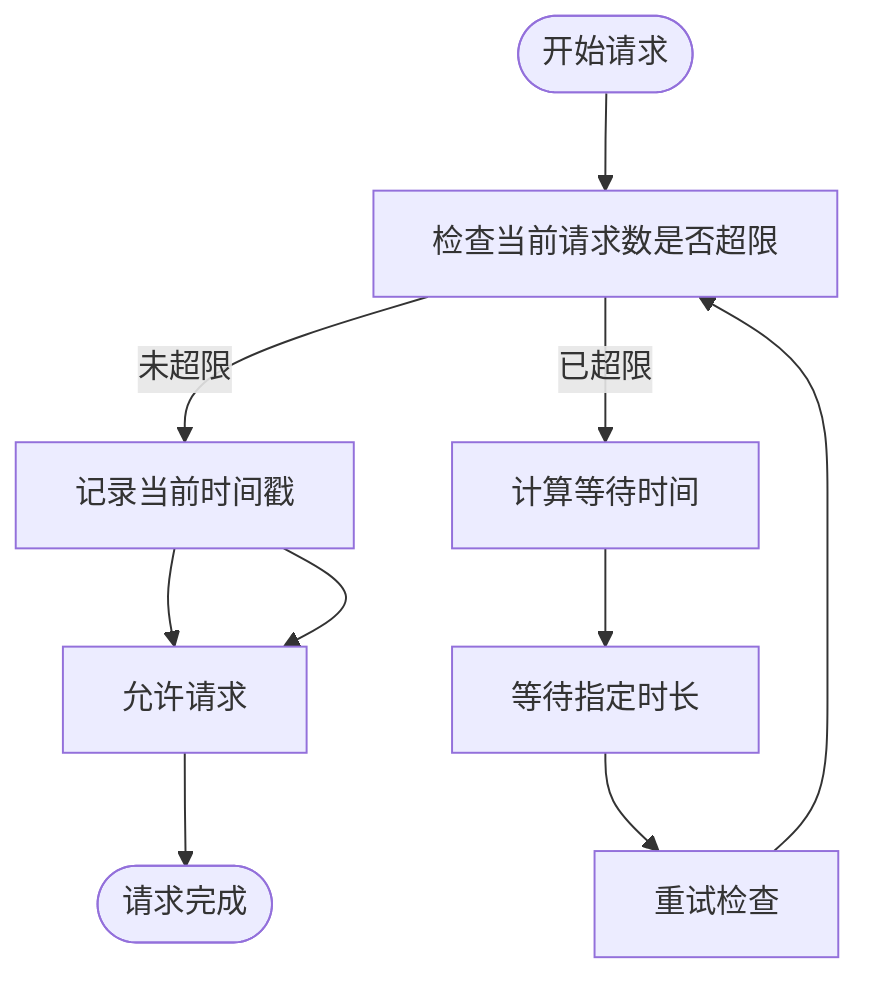
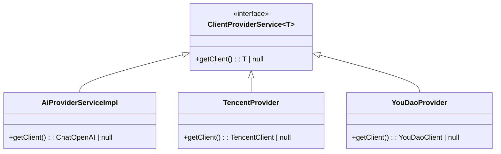
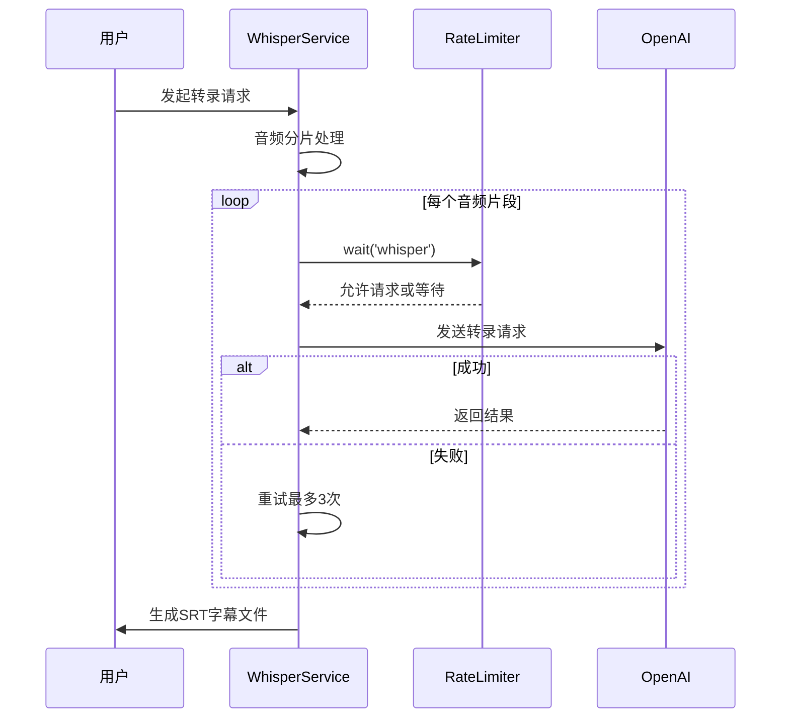
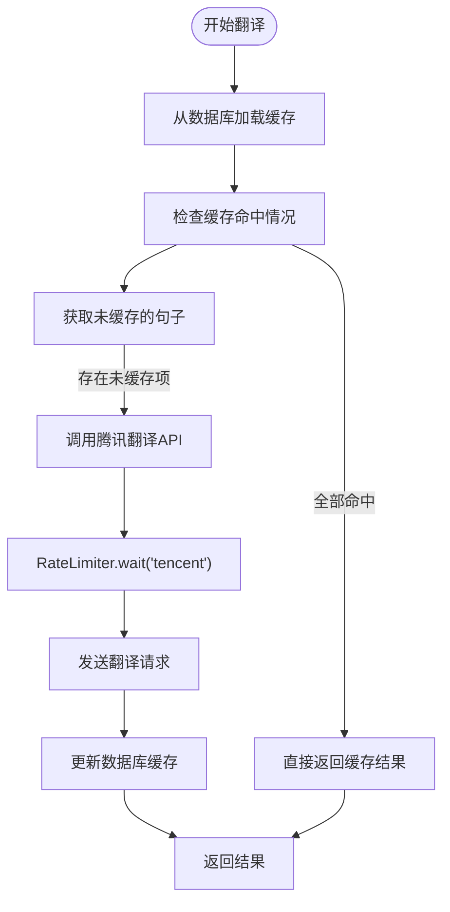

# API调用速率控制

<cite>
**本文档引用的文件**
- [RateLimiter.ts](file://src/common/utils/RateLimiter.ts)
- [AiProviderServiceImpl.ts](file://src/backend/services/impl/clients/AiProviderServiceImpl.ts)
- [WhisperServiceImpl.ts](file://src/backend/services/impl/WhisperServiceImpl.ts)
- [TranslateServiceImpl.ts](file://src/backend/services/impl/TranslateServiceImpl.ts)
- [OpenAIServiceImpl.ts](file://src/backend/services/impl/OpenAIServiceImpl.ts)
- [TencentProvider.ts](file://src/backend/services/impl/clients/TencentProvider.ts)
- [YouDaoProvider.ts](file://src/backend/services/impl/clients/YouDaoProvider.ts)
- [OpenAiWhisperRequest.ts](file://src/backend/objs/OpenAiWhisperRequest.ts)
- [TencentClient.ts](file://src/backend/objs/TencentClient.ts)
</cite>

## 目录
1. [引言](#引言)
2. [速率限制器核心机制](#速率限制器核心机制)
3. [令牌桶算法实现原理](#令牌桶算法实现原理)
4. [限流策略配置与差异化设置](#限流策略配置与差异化设置)
5. [在Whisper服务中的集成应用](#在whisper服务中的集成应用)
6. [翻译服务中的限流集成](#翻译服务中的限流集成)
7. [错误重试与退避策略建议](#错误重试与退避策略建议)
8. [API配额适配与参数调优](#api配额适配与参数调优)
9. [总结](#总结)

## 引言
在调用外部AI服务（如OpenAI、腾讯云、有道翻译）时，API调用频率受到服务商严格的速率限制。为避免因请求超限导致服务中断或账号被封禁，系统引入了基于令牌桶算法的速率限制器（RateLimiter）。该机制通过控制请求频率，确保在合法范围内高效使用API资源，同时支持突发请求处理，提升用户体验。

## 速率限制器核心机制

速率限制器的核心目标是防止对第三方API的过度调用，保护系统稳定性并遵守服务商的使用条款。通过集中管理不同服务的调用频率，系统能够智能地排队和延迟请求，从而避免触发服务商的限流规则。

**节流机制工作流程：**
1. 每个API请求前调用 `RateLimiter.wait(key)` 方法
2. 系统根据配置的限流策略检查当前时间窗口内的请求数量
3. 若超出限制，则自动延迟执行，直到满足条件
4. 请求成功后记录时间戳，供后续判断使用

该机制采用静态类设计，全局共享状态，确保跨实例调用的一致性。

**Section sources**
- [RateLimiter.ts](file://src/common/utils/RateLimiter.ts#L14-L43)

## 令牌桶算法实现原理

系统采用经典的**令牌桶算法**实现速率控制。该算法模拟一个以恒定速率填充令牌的“桶”，每次API调用需消耗一个令牌。当桶中无可用令牌时，请求将被延迟至新令牌生成。

### 核心逻辑解析
- **时间窗口（timeWindow）**：定义统计请求频率的时间周期（单位：毫秒）
- **最大请求数（maxRequests）**：在时间窗口内允许的最大请求数
- **请求时间戳队列**：记录每个请求发生的时间点
- **滑动窗口清理**：移除超出时间窗口的历史请求记录
- **阻塞等待机制**：当请求数超限时，计算需等待的时间并暂停执行

例如，配置 `whisper: {maxRequests: 10, timeWindow: 1000}` 表示每秒最多允许10次Whisper转录请求。



**Diagram sources**
- [RateLimiter.ts](file://src/common/utils/RateLimiter.ts#L17-L42)

**Section sources**
- [RateLimiter.ts](file://src/common/utils/RateLimiter.ts#L6-L11)

## 限流策略配置与差异化设置

系统为不同AI服务商配置了差异化的限流策略，以适应各平台的API配额限制。所有策略集中定义在 `RateLimitConfig` 对象中，便于统一维护。

### 各服务商限流配置
| 服务类型 | 最大请求数 | 时间窗口（ms） | 说明 |
|---------|-----------|----------------|------|
| whisper | 10 | 1000 | OpenAI Whisper语音识别 |
| gpt | 10 | 1000 | GPT模型对话服务 |
| tencent | 4 | 1000 | 腾讯云翻译API |
| tts | 10 | 1000 | 文本转语音服务 |

这些配置体现了对不同服务商限制策略的适配：
- **腾讯云**限制较严，每秒仅允许4次请求
- **OpenAI**服务相对宽松，每秒支持10次调用

### 客户端服务实现差异
通过依赖注入机制，不同服务商的客户端由各自的 `ClientProviderService` 实现类管理：

- `AiProviderServiceImpl`：负责OpenAI GPT模型客户端的创建与配置
- `TencentProvider`：封装腾讯云API密钥与客户端初始化逻辑
- `YouDaoProvider`：管理有道翻译API的认证与配置更新

这些服务在获取客户端实例前均会检查API密钥的有效性，并缓存已创建的客户端以提高性能。



**Diagram sources**
- [AiProviderServiceImpl.ts](file://src/backend/services/impl/clients/AiProviderServiceImpl.ts#L8-L30)
- [TencentProvider.ts](file://src/backend/services/impl/clients/TencentProvider.ts#L7-L42)
- [YouDaoProvider.ts](file://src/backend/services/impl/clients/YouDaoProvider.ts#L7-L31)

**Section sources**
- [RateLimiter.ts](file://src/common/utils/RateLimiter.ts#L6-L11)
- [AiProviderServiceImpl.ts](file://src/backend/services/impl/clients/AiProviderServiceImpl.ts#L10-L29)

## 在Whisper服务中的集成应用

Whisper语音转录服务是速率限制器的重要应用场景之一。由于音频文件通常较大且处理耗时，频繁调用可能导致API超限。

### 集成路径分析
1. 用户发起转录任务 → `WhisperServiceImpl.transcript()`
2. 音频分片处理 → `convertAndSplit()`
3. 分片并发转录 → `whisperThreeTimes()`
4. 单次转录请求 → `whisper()`
5. **关键步骤**：调用 `RateLimiter.wait('whisper')` 进行限流控制

### 错误重试机制
系统内置三层重试逻辑：
- 单次请求失败自动重试3次
- 每次重试前均进行速率限制检查
- 支持用户手动取消任务



**Diagram sources**
- [WhisperServiceImpl.ts](file://src/backend/services/impl/WhisperServiceImpl.ts#L46-L155)
- [OpenAiWhisperRequest.ts](file://src/backend/objs/OpenAiWhisperRequest.ts#L35-L93)

**Section sources**
- [WhisperServiceImpl.ts](file://src/backend/services/impl/WhisperServiceImpl.ts#L46-L155)
- [OpenAiWhisperRequest.ts](file://src/backend/objs/OpenAiWhisperRequest.ts#L35-L93)

## 翻译服务中的限流集成

翻译服务同样集成了速率限制机制，特别是在批量翻译场景下尤为重要。

### 腾讯云翻译集成
- 使用 `RateLimiter.wait('tencent')` 控制调用频率
- 每秒最多4次请求，严格遵守API限制
- 支持大文本自动分批处理（SIZE_LIMIT=1500字符）

### 有道翻译集成
- 有道API虽未显式调用RateLimiter，但可通过扩展支持
- 当前实现包含错误码检测与日志输出
- 建议未来版本增加限流支持

### 批量翻译流程


**Diagram sources**
- [TranslateServiceImpl.ts](file://src/backend/services/impl/TranslateServiceImpl.ts#L18-L153)
- [TencentClient.ts](file://src/backend/objs/TencentClient.ts#L7-L65)

**Section sources**
- [TranslateServiceImpl.ts](file://src/backend/services/impl/TranslateServiceImpl.ts#L18-L153)
- [TencentClient.ts](file://src/backend/objs/TencentClient.ts#L7-L65)

## 错误重试与退避策略建议

为提高系统鲁棒性，建议实施以下重试与退避策略：

### 指数退避算法（Exponential Backoff）
```typescript
// 示例：建议的重试逻辑
async function retryWithBackoff(fn, maxRetries = 3) {
    for (let i = 0; i < maxRetries; i++) {
        try {
            return await fn();
        } catch (error) {
            if (i === maxRetries - 1) throw error;
            const delay = Math.pow(2, i) * 1000; // 1s, 2s, 4s
            await new Promise(resolve => setTimeout(resolve, delay));
        }
    }
}
```

### 推荐策略组合
1. **前置限流**：使用RateLimiter预防性控制请求速率
2. **失败重试**：对临时性错误进行有限次重试
3. **指数退避**：重试间隔随次数指数增长
4. **熔断机制**：连续失败后暂停服务一段时间
5. **日志监控**：记录所有限流与重试事件

### 实际应用建议
- 对于OpenAI服务：建议重试3次，初始延迟1秒
- 对于腾讯云服务：建议重试2次，初始延迟2秒
- 对于有道服务：建议重试3次，初始延迟1.5秒

## API配额适配与参数调优

为最大化资源利用率并避免服务中断，用户应根据实际API配额调整限流参数。

### 配置调整指南
| 服务商 | 免费配额 | 建议配置 | 调整依据 |
|-------|---------|---------|---------|
| OpenAI | 查阅官方文档 | maxRequests: 10, timeWindow: 1000 | 默认每分钟600次 |
| 腾讯云 | 每秒4次 | maxRequests: 4, timeWindow: 1000 | 严格遵守限制 |
| 有道云 | 按量计费 | 可适当放宽 | 根据账单调整 |

### 动态调整建议
- **监控日志**：定期检查 `dpLog.error` 中的限流记录
- **性能测试**：在安全范围内测试最高吞吐量
- **弹性配置**：根据使用时段动态调整限流阈值
- **告警机制**：当接近配额上限时发出提醒

### 配置示例
```typescript
// rate-limit-config.ts
const RateLimitConfig = {
    whisper: { maxRequests: 10, timeWindow: 1000 },  // 可根据订阅等级调整
    gpt: { maxRequests: 10, timeWindow: 1000 },
    tencent: { maxRequests: 4, timeWindow: 1000 },   // 严格限制
    tts: { maxRequests: 10, timeWindow: 1000 }
};
```

用户可通过修改 `RateLimitConfig` 中的数值来适配不同级别的API订阅计划，实现资源利用最优化。

## 总结
速率限制器在保护外部AI服务调用中发挥着至关重要的作用。通过基于令牌桶算法的实现，系统能够有效控制对OpenAI、腾讯云、有道等服务的请求频率，避免因超限导致的服务中断。结合 `AiProviderServiceImpl` 等服务类，实现了针对不同服务商的差异化限流策略。在Whisper语音转录和翻译服务中的集成应用，证明了该机制的实用性和有效性。建议用户根据实际API配额合理调整限流参数，并结合错误重试与退避策略，构建稳定可靠的AI服务调用体系。