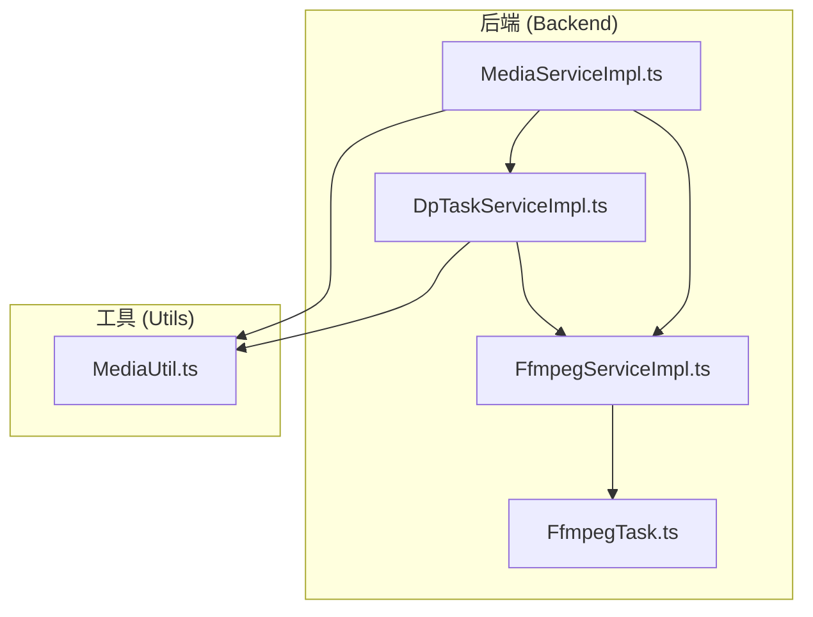
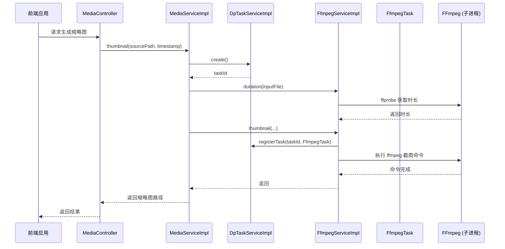
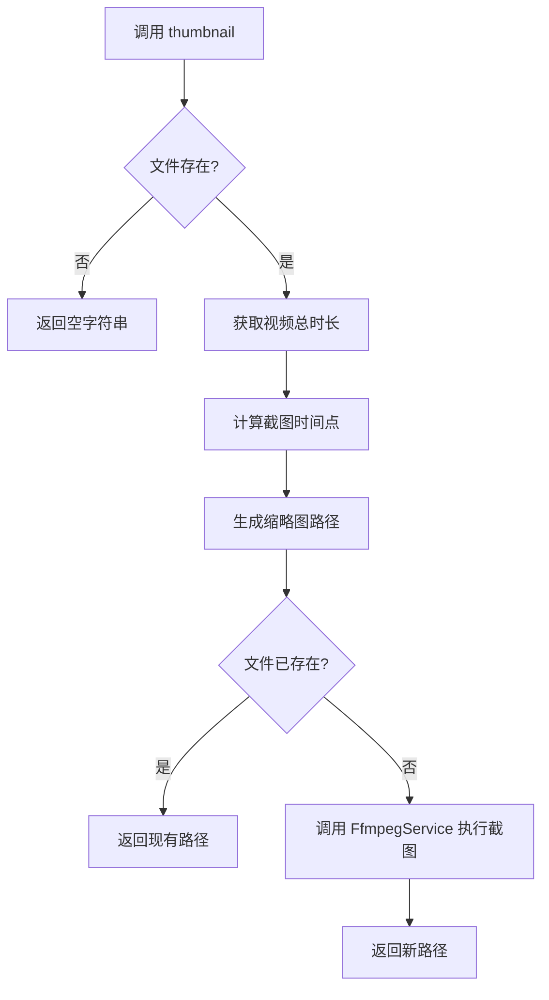
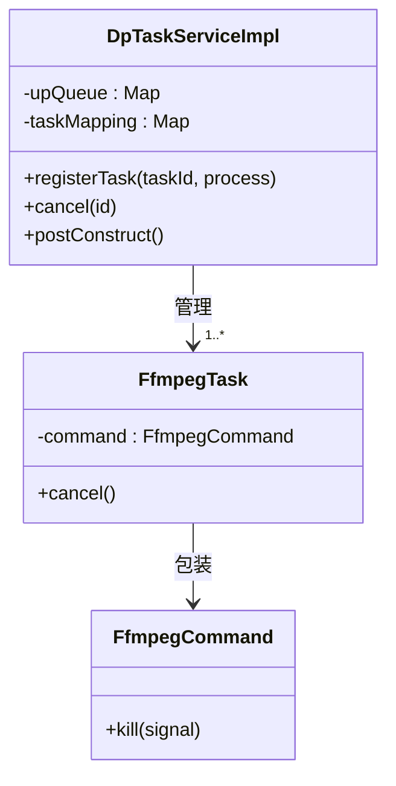
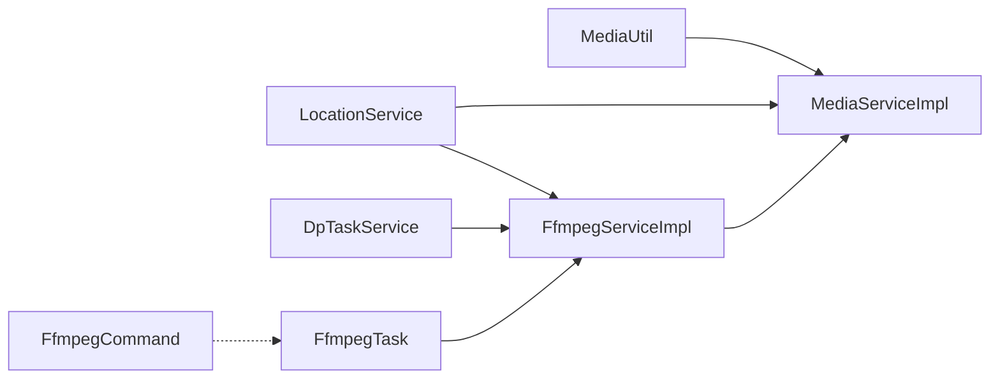

# 媒体资源调度优化

<cite>
**本文档引用的文件**  
- [MediaServiceImpl.ts](file://src/backend/services/impl/MediaServiceImpl.ts)
- [FfmpegServiceImpl.ts](file://src/backend/services/impl/FfmpegServiceImpl.ts)
- [FfmpegTask.ts](file://src/backend/objs/FfmpegTask.ts)
- [DpTaskServiceImpl.ts](file://src/backend/services/impl/DpTaskServiceImpl.ts)
- [MediaUtil.ts](file://src/common/utils/MediaUtil.ts)
</cite>

## 目录
1. [引言](#引言)
2. [项目结构](#项目结构)
3. [核心组件](#核心组件)
4. [架构概览](#架构概览)
5. [详细组件分析](#详细组件分析)
6. [依赖分析](#依赖分析)
7. [性能考量](#性能考量)
8. [故障排查指南](#故障排查指南)
9. [结论](#结论)

## 引言
本文档旨在深入分析 DashPlayer 项目中媒体处理服务在处理高分辨率或长时间视频时的资源消耗特征，并提出一系列优化策略，以降低 CPU、内存和磁盘 I/O 的占用。重点分析 `MediaServiceImpl.ts` 如何通过 `FfmpegTask` 调用 FFmpeg 进行媒体处理，探讨 `MediaUtil.ts` 提供的资源预估功能，并阐述后台任务队列 `DpTaskServiceImpl.ts` 如何优先调度媒体任务以避免阻塞主线程。最终，将提供多任务并行度控制建议，实现系统负载的动态调整。

## 项目结构
DashPlayer 项目采用典型的前后端分离架构。后端服务位于 `src/backend` 目录下，采用 TypeScript 编写，核心功能包括媒体处理、AI 服务、下载、任务调度等。前端位于 `src/fronted` 目录，使用 React 框架。本分析重点关注后端的媒体处理模块，特别是 `services/impl` 目录下的实现类和 `objs` 目录下的任务对象。

**图示来源**
- [MediaServiceImpl.ts](file://src/backend/services/impl/MediaServiceImpl.ts)
- [FfmpegServiceImpl.ts](file://src/backend/services/impl/FfmpegServiceImpl.ts)
- [FfmpegTask.ts](file://src/backend/objs/FfmpegTask.ts)
- [DpTaskServiceImpl.ts](file://src/backend/services/impl/DpTaskServiceImpl.ts)
- [MediaUtil.ts](file://src/common/utils/MediaUtil.ts)

**本节来源**
- [src/backend](file://src/backend)
- [src/common/utils](file://src/common/utils)

## 核心组件
本系统的核心组件围绕媒体文件的处理与调度展开。`MediaServiceImpl` 作为媒体服务的高层接口，负责协调 `FfmpegServiceImpl` 执行具体的 FFmpeg 操作。`FfmpegTask` 封装了 FFmpeg 子进程，使其具备可取消性。`DpTaskServiceImpl` 则是整个后台任务的调度中心，管理任务的生命周期。`MediaUtil` 提供了基础的媒体文件类型判断和路径处理工具。

**本节来源**
- [MediaServiceImpl.ts](file://src/backend/services/impl/MediaServiceImpl.ts)
- [FfmpegServiceImpl.ts](file://src/backend/services/impl/FfmpegServiceImpl.ts)
- [FfmpegTask.ts](file://src/backend/objs/FfmpegTask.ts)
- [DpTaskServiceImpl.ts](file://src/backend/services/impl/DpTaskServiceImpl.ts)
- [MediaUtil.ts](file://src/common/utils/MediaUtil.ts)

## 架构概览
系统的媒体处理流程遵循清晰的分层架构。用户请求通过控制器（如 `MediaController.ts`）进入，由 `MediaServiceImpl` 接收并解析。对于需要长时间运行的任务（如视频转码、分割），`MediaServiceImpl` 会通过 `DpTaskService` 创建一个后台任务（`DpTask`），并将任务 ID 返回给前端，实现异步处理。随后，`MediaServiceImpl` 调用 `FfmpegServiceImpl` 的具体方法。`FfmpegServiceImpl` 在执行 FFmpeg 命令前，会将 `FfmpegTask` 注册到 `DpTaskServiceImpl` 的任务映射中，从而实现任务的统一管理和取消。`MediaUtil` 则在各层之间提供通用的工具函数。

**图示来源**
- [MediaServiceImpl.ts](file://src/backend/services/impl/MediaServiceImpl.ts#L28-L49)
- [FfmpegServiceImpl.ts](file://src/backend/services/impl/FfmpegServiceImpl.ts#L111-L138)
- [DpTaskServiceImpl.ts](file://src/backend/services/impl/DpTaskServiceImpl.ts#L57-L73)
- [DpTaskServiceImpl.ts](file://src/backend/services/impl/DpTaskServiceImpl.ts#L187-L190)

## 详细组件分析

### MediaServiceImpl 分析
`MediaServiceImpl` 是媒体处理功能的入口。它主要提供两个核心方法：`thumbnail` 用于生成视频缩略图，`duration` 用于获取媒体文件的时长。该服务本身不直接执行耗时操作，而是作为协调者，调用 `FfmpegService` 来完成实际工作。

当调用 `thumbnail` 方法时，它首先检查源文件是否存在。如果存在，则通过 `FfmpegService` 获取视频总时长，并根据用户提供的时间戳或默认的中间时间点计算出最终的截图时间。接着，它会检查目标缩略图是否已存在（基于文件哈希和时间戳生成路径），若存在则直接返回路径，实现缓存优化。若不存在，则调用 `FfmpegService.thumbnail` 方法执行截图。

**图示来源**
- [MediaServiceImpl.ts](file://src/backend/services/impl/MediaServiceImpl.ts#L28-L49)

**本节来源**
- [MediaServiceImpl.ts](file://src/backend/services/impl/MediaServiceImpl.ts)

### FfmpegTask 与 FFmpeg 参数调优
`FfmpegTask` 是一个简单的封装类，实现了 `Cancelable` 接口。它将 `fluent-ffmpeg` 库创建的 `FfmpegCommand` 对象包装起来，并提供 `cancel()` 方法，通过向 FFmpeg 子进程发送 `SIGKILL` 信号来强制终止任务。这为上层任务调度提供了基础的取消能力。

`FfmpegServiceImpl` 类中定义了多个使用 FFmpeg 处理媒体的方法。虽然代码中没有显式地暴露 `preset` 和 `crf` 等参数的配置接口，但可以在具体方法中进行优化。例如，在 `trimVideo` 方法中，已经使用了 `-crf 28` 参数来控制视频质量（CRF 值越高，质量越低，文件越小）。为了进一步优化编码效率与质量的平衡，建议：

1.  **引入 `preset` 参数**：在需要重新编码的场景（如 `toMp4`, `trimVideo`），应增加 `preset` 参数。`preset` 控制编码速度与压缩率的权衡。例如，`-preset fast` 可以在保持较好压缩率的同时显著降低 CPU 占用，而 `-preset ultrafast` 则能最快完成编码，但文件较大。应根据系统负载和用户需求动态选择。
2.  **优化 `crf` 值**：`crf 28` 是一个偏高的值，适用于对文件大小敏感的场景。对于高分辨率视频，可以尝试 `crf 23` 左右以获得更好的视觉质量，或根据视频内容动态调整。
3.  **控制线程数 `threads`**：通过 `-threads N` 参数限制 FFmpeg 使用的 CPU 线程数。默认情况下，FFmpeg 会使用所有可用核心，这可能导致系统过载。建议设置为 CPU 核心数的 50%-75%，或根据 `DpTaskServiceImpl` 管理的并发任务数动态调整，避免多任务并行时资源争抢。

**本节来源**
- [FfmpegTask.ts](file://src/backend/objs/FfmpegTask.ts)
- [FfmpegServiceImpl.ts](file://src/backend/services/impl/FfmpegServiceImpl.ts#L302-L317)

### MediaUtil 资源预估功能
`MediaUtil` 类提供了一系列静态工具方法，用于快速判断文件类型和提取文件名，这些功能是实现资源预估的基础。

-   `isVideo`, `isAudio`, `isMedia` 方法通过检查文件扩展名来判断文件类型，可以快速过滤出需要处理的媒体文件。
-   `fileName` 方法用于提取文件名，便于在日志和用户界面中显示。

虽然 `MediaUtil` 本身不直接进行时间和空间的预估，但它提供的功能是构建预估系统的关键。一个完整的资源预估方案可以结合 `MediaUtil` 和 `FfmpegServiceImpl`：
1.  使用 `MediaUtil.isMedia()` 和 `isVideo()` 确认文件为视频。
2.  调用 `FfmpegServiceImpl.duration()` 获取视频时长。
3.  结合视频的分辨率、码率（可通过 `ffprobe` 获取更多元数据）和目标编码参数（如 CRF、preset），利用经验公式或历史数据模型来估算处理所需的时间和输出文件的大致空间。

**本节来源**
- [MediaUtil.ts](file://src/common/utils/MediaUtil.ts)

### 后台任务队列调度机制
`DpTaskServiceImpl` 是后台任务调度的核心。它通过一个 `Map` 结构 `taskMapping` 将任务 ID 与可取消的进程（如 `FfmpegTask`）关联起来。

当一个媒体任务（如 `splitToAudio`, `mkvToMp4`, `extractSubtitles`）开始执行时，`FfmpegServiceImpl` 会调用 `dpTaskService.registerTask(taskId, new FfmpegTask(command))`，将 FFmpeg 命令对象注册到 `DpTaskServiceImpl` 中。这使得 `DpTaskServiceImpl` 能够在用户请求取消任务时（通过 `cancel(id)` 方法），找到对应的所有 `Cancelable` 对象并调用其 `cancel()` 方法，从而优雅地终止 FFmpeg 进程。

此外，`DpTaskServiceImpl` 使用一个 `upQueue` 队列来批量更新任务状态到数据库，通过 `setInterval` 每 3 秒执行一次，减少了对数据库的频繁写入，避免了因状态更新而阻塞主线程。

**图示来源**
- [DpTaskServiceImpl.ts](file://src/backend/services/impl/DpTaskServiceImpl.ts#L13-L192)
- [FfmpegTask.ts](file://src/backend/objs/FfmpegTask.ts)

**本节来源**
- [DpTaskServiceImpl.ts](file://src/backend/services/impl/DpTaskServiceImpl.ts)
- [FfmpegTask.ts](file://src/backend/objs/FfmpegTask.ts)

## 依赖分析
系统各组件间依赖关系明确。`MediaServiceImpl` 依赖 `FfmpegService` 和 `LocationService`。`FfmpegServiceImpl` 依赖 `DpTaskService` 和 `LocationService` 来获取 FFmpeg 可执行文件路径和进行任务注册。`DpTaskServiceImpl` 依赖数据库操作和日志服务。`FfmpegTask` 依赖 `fluent-ffmpeg` 库。`MediaUtil` 作为工具类，被多个组件直接或间接依赖。这种依赖注入（通过 `@inject` 装饰器）的设计模式使得组件间耦合度低，易于测试和维护。

**图示来源**
- [MediaServiceImpl.ts](file://src/backend/services/impl/MediaServiceImpl.ts)
- [FfmpegServiceImpl.ts](file://src/backend/services/impl/FfmpegServiceImpl.ts)
- [DpTaskServiceImpl.ts](file://src/backend/services/impl/DpTaskServiceImpl.ts)
- [FfmpegTask.ts](file://src/backend/objs/FfmpegTask.ts)

## 性能考量
处理高分辨率或长时间视频时，主要的性能瓶颈在于 CPU（编码/解码）、内存（帧缓冲）和磁盘 I/O（读写大文件）。为优化资源消耗，建议采取以下措施：

1.  **参数调优**：如前所述，合理使用 `preset` 和 `crf` 参数，在保证质量的前提下，选择更快的编码预设以降低 CPU 占用。
2.  **并发控制**：`DpTaskServiceImpl` 的 `taskMapping` 机制为并发控制提供了基础。应设置一个最大并发任务数（例如，等于 CPU 核心数）。当新任务创建时，检查当前运行的媒体任务数，若已达到上限，则将新任务放入等待队列，待有任务完成后再启动，避免系统过载。
3.  **动态调整**：结合系统监控（如 CPU 使用率、内存占用），动态调整 FFmpeg 的 `threads` 参数和并发任务数。在系统空闲时允许更多并行任务和更高线程数以加速处理；在系统繁忙时则降低资源占用，保证系统稳定性。
4.  **I/O 优化**：确保输入/输出文件位于高速磁盘（如 SSD），并考虑使用临时目录（`LocationType.TEMP`）进行中间文件处理，减少对主存储的频繁读写。

## 故障排查指南
-   **任务卡住或无法取消**：检查 `DpTaskServiceImpl` 的 `taskMapping` 是否正确注册了 `FfmpegTask`。确认 `FfmpegTask.cancel()` 方法是否被正确调用，以及 `SIGKILL` 信号是否能有效终止 FFmpeg 进程。
-   **FFmpeg 命令执行失败**：检查 `locationService.getThirdLibPath(ProgramType.FFMPEG)` 返回的路径是否正确，FFmpeg 可执行文件是否存在且有执行权限。
-   **资源预估不准确**：确保 `MediaUtil` 能正确识别文件类型，并且 `FfmpegServiceImpl.duration()` 能准确获取时长。预估模型需要根据实际处理性能进行校准。

**本节来源**
- [DpTaskServiceImpl.ts](file://src/backend/services/impl/DpTaskServiceImpl.ts#L133-L141)
- [FfmpegTask.ts](file://src/backend/objs/FfmpegTask.ts#L10-L12)
- [FfmpegServiceImpl.ts](file://src/backend/services/impl/FfmpegServiceImpl.ts#L351-L354)

## 结论
通过对 `MediaServiceImpl`、`FfmpegTask`、`DpTaskServiceImpl` 和 `MediaUtil` 的分析，可以看出 DashPlayer 已经建立了一个较为完善的媒体处理和任务调度框架。通过引入 FFmpeg 的 `preset` 和 `threads` 参数调优，并结合 `DpTaskServiceImpl` 的任务注册与取消机制，可以有效地平衡编码效率与系统资源消耗。未来的工作应集中在实现动态的并发控制和更精确的资源预估功能上，以提供更稳定、高效的用户体验。