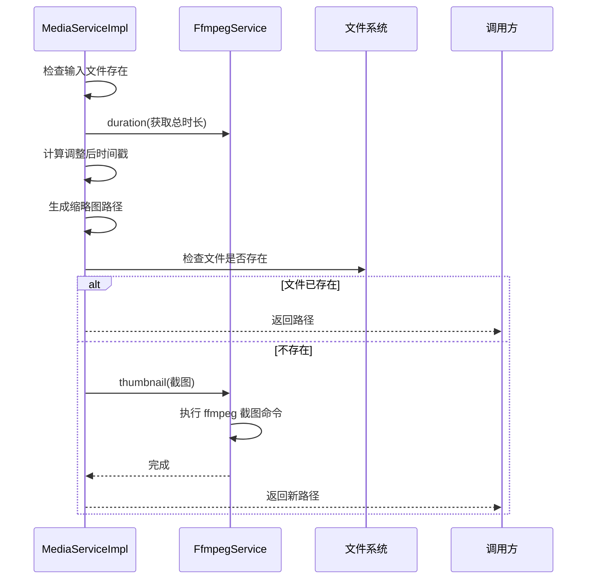
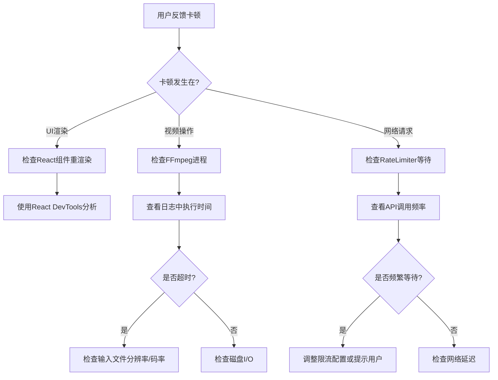

# 性能优化与大规模管理

<cite>
**本文档中引用的文件**  
- [CacheService.ts](file://src/backend/services/impl/CacheService.ts)
- [MediaServiceImpl.ts](file://src/backend/services/impl/MediaServiceImpl.ts)
- [RateLimiter.ts](file://src/common/utils/RateLimiter.ts)
- [db.ts](file://src/backend/db/db.ts)
- [FfmpegServiceImpl.ts](file://src/backend/services/impl/FfmpegServiceImpl.ts)
</cite>

## 目录
1. [引言](#引言)
2. [缓存服务机制分析](#缓存服务机制分析)
3. [媒体服务资源消耗与优化](#媒体服务资源消耗与优化)
4. [速率限制器在API保护中的作用](#速率限制器在api保护中的作用)
5. [SQLite数据库查询优化策略](#sqlite数据库查询优化策略)
6. [性能监控与瓶颈诊断流程](#性能监控与瓶颈诊断流程)
7. [结论](#结论)

## 引言
本文档旨在为管理大型视频库的高级用户提供系统级性能优化策略。通过深入分析核心服务模块，包括缓存机制、媒体处理、请求限流和数据库操作，提出可落地的配置建议与调优方案，以提升系统在高负载场景下的稳定性与响应效率。

## 缓存服务机制分析
缓存服务（`CacheService`）通过内存映射实现高效数据存取，主要用于存储字幕解析结果等结构化数据，避免重复I/O与计算开销。

缓存键采用 `"类型::=::键名"` 的复合格式（如 `cache:srt::文件哈希`），确保不同类型数据隔离存储。该设计支持扩展更多缓存类型，同时保持键空间清晰。

缓存值以JSON字符串形式存储，支持任意可序列化对象。读取时自动反序列化并进行类型断言，保证类型安全。

```mermaid
flowchart TD
A["请求缓存 get(type, key)"] --> B{缓存中存在?}
B --> |是| C[返回 JSON.parse(值)]
B --> |否| D[返回 null]
E["设置缓存 set(type, key, value)"] --> F{值为 null?}
F --> |是| G[直接返回]
F --> |否| H[JSON.stringify 后存入 mapKey(type,key)]
I["删除缓存 delete(type, key)"] --> J[从 Map 删除对应键]
K["清空缓存 clear()"] --> L[调用 Map.clear()]
```

**图示来源**  
- [CacheService.ts](file://src/backend/services/impl/CacheService.ts#L8-L36)

**本节来源**  
- [CacheService.ts](file://src/backend/services/impl/CacheService.ts#L4-L36)

## 媒体服务资源消耗与优化
`MediaServiceImpl` 负责视频缩略图生成与时长获取，其性能直接影响用户界面响应速度，尤其在处理高分辨率视频时需重点关注资源占用。

### 缩略图生成流程
缩略图路径由源文件路径哈希与时间戳组合生成，统一存放于临时目录。若目标文件已存在则直接复用，避免重复处理。

时间戳经 `calculateAdjustedTimestamp` 函数调整：默认取视频中点，限制在有效范围内，并按15秒间隔向下取整，实现时间对齐，提高缓存命中率。

实际截图由 `FfmpegService` 执行，使用 `size: '320x?'` 参数控制输出尺寸，降低内存占用。

### 高分辨率视频优化建议
- **限制并发截图任务数**：通过 `@WaitLock('ffmpeg')` 装饰器确保同一时间仅运行一个FFmpeg实例，防止资源争抢。
- **调整输出尺寸**：前端可请求更小尺寸缩略图（如160px宽），减少GPU与内存压力。
- **异步预生成**：在视频导入后后台批量生成关键帧缩略图，提升后续访问速度。



**图示来源**  
- [MediaServiceImpl.ts](file://src/backend/services/impl/MediaServiceImpl.ts#L28-L49)
- [FfmpegServiceImpl.ts](file://src/backend/services/impl/FfmpegServiceImpl.ts#L111-L138)

**本节来源**  
- [MediaServiceImpl.ts](file://src/backend/services/impl/MediaServiceImpl.ts#L9-L63)
- [FfmpegServiceImpl.ts](file://src/backend/services/impl/FfmpegServiceImpl.ts#L16-L355)

## 速率限制器在API保护中的作用
`RateLimiter` 用于防止对第三方API（如Whisper、GPT、腾讯云）的过度调用，避免触发配额限制或产生额外费用。

### 限流机制
采用滑动时间窗口算法，每个API类型（`RATE_LIMIT_KEY`）独立维护请求时间戳队列。

当前配置如下：
| API类型 | 最大请求数 | 时间窗口（毫秒） |
|--------|-----------|----------------|
| whisper | 10 | 1000 |
| gpt | 10 | 1000 |
| tencent | 4 | 1000 |
| tts | 10 | 1000 |

当请求数超过阈值时，计算需等待的时间（最早请求+窗口时长 - 当前时间），并使用 `setTimeout` 延迟执行，随后递归重试。

### 可调参数建议
- **开发调试**：可临时提高 `maxRequests` 或延长 `timeWindow`，加快测试速度。
- **生产环境**：应根据API提供商的实际配额调整，建议保留20%余量。
- **突发流量**：对于用户主动触发的操作（如转录），可在UI显示预计等待时间，提升体验。

```mermaid
flowchart TD
A["RateLimiter.wait('whisper')"] --> B{是否存在该key队列?}
B --> |否| C[创建空数组]
B --> |是| D[获取时间戳数组]
D --> E[移除超出时间窗口的旧记录]
E --> F{当前请求数 >= 上限?}
F --> |是| G[计算等待时间 = (首条时间 + 窗口) - 当前]
G --> H[await setTimeout(等待时间)]
H --> A
F --> |否| I[添加当前时间戳]
I --> J[返回]
```

**图示来源**  
- [RateLimiter.ts](file://src/common/utils/RateLimiter.ts#L17-L42)

**本节来源**  
- [RateLimiter.ts](file://src/common/utils/RateLimiter.ts#L6-L44)
- [WhisperServiceImpl.ts](file://src/backend/services/impl/WhisperServiceImpl.ts#L46-L155)

## SQLite数据库查询优化策略
系统使用Drizzle ORM操作SQLite数据库，存储视频元数据、标签、播放历史等信息。在大数据量下，合理优化可显著提升查询性能。

### 索引建立建议
- **高频查询字段**：在 `videoClip.filePath`、`tag.name`、`watchHistory.videoPath` 等字段上创建索引。
- **联合索引**：对于复合查询（如按标签和收藏夹筛选），建立 `(collection, tagId)` 等联合索引。
- **外键索引**：确保所有外键字段（如 `clipTagRelation.clipId`）均有索引，加速JOIN操作。

### 事务批处理
- **批量插入/更新**：使用单个事务包裹多条 `INSERT` 或 `UPDATE` 语句，减少磁盘I/O。
- **禁用自动提交**：显式控制事务边界，避免每条语句自动提交带来的开销。
- **WAL模式**：启用Write-Ahead Logging模式，提高并发读写性能。

### 其他优化技巧
- **避免SELECT ***：仅查询所需字段，减少数据传输量。
- **合理使用LIMIT**：分页查询时配合 `OFFSET` 使用，避免加载过多结果。
- **定期VACUUM**：在数据大量删除后执行 `VACUUM` 命令，回收碎片空间。

**本节来源**  
- [db.ts](file://src/backend/db/db.ts#L0-L63)

## 性能监控与瓶颈诊断流程
### 监控工具使用建议
- **Electron DevTools**：监控主线程与渲染进程的CPU、内存占用，识别长时间运行的任务。
- **FFmpeg日志**：启用 `on('progress')` 回调，实时显示转码进度，定位性能瓶颈。
- **自定义日志**：利用 `dpLog` 记录关键操作耗时，便于事后分析。

### 性能瓶颈诊断流程


**图示来源**  
- [FfmpegServiceImpl.ts](file://src/backend/services/impl/FfmpegServiceImpl.ts#L30-L54)
- [RateLimiter.ts](file://src/common/utils/RateLimiter.ts#L17-L42)

**本节来源**  
- [FfmpegServiceImpl.ts](file://src/backend/services/impl/FfmpegServiceImpl.ts#L16-L355)
- [RateLimiter.ts](file://src/common/utils/RateLimiter.ts#L6-L44)

## 结论
通过对缓存、媒体处理、API调用和数据库四大核心模块的深入分析，本文提出了针对大型视频库管理的系统级性能优化策略。建议高级用户根据实际负载情况，合理配置缓存策略、限流参数和数据库索引，并结合监控工具持续优化系统表现，确保在高并发、大数据量场景下的稳定运行。