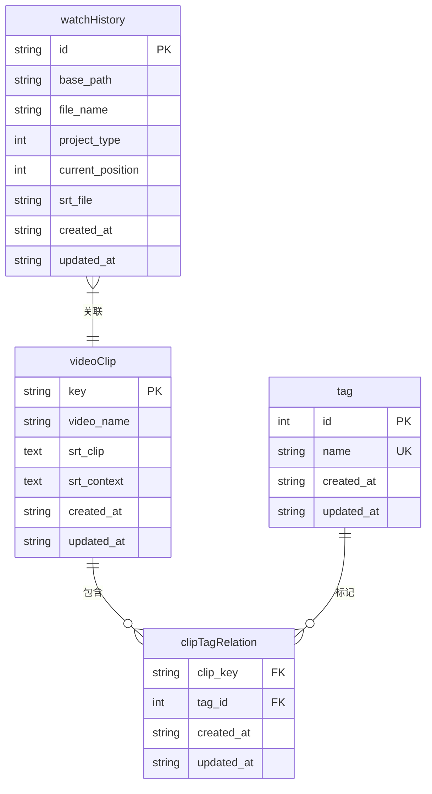

# 数据库性能调优

<cite>
**本文档引用的文件**
- [db.ts](file://src/backend/db/db.ts)
- [SqliteBuilder.ts](file://src/common/utils/SqliteBuilder.ts)
- [migrate.ts](file://src/backend/db/migrate.ts)
- [videoClip.ts](file://src/backend/db/tables/videoClip.ts)
- [watchHistory.ts](file://src/backend/db/tables/watchHistory.ts)
- [tag.ts](file://src/backend/db/tables/tag.ts)
- [clipTagRelation.ts](file://src/backend/db/tables/clipTagRelation.ts)
</cite>

## 目录
1. [引言](#引言)
2. [连接池与PRAGMA参数调优](#连接池与pragma参数调优)
3. [核心表结构与索引优化](#核心表结构与索引优化)
4. [批量插入与事务处理最佳实践](#批量插入与事务处理最佳实践)
5. [数据库迁移策略优化](#数据库迁移策略优化)
6. [慢查询诊断与EXPLAIN使用](#慢查询诊断与explain使用)
7. [总结](#总结)

## 引言
在大规模视频库管理场景中，SQLite作为轻量级嵌入式数据库面临显著的性能瓶颈。本文基于`db.ts`中的连接配置、`SqliteBuilder.ts`中的查询构建逻辑以及`migrate.ts`中的迁移机制，系统性地提出性能调优方案。重点涵盖PRAGMA参数设置、复合索引设计、批量操作优化、迁移策略改进及查询诊断方法，旨在提升读写效率与系统响应速度。

## 连接池与PRAGMA参数调优

SQLite虽无原生连接池，但通过`better-sqlite3`的持久化连接实现类似效果。在`db.ts`中，数据库实例被单例化导出，确保应用生命周期内共享连接，减少频繁打开/关闭的开销。

关键PRAGMA参数对性能影响显著，应在连接初始化时设置：

- **`journal_mode=WAL`**：启用Write-Ahead Logging模式，允许多个读操作与单个写操作并发执行，大幅提升读密集场景性能。
- **`synchronous=NORMAL`**：在数据安全与写入速度间取得平衡。相比`FULL`模式，减少磁盘同步频率，提高写入吞吐量。
- **`cache_size`**：增大内存缓存页数（如-10000表示10MB），减少磁盘I/O，尤其对复杂查询有益。
- **`temp_store=MEMORY`**：将临时表和索引存储于内存，加速排序与连接操作。

这些设置可通过执行`PRAGMA`语句在`db.ts`初始化后立即应用，以优化整体数据库行为。

**Section sources**
- [db.ts](file://src/backend/db/db.ts#L1-L63)

## 核心表结构与索引优化

### 表结构分析
系统包含以下核心表：
- `dp_video_clip`：存储视频片段信息
- `dp_watch_history`：记录用户观看历史
- `dp_tag`：标签定义
- `dp_clip_tag_relation`：片段与标签的多对多关系

### 复合索引建议
为加速高频查询，应在以下字段组合上建立复合索引：

1. **`videoClip`表**：
   - `(video_name, created_at)`：支持按名称和时间范围检索片段
   - `(updated_at)`：用于同步或清理过期数据

2. **`watchHistory`表**：
   - 已存在索引`base_path_file_name_idx`（`base_path`, `file_name`），有效支持路径+文件名的唯一性查询
   - 建议新增`(project_type, current_position)`：优化按项目类型筛选及播放位置排序

3. **`clipTagRelation`表**：
   - 主键`(clip_key, tag_id)`已提供高效关联查询
   - 建议新增`(tag_id, clip_key)`：加速“按标签查找所有片段”的反向查询

4. **`tag`表**：
   - `name`字段已有唯一约束，支持快速标签查找



**Diagram sources**
- [videoClip.ts](file://src/backend/db/tables/videoClip.ts#L3-L20)
- [watchHistory.ts](file://src/backend/db/tables/watchHistory.ts#L3-L18)
- [tag.ts](file://src/backend/db/tables/tag.ts#L3-L12)
- [clipTagRelation.ts](file://src/backend/db/tables/clipTagRelation.ts#L3-L16)

**Section sources**
- [videoClip.ts](file://src/backend/db/tables/videoClip.ts#L3-L20)
- [watchHistory.ts](file://src/backend/db/tables/watchHistory.ts#L3-L18)
- [tag.ts](file://src/backend/db/tables/tag.ts#L3-L12)
- [clipTagRelation.ts](file://src/backend/db/tables/clipTagRelation.ts#L3-L16)

## 批量插入与事务处理最佳实践

`SqliteBuilder.ts`虽主要用于查询构建，但其封装的SQL解析逻辑可为批量操作提供参考。结合Drizzle ORM，应遵循以下最佳实践：

### 1. 显式事务控制
将批量操作包裹在事务中，减少自动提交带来的I/O开销：
```ts
await db.transaction(async (tx) => {
  for (const item of data) {
    await tx.insert(videoClip).values(item);
  }
});
```

### 2. 批量插入优化
使用`insert().values()`接受数组，避免逐条执行：
```ts
await db.insert(videoClip).values(largeDataSet);
```

### 3. 预处理语句复用
Drizzle会自动准备语句，确保在循环插入时复用执行计划，降低解析开销。

### 4. 合理批大小
根据内存与性能测试确定最佳批大小（如100-1000条），避免单次事务过大导致锁争用或内存溢出。

**Section sources**
- [SqliteBuilder.ts](file://src/common/utils/SqliteBuilder.ts#L1-L66)
- [db.ts](file://src/backend/db/db.ts#L1-L63)

## 数据库迁移策略优化

`migrate.ts`中的迁移逻辑存在性能隐患：失败时清空数据库并重试，对大规模数据极不友好。

### 分阶段迁移建议：
1. **预检阶段**：检查目标迁移版本是否已应用，避免重复执行。
2. **增量迁移**：每次仅执行单个迁移文件，记录状态，支持中断恢复。
3. **大表操作优化**：
   - 添加索引时使用`CREATE INDEX CONCURRENTLY`（SQLite不支持，需应用层模拟）
   - 修改表结构时采用“新建表→复制数据→重命名”策略，减少锁表时间
4. **备份机制**：迁移前自动备份数据库文件，防止数据丢失。
5. **进度反馈**：对耗时迁移提供进度提示，提升用户体验。

当前`migrate`函数应重构为异步分步执行，而非一次性调用`drizzle-orm`的`migrate`。

**Section sources**
- [migrate.ts](file://src/backend/db/migrate.ts#L1-L27)

## 慢查询诊断与EXPLAIN使用

### EXPLAIN QUERY PLAN 使用示例
开发者可通过以下步骤诊断慢查询：

1. **获取查询SQL**：从`SqliteBuilder.ts`的`parseQuery`输出或日志中获取实际执行的SQL。
2. **执行解释命令**：
   ```sql
   EXPLAIN QUERY PLAN SELECT * FROM dp_video_clip WHERE video_name = 'example' AND updated_at > '2023-01-01';
   ```
3. **分析输出**：
   - `SEARCH`表示使用了索引
   - `SCAN`表示全表扫描，需优化
   - 检查是否使用了预期的复合索引

### 常见优化场景
- **避免函数包装**：`WHERE datetime(updated_at) > ...` 会阻止索引使用，应直接比较字符串。
- **覆盖索引**：确保查询字段均在索引中，避免回表。
- **参数化查询**：防止SQL注入，同时利于执行计划缓存。

结合Drizzle的查询日志（开发模式开启`logger: true`），可系统性识别并优化性能瓶颈。

**Section sources**
- [SqliteBuilder.ts](file://src/common/utils/SqliteBuilder.ts#L41-L65)
- [db.ts](file://src/backend/db/db.ts#L41-L62)

## 总结
针对DashPlayer的SQLite性能调优需多管齐下：通过PRAGMA参数优化底层行为，为`videoClip`、`watchHistory`等核心表建立复合索引，利用事务和批量插入减少I/O，改进`migrate.ts`的迁移策略以支持大规模数据升级，并借助`EXPLAIN QUERY PLAN`持续监控查询性能。这些措施将显著提升视频库管理的响应速度与用户体验。