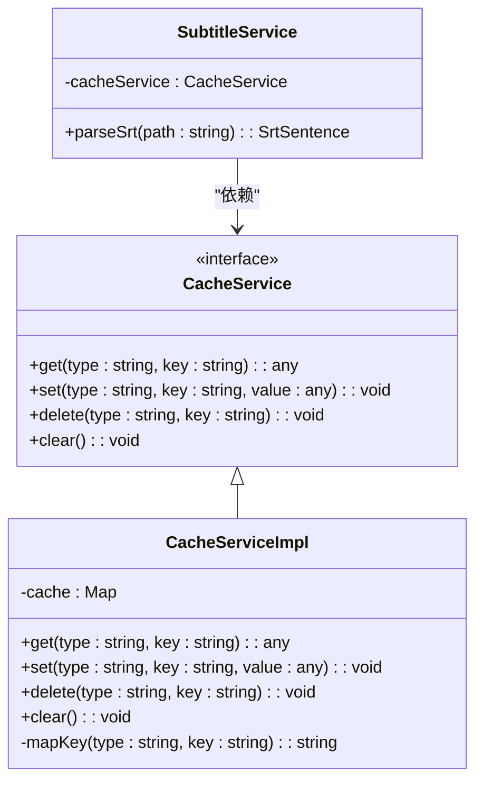
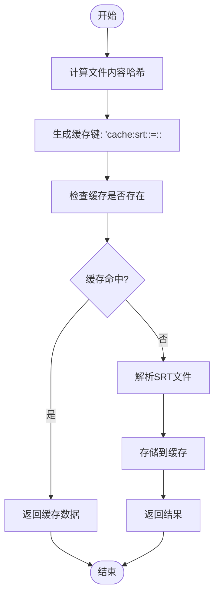
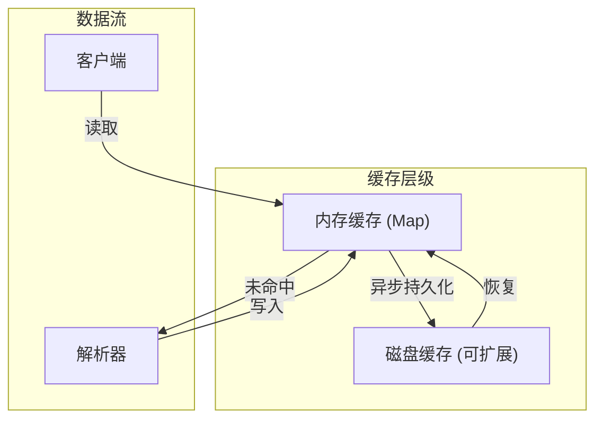
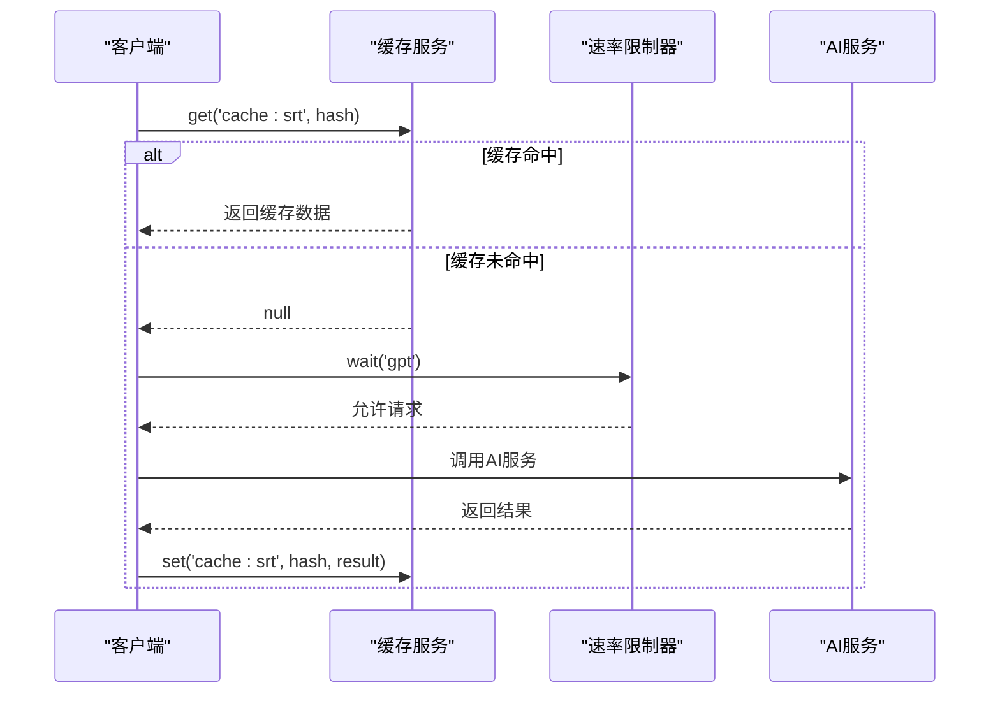
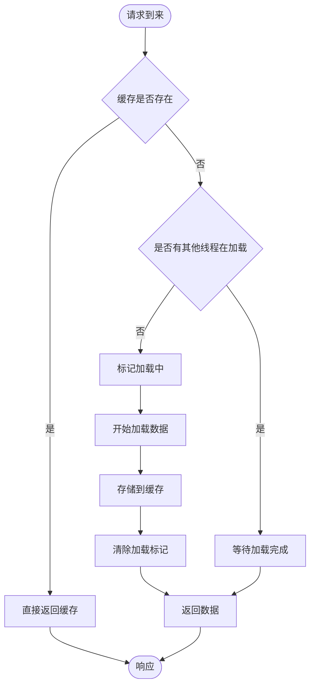
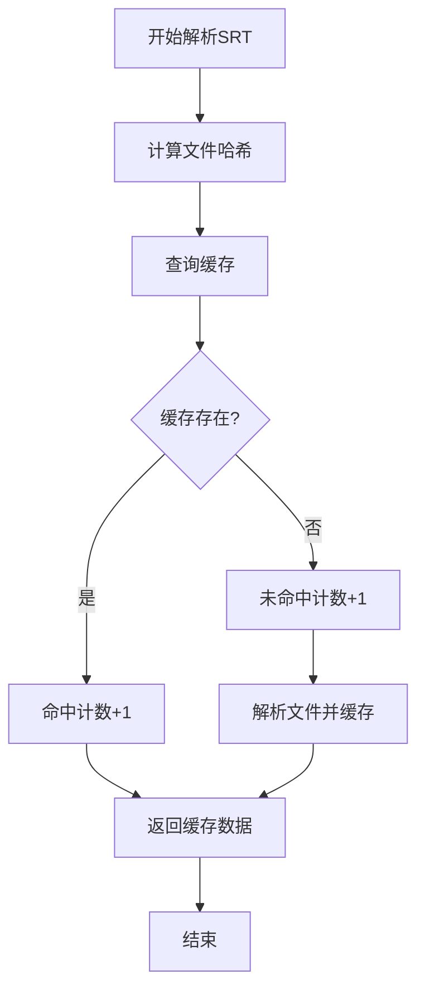
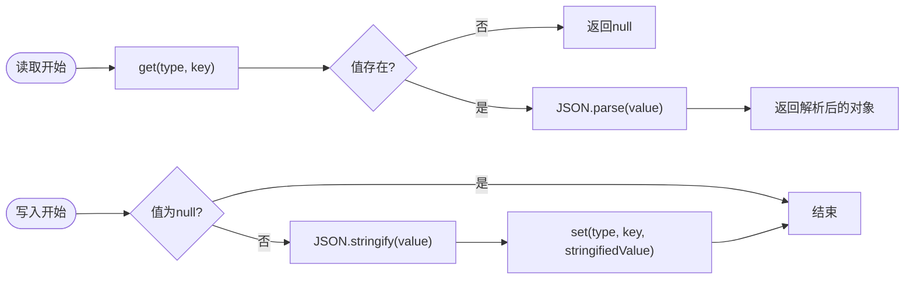

# 缓存机制优化

<cite>
**本文档引用的文件**
- [CacheService.ts](file://src/backend/services/CacheService.ts)
- [CacheServiceImpl.ts](file://src/backend/services/impl/CacheService.ts)
- [SubtitleServiceImpl.ts](file://src/backend/services/impl/SubtitleServiceImpl.ts)
- [RateLimiter.ts](file://src/common/utils/RateLimiter.ts)
- [SrtSentence.tsx](file://src/common/types/SentenceC.tsx)
</cite>

## 目录
1. [引言](#引言)
2. [缓存服务架构](#缓存服务架构)
3. [缓存键设计原则](#缓存键设计原则)
4. [分层缓存结构](#分层缓存结构)
5. [TTL过期策略](#ttl过期策略)
6. [与速率限制器的协同](#与速率限制器的协同)
7. [高并发防护机制](#高并发防护机制)
8. [缓存监控与命中率](#缓存监控与命中率)
9. [缓存读写流程](#缓存读写流程)
10. [异常降级处理](#异常降级处理)

## 引言
缓存服务在DashPlayer中扮演着关键角色，通过减少重复的I/O操作和AI服务调用，显著提升了系统性能和用户体验。本文深入分析`CacheService`的实现机制，探讨其在字幕解析、AI服务调用等场景中的应用，以及如何通过合理的缓存策略优化系统性能。

## 缓存服务架构



**图示来源**
- [CacheService.ts](file://src/backend/services/CacheService.ts#L6-L11)
- [CacheServiceImpl.ts](file://src/backend/services/impl/CacheService.ts#L4-L36)
- [SubtitleServiceImpl.ts](file://src/backend/services/impl/SubtitleServiceImpl.ts#L49-L95)

**本节来源**
- [CacheService.ts](file://src/backend/services/CacheService.ts#L6-L11)
- [CacheServiceImpl.ts](file://src/backend/services/impl/CacheService.ts#L4-L36)

## 缓存键设计原则

缓存键的设计遵循类型+键名的复合结构，通过`mapKey`方法将类型和键名用`::=::`连接，确保键的唯一性和可读性。对于字幕缓存，使用文件内容的哈希值作为键，确保相同内容的字幕文件能够命中缓存。



**图示来源**
- [CacheServiceImpl.ts](file://src/backend/services/impl/CacheService.ts#L34-L36)
- [SubtitleServiceImpl.ts](file://src/backend/services/impl/SubtitleServiceImpl.ts#L49-L95)

**本节来源**
- [CacheServiceImpl.ts](file://src/backend/services/impl/CacheService.ts#L34-L36)
- [SubtitleServiceImpl.ts](file://src/backend/services/impl/SubtitleServiceImpl.ts#L49-L95)

## 分层缓存结构
DashPlayer采用内存缓存作为主要缓存层，使用`Map`数据结构存储序列化后的JSON字符串。这种设计简单高效，适合存储字幕解析结果等中等大小的数据。虽然当前实现未包含磁盘缓存层，但架构上支持通过扩展`CacheService`接口来实现多级缓存。



**图示来源**
- [CacheServiceImpl.ts](file://src/backend/services/impl/CacheService.ts#L6-L8)
- [CacheService.ts](file://src/backend/services/CacheService.ts#L2-L4)

**本节来源**
- [CacheServiceImpl.ts](file://src/backend/services/impl/CacheService.ts#L6-L8)
- [CacheService.ts](file://src/backend/services/CacheService.ts#L2-L4)

## TTL过期策略
当前缓存实现采用无TTL的永久存储策略，依赖应用生命周期管理缓存数据。缓存数据在应用重启后丢失，这种设计简化了缓存管理，避免了复杂的过期清理逻辑。对于需要持久化缓存的场景，可以通过扩展`CacheServiceImpl`添加基于时间的过期机制。

```mermaid
stateDiagram-v2
[*] --> Active
Active --> Set["set(key, value)"]
Set --> Stored["数据存储"]
Active --> Get["get(key)"]
Get --> Hit{"缓存命中?"}
Hit --> |是| ReturnData["返回数据"]
Hit --> |否| ReturnNull["返回null"]
Active --> Clear["clear()"]
Clear --> Cleared["清空所有缓存"]
Stored --> AppRestart["应用重启"]
AppRestart --> Cleared
ReturnData --> Active
ReturnNull --> Active
Cleared --> Active
```

**图示来源**
- [CacheServiceImpl.ts](file://src/backend/services/impl/CacheService.ts#L24-L26)
- [CacheServiceImpl.ts](file://src/backend/services/impl/CacheService.ts#L16-L18)

**本节来源**
- [CacheServiceImpl.ts](file://src/backend/services/impl/CacheService.ts#L16-L18)
- [CacheServiceImpl.ts](file://src/backend/services/impl/CacheService.ts#L24-L26)

## 与速率限制器的协同



**图示来源**
- [RateLimiter.ts](file://src/common/utils/RateLimiter.ts#L14-L43)
- [ChatServiceImpl.ts](file://src/backend/services/impl/ChatServiceImpl.ts#L52-L53)
- [CacheServiceImpl.ts](file://src/backend/services/impl/CacheService.ts#L12-L14)

**本节来源**
- [RateLimiter.ts](file://src/common/utils/RateLimiter.ts#L14-L43)
- [ChatServiceImpl.ts](file://src/backend/services/impl/ChatServiceImpl.ts#L52-L53)

## 高并发防护机制
在高并发场景下，缓存服务通过内存Map的原子操作保证线程安全。对于缓存击穿问题，采用互斥锁或双重检查机制可进一步优化，但当前实现依赖上层业务逻辑控制并发访问。对于缓存雪崩，由于采用永久存储策略，不存在集体过期问题。



**图示来源**
- [SubtitleServiceImpl.ts](file://src/backend/services/impl/SubtitleServiceImpl.ts#L49-L95)
- [CacheServiceImpl.ts](file://src/backend/services/impl/CacheService.ts#L12-L14)

**本节来源**
- [SubtitleServiceImpl.ts](file://src/backend/services/impl/SubtitleServiceImpl.ts#L49-L95)

## 缓存监控与命中率
通过分析`SubtitleServiceImpl`中的缓存使用情况，可以统计缓存命中率。在`parseSrt`方法中，通过检查`cacheService.get`的返回值是否为null来判断缓存命中情况。建议添加监控日志记录缓存命中/未命中次数，以便评估缓存效果。



**图示来源**
- [SubtitleServiceImpl.ts](file://src/backend/services/impl/SubtitleServiceImpl.ts#L49-L95)
- [CacheServiceImpl.ts](file://src/backend/services/impl/CacheService.ts#L12-L14)

**本节来源**
- [SubtitleServiceImpl.ts](file://src/backend/services/impl/SubtitleServiceImpl.ts#L49-L95)

## 缓存读写流程
缓存读写流程遵循标准的缓存模式：先查询缓存，命中则直接返回；未命中则执行实际操作，将结果存入缓存后再返回。读取时对JSON字符串进行反序列化，写入时对对象进行序列化，确保持久化存储。



**图示来源**
- [CacheServiceImpl.ts](file://src/backend/services/impl/CacheService.ts#L12-L18)
- [CacheServiceImpl.ts](file://src/backend/services/impl/CacheService.ts#L20-L28)

**本节来源**
- [CacheServiceImpl.ts](file://src/backend/services/impl/CacheService.ts#L12-L28)

## 异常降级处理
当缓存服务出现异常时，系统会降级到直接解析文件的模式。由于缓存操作被设计为非阻塞性的，即使缓存读写失败，也不会影响核心功能的执行。对于序列化/反序列化异常，当前实现直接返回null，确保不会抛出异常中断正常流程。

```mermaid
flowchart TD
A([缓存读取]) --> B[get(type, key)]
B --> C{返回值检查}
C --> |undefined/null| D[返回null]
C --> |有值| E[尝试JSON.parse]
E --> F{解析成功?}
F --> |是| G[返回解析结果]
F --> |否| H[记录错误日志]
H --> I[返回null]
J([缓存写入]) --> K{值为null?}
K --> |是| L[直接返回]
K --> |否| M[尝试JSON.stringify]
M --> N{序列化成功?}
N --> |是| O[set(key, stringified)]
N --> |否| P[记录错误日志]
O --> Q[返回]
P --> Q
```

**图示来源**
- [CacheServiceImpl.ts](file://src/backend/services/impl/CacheService.ts#L12-L18)
- [CacheServiceImpl.ts](file://src/backend/services/impl/CacheService.ts#L20-L22)

**本节来源**
- [CacheServiceImpl.ts](file://src/backend/services/impl/CacheService.ts#L12-L22)