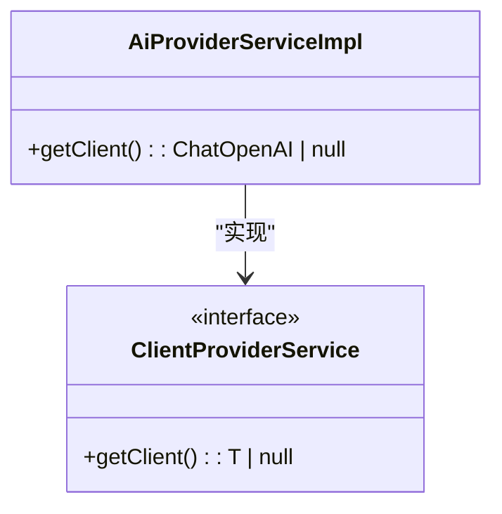
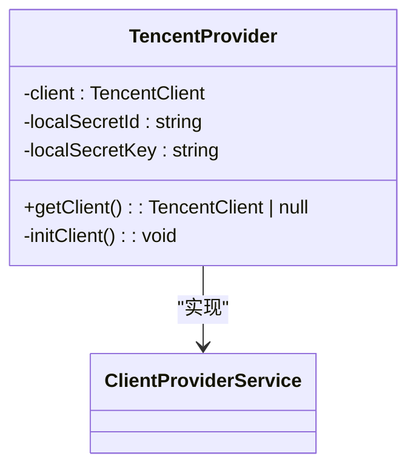
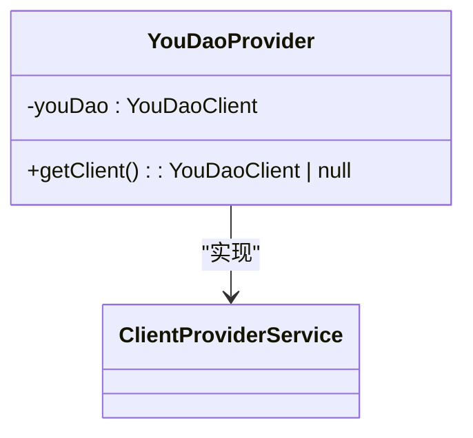
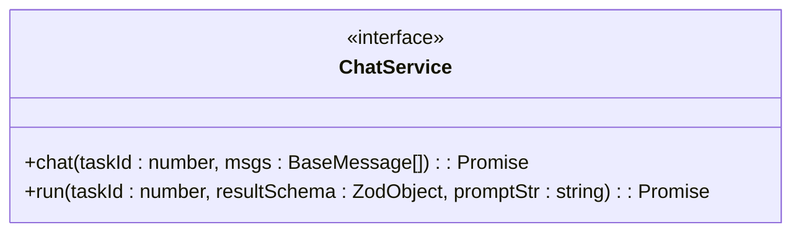
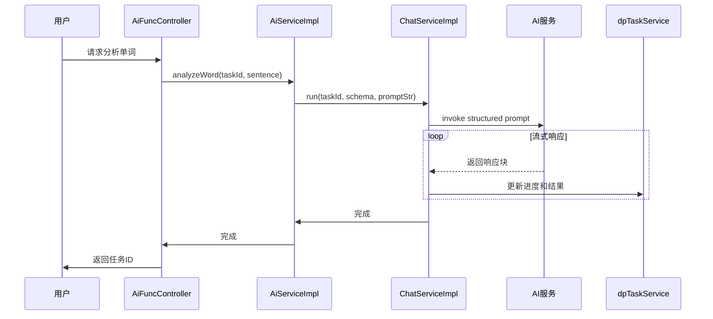
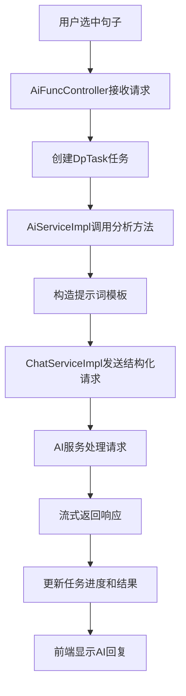

# AI提示词工程原理

<cite>
**本文档引用的文件**  
- [analyze-word.ts](file://src/backend/services/prompts/analyze-word.ts)
- [analyze-phrases.ts](file://src/backend/services/prompts/analyze-phrases.ts)
- [analyze-grammer.ts](file://src/backend/services/prompts/analyze-grammer.ts)
- [ChatServiceImpl.ts](file://src/backend/services/impl/ChatServiceImpl.ts)
- [AiProviderServiceImpl.ts](file://src/backend/services/impl/clients/AiProviderServiceImpl.ts)
- [TencentProvider.ts](file://src/backend/services/impl/clients/TencentProvider.ts)
- [YouDaoProvider.ts](file://src/backend/services/impl/clients/YouDaoProvider.ts)
- [AiFuncController.ts](file://src/backend/controllers/AiFuncController.ts)
- [AiServiceImpl.ts](file://src/backend/services/AiServiceImpl.ts)
- [ChatService.ts](file://src/backend/services/ChatService.ts)
- [ClientProviderService.ts](file://src/backend/services/ClientProviderService.ts)
</cite>

## 目录
1. [引言](#引言)
2. [提示模板结构设计](#提示模板结构设计)
3. [AI服务调用流程](#ai服务调用流程)
4. [多语言分析场景支持](#多语言分析场景支持)
5. [请求构造与响应解析](#请求构造与响应解析)
6. [错误重试与流式响应策略](#错误重试与流式响应策略)
7. [完整调用链路分析](#完整调用链路分析)
8. [模板可维护性与扩展性](#模板可维护性与扩展性)
9. [结论](#结论)

## 引言
DashPlayer通过集成OpenAI、腾讯云和有道AI服务，实现了基于AI的英语学习辅助功能。系统通过精心设计的提示词模板，支持单词释义、短语搭配识别、语法结构解析等多种语言分析场景。本文深入解析其AI提示词工程的实现机制，涵盖提示模板结构、动态变量注入、多AI服务调用流程及系统扩展性设计。

## 提示模板结构设计

DashPlayer在`src/backend/services/prompts/`目录下定义了多个提示模板，分别用于不同语言分析任务。这些模板采用函数式设计，接受动态参数并返回格式化的提示字符串。

### 单词分析模板
`analyze-word.ts`中定义的`analyzeWordsPrompt`函数用于识别句子中中等难度以上的英文单词，并提供中文翻译。模板通过注入用户选中的句子`${s}`实现上下文感知。

**Section sources**
- [analyze-word.ts](file://src/backend/services/prompts/analyze-word.ts#L0-L6)

### 短语分析模板
`analyze-phrases.ts`中的`analyzePhrasesPrompt`函数专注于识别英语中的短语、词组和固定搭配。模板明确指示AI角色为“帮助用户学习英语”，增强语义引导。

**Section sources**
- [analyze-phrases.ts](file://src/backend/services/prompts/analyze-phrases.ts#L0-L6)

### 语法分析模板
`analyze-grammer.ts`中的`analyzeGrammarPrompt`函数将AI定位为“专业语法分析器”，要求使用中文解释英文句子的语法结构。模板通过三重引号包裹输入句子，确保格式清晰。

**Section sources**
- [analyze-grammer.ts](file://src/backend/services/prompts/analyze-grammer.ts#L0-L11)

## AI服务调用流程

系统通过依赖注入（Inversify）实现AI服务的统一管理与调用，支持OpenAI、腾讯云和有道三种AI提供商。

### OpenAI服务实现
`AiProviderServiceImpl.ts`实现了`ClientProviderService<ChatOpenAI>`接口，通过`storeGet`获取API密钥和端点，动态创建`ChatOpenAI`实例。默认模型为`gpt-4o-mini`，支持自定义温度和基础URL。

**Diagram sources**
- [AiProviderServiceImpl.ts](file://src/backend/services/impl/clients/AiProviderServiceImpl.ts#L8-L30)

### 腾讯云服务实现
`TencentProvider.ts`通过`TencentClient`封装腾讯云API调用。采用懒加载模式，仅当密钥变更时重新初始化客户端，提升性能。

**Diagram sources**
- [TencentProvider.ts](file://src/backend/services/impl/clients/TencentProvider.ts#L7-L42)

### 有道AI服务实现
`YouDaoProvider.ts`通过`YouDaoClient`调用有道翻译API。支持动态更新配置，包括源语言（中文）和目标语言（英文）。

**Diagram sources**
- [YouDaoProvider.ts](file://src/backend/services/impl/clients/YouDaoProvider.ts#L7-L31)

## 多语言分析场景支持

系统通过不同的提示模板和Zod模式定义，支持多种语言分析场景：

| 分析类型 | 提示模板 | 输出结构 | 应用场景 |
|---------|--------|--------|--------|
| 单词分析 | analyzeWordsPrompt | 包含单词、音标、中文释义的数组 | 词汇学习 |
| 短语分析 | analyzePhrasesPrompt | 包含短语和中文释义的数组 | 搭配识别 |
| 语法分析 | analyzeGrammarPrompt | 自由文本解释 | 语法理解 |
| 例句生成 | exampleSentences | 包含例句、释义和知识点的数组 | 语境学习 |
| 同义句生成 | synonymousSentence | 同义句数组 | 表达多样性 |

**Section sources**
- [analyze-word.ts](file://src/backend/services/prompts/analyze-word.ts)
- [analyze-phrases.ts](file://src/backend/services/prompts/analyze-phrases.ts)
- [analyze-grammer.ts](file://src/backend/services/prompts/analyze-grammer.ts)

## 请求构造与响应解析

### ChatService接口定义
`ChatService.ts`定义了统一的AI交互接口，支持普通聊天和结构化输出两种模式。

**Diagram sources**
- [ChatService.ts](file://src/backend/services/ChatService.ts#L3-L6)

### 结构化请求处理
`ChatServiceImpl.ts`通过`withStructuredOutput`方法实现结构化响应。系统使用Zod定义输出模式，确保AI返回的数据格式符合预期，便于前端解析。

**Section sources**
- [ChatServiceImpl.ts](file://src/backend/services/impl/ChatServiceImpl.ts#L12-L88)

## 错误重试与流式响应策略

### 速率限制与错误处理
系统通过`RateLimiter.wait('gpt')`实现请求节流，防止API调用过于频繁。当API密钥或端点为空时，通过`dpTaskService.fail`记录错误状态。

### 流式响应支持
系统支持流式响应模式，通过`storeGet('apiKeys.openAi.stream')`配置开关。启用时，AI响应逐块返回，实时更新任务进度和结果。

**Diagram sources**
- [ChatServiceImpl.ts](file://src/backend/services/impl/ChatServiceImpl.ts#L12-L88)
- [AiServiceImpl.ts](file://src/backend/services/AiServiceImpl.ts#L45-L153)

## 完整调用链路分析

从用户选中文字到生成AI回复的完整流程如下：

1. 用户在前端界面选中句子，触发分析请求
2. `AiFuncController`接收HTTP请求，创建任务ID
3. 调用`AiServiceImpl`对应分析方法
4. 构造提示词并调用`ChatService.run`
5. `ChatServiceImpl`获取AI客户端，发送结构化请求
6. AI服务返回响应，结果通过任务系统异步更新
7. 前端监听任务状态，实时显示AI回复

**Diagram sources**
- [AiFuncController.ts](file://src/backend/controllers/AiFuncController.ts#L12-L129)
- [AiServiceImpl.ts](file://src/backend/services/AiServiceImpl.ts#L45-L153)

## 模板可维护性与扩展性

### 模块化设计
提示模板独立存放于`prompts`目录，与业务逻辑分离，便于维护和测试。

### 扩展性支持
系统设计支持新增AI模型或语言类型：
- 新增AI提供商：实现`ClientProviderService`接口
- 新增分析类型：定义新提示模板和Zod模式
- 新增语言支持：修改`YouDaoClient`配置中的`from/to`字段

### 依赖注入优势
通过Inversify实现依赖注入，使得AI服务的替换和测试更加灵活，符合开闭原则。

**Section sources**
- [AiProviderServiceImpl.ts](file://src/backend/services/impl/clients/AiProviderServiceImpl.ts)
- [TencentProvider.ts](file://src/backend/services/impl/clients/TencentProvider.ts)
- [YouDaoProvider.ts](file://src/backend/services/impl/clients/YouDaoProvider.ts)

## 结论
DashPlayer的AI提示词工程通过模块化模板设计、结构化输出、多AI服务集成和流式响应等机制，构建了一个高效、可扩展的英语学习辅助系统。其设计充分考虑了可维护性和扩展性，为支持更多AI模型和语言分析场景奠定了坚实基础。