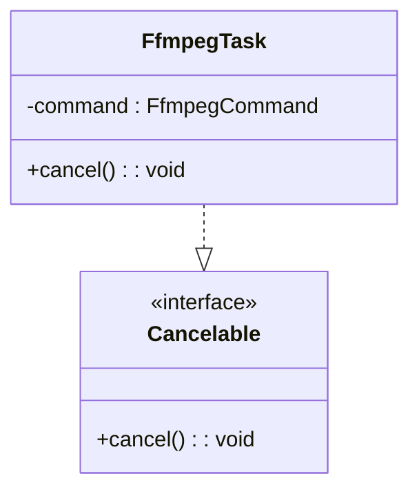
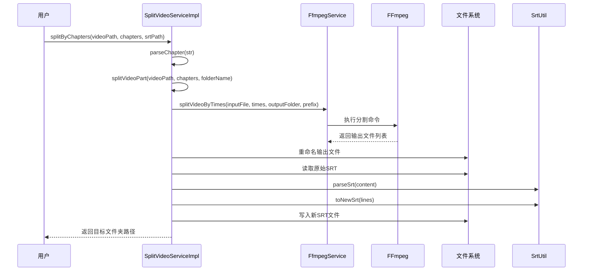

# 技术原理详解

<cite>
**本文档引用的文件**  
- [analyze-word.ts](file://src/backend/services/prompts/analyze-word.ts)
- [analyze-phrases.ts](file://src/backend/services/prompts/analyze-phrases.ts)
- [analyze-grammer.ts](file://src/backend/services/prompts/analyze-grammer.ts)
- [SplitVideoServiceImpl.ts](file://src/backend/services/impl/SplitVideoServiceImpl.ts)
- [FfmpegTask.ts](file://src/backend/objs/FfmpegTask.ts)
- [FfmpegService.ts](file://src/backend/services/FfmpegService.ts)
</cite>

## 目录
1. [引言](#引言)
2. [AI提示词工程设计机制](#ai提示词工程设计机制)
3. [视频切割算法实现逻辑](#视频切割算法实现逻辑)
4. [音频处理流程与性能优化](#音频处理流程与性能优化)
5. [关键函数调用链路分析](#关键函数调用链路分析)
6. [设计决策中的权衡考量](#设计决策中的权衡考量)
7. [结论](#结论)

## 引言
DashPlayer 是一个集视频播放、AI辅助学习、字幕处理与媒体分割于一体的多功能工具。其核心技术涵盖自然语言处理、音视频处理调度以及高性能任务管理。本文将深入解析其实现原理，重点剖析AI提示词模板机制、视频精准分割算法及FFmpeg任务调度策略。

## AI提示词工程设计机制

DashPlayer 的语言分析功能依赖于精心设计的提示词模板系统，分别用于单词、短语和语法的解析。这些模板通过结构化输入引导AI模型输出符合中文用户学习习惯的结果。

### 单词分析提示模板
该模板旨在识别句子中对中等英文水平学习者而言较难理解的词汇，并提供准确的中文翻译。提示结构简洁明了，直接要求模型从给定句子中提取关键词汇并翻译。

**Section sources**  
- [analyze-word.ts](file://src/backend/services/prompts/analyze-word.ts#L1-L7)

### 短语分析提示模板
此模板专注于识别英语中的固定搭配、习语或常用短语（phrases），并给出对应的中文释义。它明确设定了AI的角色为“英语学习助手”，增强了上下文语义引导，提升输出的相关性与教育价值。

**Section sources**  
- [analyze-phrases.ts](file://src/backend/services/prompts/analyze-phrases.ts#L1-L7)

### 语法分析提示模板
语法分析采用更专业的角色设定：“专业语法分析员”，目标是帮助中文母语者理解英文句子的语法结构。提示中使用三重引号包裹待分析句子，确保输入内容边界清晰，避免解析歧义。整个提示以中文指令结尾，强制模型使用中文进行详细解释。

**Section sources**  
- [analyze-grammer.ts](file://src/backend/services/prompts/analyze-grammer.ts#L1-L12)

## 视频切割算法实现逻辑

DashPlayer 支持基于时间戳或章节信息对长视频进行智能分割，核心逻辑由 `SplitVideoServiceImpl.ts` 实现，结合 `FfmpegService` 完成实际的媒体处理任务。

### 分割流程概述
1. **章节解析**：接收用户输入的章节文本，调用 `parseChapter` 工具函数解析出标题与起始时间戳。
2. **视频分割**：根据解析出的时间点，调用 FFmpeg 按时间切割视频，生成多个片段。
3. **字幕同步**：若存在原始字幕文件（SRT），则按各片段的时间范围重新切分字幕，并生成对应的新 SRT 文件。
4. **文件重命名与组织**：将输出的视频片段按“时间戳-标题”格式重命名，并统一存放于以原视频名命名的子目录中。

### 时间戳处理与精度控制
系统使用 `TimeUtil.parseDuration` 将字符串形式的时间戳（如 `00:05:30`）转换为秒级数值，确保时间计算的准确性。在字幕切分时引入 `-0.2` 秒的偏移量（`offset`），用于补偿音画同步误差，提升用户体验。

### 字幕切分逻辑
字幕切分采用区间交集判断法：对于每个视频片段的时间区间 `[start, end]`，筛选出所有与其有重叠的原始字幕行。然后将这些字幕的时间基准调整为片段内的相对时间，并限制在片段持续时间内，防止越界。

**Section sources**  
- [SplitVideoServiceImpl.ts](file://src/backend/services/impl/SplitVideoServiceImpl.ts#L1-L118)

## 音频处理流程与性能优化

### FFmpeg任务调度机制
所有音视频操作均通过 `FfmpegService` 封装的 FFmpeg 命令执行。每个任务被封装为 `FfmpegTask` 类实例，实现 `Cancelable` 接口，支持运行时中断。

#### 任务取消机制
`FfmpegTask` 持有 `fluent-ffmpeg` 的命令实例，通过调用 `command.kill('SIGKILL')` 实现强制终止，确保资源及时释放，避免僵尸进程。

**Diagram sources**  
- [FfmpegTask.ts](file://src/backend/objs/FfmpegTask.ts#L1-L15)

### 音视频同步策略
在视频分割过程中，音频作为视频流的一部分被自动处理，保证音画同步。字幕文件则通过时间偏移与片段对齐，确保文本与音视频内容一致。

### 性能优化手段
- **异步非阻塞IO**：文件读写、FFmpeg执行均采用异步方式，避免主线程阻塞。
- **批量操作**：字幕切分采用批量过滤与映射，减少重复遍历开销。
- **缓存目录结构**：输出目录按视频名称自动创建，避免频繁路径判断。
- **哈希前缀命名**：临时文件使用视频路径的哈希值作为前缀，防止命名冲突。

## 关键函数调用链路分析

以下是视频分割功能的核心调用链：

**Diagram sources**  
- [SplitVideoServiceImpl.ts](file://src/backend/services/impl/SplitVideoServiceImpl.ts#L1-L118)
- [FfmpegService.ts](file://src/backend/services/FfmpegService.ts#L1-L50)

## 设计决策中的权衡考量

### 精度与速度的平衡
- **时间精度**：采用浮点数表示时间（秒），支持亚秒级切割，满足高精度需求。
- **处理速度**：避免逐帧分析，直接使用 FFmpeg 的 `-ss` 和 `-t` 参数进行快速剪辑，牺牲少量精度换取高效处理。

### 内存占用控制
- **流式处理**：字幕文件逐行解析与写入，避免一次性加载大文件至内存。
- **对象复用**：`FfmpegTask` 实例在任务完成后即被销毁，防止内存泄漏。
- **临时文件管理**：使用唯一哈希前缀命名临时输出，避免缓存堆积。

### 可维护性与扩展性
- **依赖注入**：通过 Inversify 实现服务解耦，便于单元测试与功能替换。
- **模块化设计**：提示词、解析器、服务层职责分明，支持新增分析类型（如发音、语调）而无需修改核心逻辑。

## 结论
DashPlayer 通过精细的提示词工程实现了高效的语言学习辅助功能，结合 FFmpeg 强大的音视频处理能力，构建了一套稳定、可扩展的媒体分割与分析系统。其设计充分考虑了用户体验、性能表现与系统健壮性，在精度、速度与资源消耗之间取得了良好平衡。未来可进一步引入AI驱动的智能章节识别与自适应字幕生成，提升自动化水平。