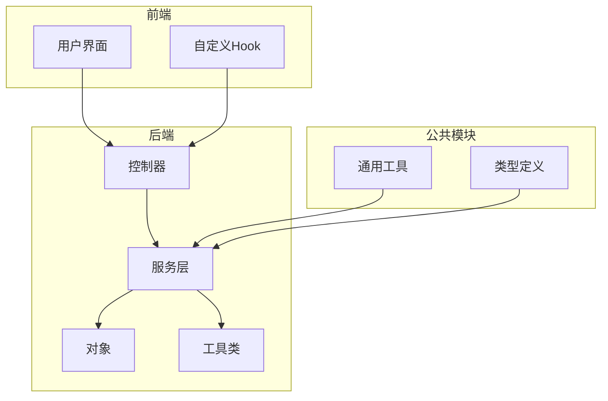
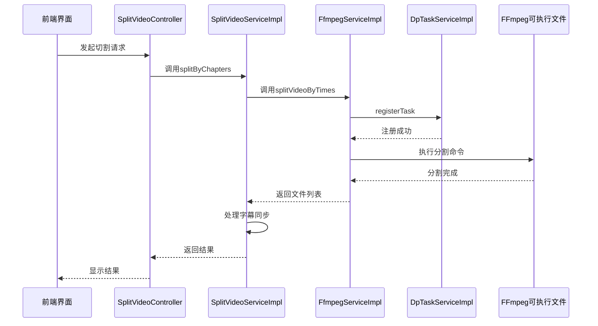
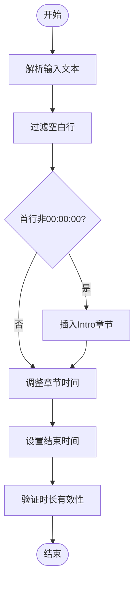
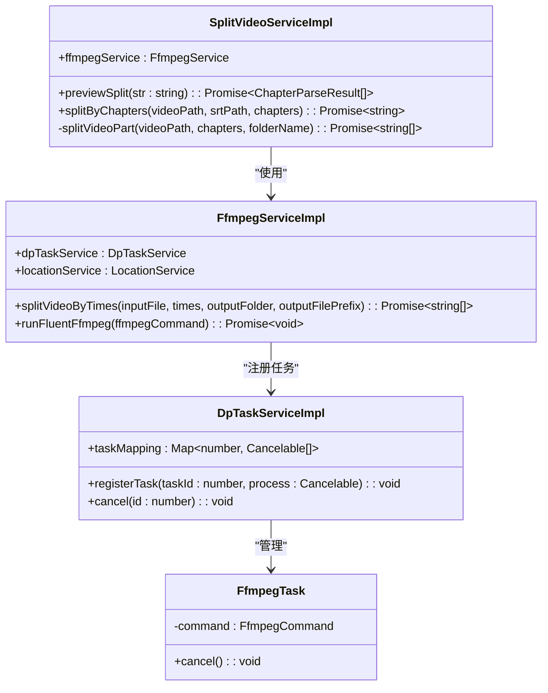
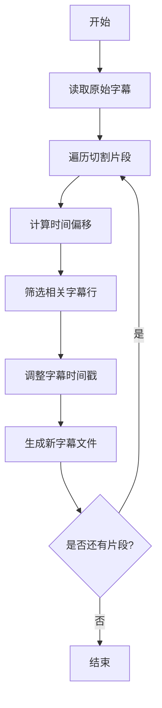

# 视频切割算法实现

<cite>
**本文档引用的文件**
- [SplitVideoServiceImpl.ts](file://src/backend/services/impl/SplitVideoServiceImpl.ts)
- [FfmpegServiceImpl.ts](file://src/backend/services/impl/FfmpegServiceImpl.ts)
- [FfmpegTask.ts](file://src/backend/objs/FfmpegTask.ts)
- [chapter-parser.ts](file://src/common/utils/praser/chapter-parser.ts)
- [SrtUtil.ts](file://src/common/utils/SrtUtil.ts)
- [DpTaskServiceImpl.ts](file://src/backend/services/impl/DpTaskServiceImpl.ts)
</cite>

## 目录
1. [简介](#简介)
2. [项目结构](#项目结构)
3. [核心组件](#核心组件)
4. [架构概述](#架构概述)
5. [详细组件分析](#详细组件分析)
6. [依赖分析](#依赖分析)
7. [性能考虑](#性能考虑)
8. [故障排除指南](#故障排除指南)
9. [结论](#结论)

## 简介
本文档全面解析DashPlayer视频切割功能的技术实现。基于`SplitVideoServiceImpl.ts`详细说明切割逻辑，包括基于时间戳区间、章节标记或用户自定义片段的分割策略，阐述任务调度机制与`FfmpegTask.ts`的集成方式，如何通过FFmpeg命令行参数实现无损切割与格式转换。解释音视频同步处理方案，确保输出片段中音频与字幕精准对齐。结合实际代码示例展示任务队列管理、进度反馈及异常处理（如文件锁定、磁盘空间不足）。分析性能优化措施，如并行处理限制、内存缓冲控制及临时文件管理策略。

## 项目结构
DashPlayer项目采用分层架构设计，主要分为前端（fronted）、后端（backend）和公共模块（common）。后端服务通过TypeScript实现，利用Inversify进行依赖注入，Drizzle ORM管理数据库操作。视频处理核心逻辑位于`src/backend/services/impl`目录下，其中`SplitVideoServiceImpl.ts`负责视频切割功能，`FfmpegServiceImpl.ts`封装FFmpeg调用，`DpTaskServiceImpl.ts`管理任务生命周期。

**图表来源**
- [SplitVideoServiceImpl.ts](file://src/backend/services/impl/SplitVideoServiceImpl.ts)
- [FfmpegServiceImpl.ts](file://src/backend/services/impl/FfmpegServiceImpl.ts)
- [DpTaskServiceImpl.ts](file://src/backend/services/impl/DpTaskServiceImpl.ts)

**本节来源**
- [SplitVideoServiceImpl.ts](file://src/backend/services/impl/SplitVideoServiceImpl.ts)
- [FfmpegServiceImpl.ts](file://src/backend/services/impl/FfmpegServiceImpl.ts)

## 核心组件
视频切割功能的核心组件包括`SplitVideoServiceImpl`、`FfmpegServiceImpl`和`DpTaskServiceImpl`。`SplitVideoServiceImpl`作为高层服务，接收切割请求并协调底层组件完成任务。`FfmpegServiceImpl`封装FFmpeg命令行调用，提供视频分割、格式转换等基础能力。`DpTaskServiceImpl`负责任务调度与状态管理，确保长时间运行的任务可被追踪、取消或恢复。

**本节来源**
- [SplitVideoServiceImpl.ts](file://src/backend/services/impl/SplitVideoServiceImpl.ts#L1-L117)
- [FfmpegServiceImpl.ts](file://src/backend/services/impl/FfmpegServiceImpl.ts#L1-L355)
- [DpTaskServiceImpl.ts](file://src/backend/services/impl/DpTaskServiceImpl.ts#L1-L193)

## 架构概述
系统采用典型的分层架构，前端通过Electron API调用后端控制器，控制器将请求转发给对应的服务实现。服务层通过依赖注入获取所需组件，如FFmpeg服务、任务服务等，完成具体业务逻辑。FFmpeg服务通过`fluent-ffmpeg`库构建命令行参数，调用本地FFmpeg可执行文件完成音视频处理。任务服务利用LRU缓存和数据库持久化结合的方式，高效管理任务状态。

**图表来源**
- [SplitVideoServiceImpl.ts](file://src/backend/services/impl/SplitVideoServiceImpl.ts#L1-L117)
- [FfmpegServiceImpl.ts](file://src/backend/services/impl/FfmpegServiceImpl.ts#L1-L355)
- [DpTaskServiceImpl.ts](file://src/backend/services/impl/DpTaskServiceImpl.ts#L1-L193)

## 详细组件分析

### 视频切割服务分析
`SplitVideoServiceImpl`实现了`SplitVideoService`接口，提供`previewSplit`和`splitByChapters`两个核心方法。`previewSplit`用于预览章节解析结果，`splitByChapters`执行实际的视频切割操作。

#### 章节解析逻辑

**图表来源**
- [chapter-parser.ts](file://src/common/utils/praser/chapter-parser.ts#L1-L67)

**本节来源**
- [chapter-parser.ts](file://src/common/utils/praser/chapter-parser.ts#L1-L67)

#### 视频切割流程

**图表来源**
- [SplitVideoServiceImpl.ts](file://src/backend/services/impl/SplitVideoServiceImpl.ts#L1-L117)
- [FfmpegServiceImpl.ts](file://src/backend/services/impl/FfmpegServiceImpl.ts#L1-L355)
- [DpTaskServiceImpl.ts](file://src/backend/services/impl/DpTaskServiceImpl.ts#L1-L193)
- [FfmpegTask.ts](file://src/backend/objs/FfmpegTask.ts#L1-L13)

**本节来源**
- [SplitVideoServiceImpl.ts](file://src/backend/services/impl/SplitVideoServiceImpl.ts#L1-L117)
- [FfmpegServiceImpl.ts](file://src/backend/services/impl/FfmpegServiceImpl.ts#L1-L355)

### 音视频同步处理
系统通过精确的时间偏移计算，确保切割后的视频片段与字幕文件保持同步。在`splitByChapters`方法中，每生成一个视频片段，都会计算其相对于原始视频的起始时间偏移，并据此调整字幕时间戳。

**图表来源**
- [SplitVideoServiceImpl.ts](file://src/backend/services/impl/SplitVideoServiceImpl.ts#L30-L75)
- [SrtUtil.ts](file://src/common/utils/SrtUtil.ts#L1-L148)

**本节来源**
- [SplitVideoServiceImpl.ts](file://src/backend/services/impl/SplitVideoServiceImpl.ts#L30-L75)
- [SrtUtil.ts](file://src/common/utils/SrtUtil.ts#L1-L148)

## 依赖分析
系统各组件间存在明确的依赖关系。`SplitVideoServiceImpl`依赖`FfmpegService`执行底层音视频处理，`FfmpegServiceImpl`依赖`DpTaskService`进行任务管理，`DpTaskServiceImpl`则通过`Cancelable`接口与`FfmpegTask`交互，实现任务取消功能。

**图表来源**
- [SplitVideoServiceImpl.ts](file://src/backend/services/impl/SplitVideoServiceImpl.ts#L1-L117)
- [FfmpegServiceImpl.ts](file://src/backend/services/impl/FfmpegServiceImpl.ts#L1-L355)
- [DpTaskServiceImpl.ts](file://src/backend/services/impl/DpTaskServiceImpl.ts#L1-L193)
- [FfmpegTask.ts](file://src/backend/objs/FfmpegTask.ts#L1-L13)

**本节来源**
- [SplitVideoServiceImpl.ts](file://src/backend/services/impl/SplitVideoServiceImpl.ts#L1-L117)
- [FfmpegServiceImpl.ts](file://src/backend/services/impl/FfmpegServiceImpl.ts#L1-L355)
- [DpTaskServiceImpl.ts](file://src/backend/services/impl/DpTaskServiceImpl.ts#L1-L193)

## 性能考虑
系统通过多种机制优化性能。`Lock`类限制同时运行的FFmpeg进程数量，防止资源耗尽。`DpTaskServiceImpl`使用LRU缓存减少数据库访问频率。`FfmpegServiceImpl`通过`-c copy`参数实现无损切割，避免重新编码带来的性能开销。任务状态通过异步更新机制持久化，避免阻塞主线程。

**本节来源**
- [FfmpegServiceImpl.ts](file://src/backend/services/impl/FfmpegServiceImpl.ts#L1-L355)
- [DpTaskServiceImpl.ts](file://src/backend/services/impl/DpTaskServiceImpl.ts#L1-L193)
- [Lock.ts](file://src/common/utils/Lock.ts#L1-L41)

## 故障排除指南
系统实现了完善的异常处理机制。`ErrorHandler`装饰器捕获FFmpeg被强制终止的情况，转换为用户友好的取消异常。`checkCancel`方法定期检查任务是否被取消，及时中断长时间运行的操作。文件系统操作前会进行存在性检查，避免因文件缺失导致的运行时错误。

**本节来源**
- [FfmpegServiceImpl.ts](file://src/backend/services/impl/FfmpegServiceImpl.ts#L358-L388)
- [DpTaskServiceImpl.ts](file://src/backend/services/impl/DpTaskServiceImpl.ts#L142-L150)
- [SplitVideoServiceImpl.ts](file://src/backend/services/impl/SplitVideoServiceImpl.ts#L30-L35)

## 结论
DashPlayer的视频切割功能通过分层架构和模块化设计，实现了高效、可靠的音视频处理能力。系统充分利用FFmpeg的强大功能，结合TypeScript的类型安全和Inversify的依赖注入，构建了一个易于维护和扩展的解决方案。任务调度机制确保了长时间运行操作的可管理性，而精细的错误处理和性能优化则提升了用户体验。