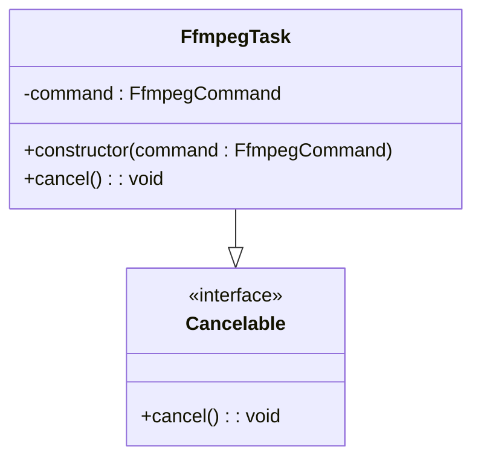
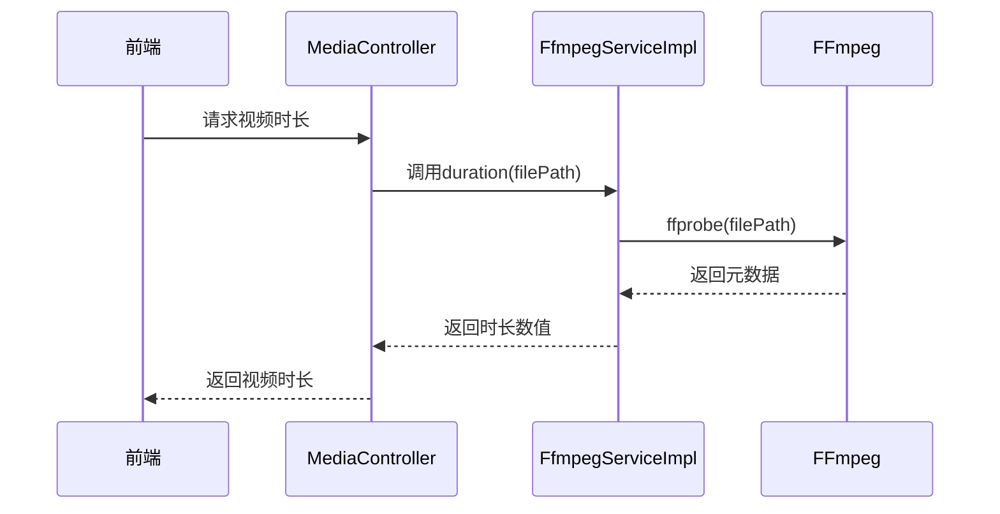
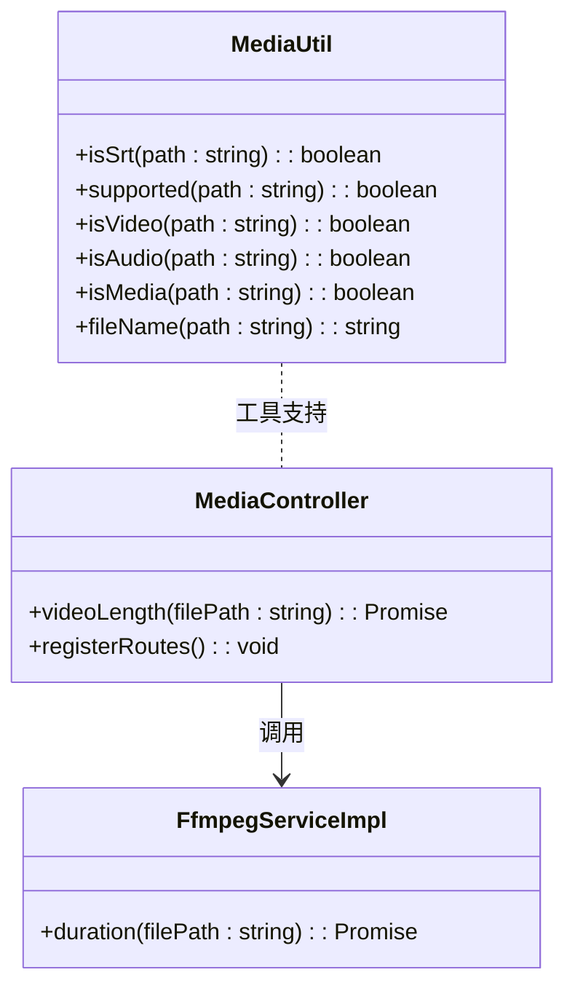

# 音频处理流程与同步策略

<cite>
**本文档引用文件**  
- [FfmpegTask.ts](file://src/backend/objs/FfmpegTask.ts)
- [FfmpegServiceImpl.ts](file://src/backend/services/impl/FfmpegServiceImpl.ts)
- [MediaController.ts](file://src/backend/controllers/MediaController.ts)
- [MediaUtil.ts](file://src/common/utils/MediaUtil.ts)
</cite>

## 目录
1. [音频处理管道设计](#音频处理管道设计)
2. [FfmpegTask任务封装机制](#ffmpegtask任务封装机制)
3. [FfmpegServiceImpl执行控制](#ffmpegserviceimpl执行控制)
4. [音频元数据与工具函数](#音频元数据与工具函数)
5. [音视频同步策略](#音视频同步策略)

## 音频处理管道设计

DashPlayer的音频处理管道基于FFmpeg构建，通过后端服务层实现对音视频文件的提取、转换、标准化及合成操作。系统通过`FfmpegServiceImpl`统一调度FFmpeg命令，支持音频提取、格式转换、音量标准化以及TTS合成后的音频合并等核心功能。整个处理流程采用异步非阻塞模式，结合任务队列与资源锁机制，确保多任务并发执行时的稳定性与资源安全。

**Section sources**
- [FfmpegServiceImpl.ts](file://src/backend/services/impl/FfmpegServiceImpl.ts#L16-L355)

## FfmpegTask任务封装机制

`FfmpegTask`类封装了FFmpeg命令的执行实例，实现了可取消操作接口`Cancelable`。该类接收`FfmpegCommand`对象作为构造参数，并通过`kill('SIGKILL')`方法实现任务的强制终止，确保用户可主动中断长时间运行的音视频处理任务。

**Diagram sources**
- [FfmpegTask.ts](file://src/backend/objs/FfmpegTask.ts#L3-L13)
- [index.ts](file://src/common/interfaces/index.ts#L9-L11)

**Section sources**
- [FfmpegTask.ts](file://src/backend/objs/FfmpegTask.ts#L3-L13)

## FfmpegServiceImpl执行控制

`FfmpegServiceImpl`作为FFmpeg功能的核心服务实现，提供了包括音频提取、格式转换、时长获取等在内的多项功能。该服务通过依赖注入获取任务管理器`DpTaskService`和路径定位服务`LocationService`，并在初始化时配置FFmpeg和FFprobe的可执行文件路径。

服务采用`@WaitLock`装饰器实现资源竞争控制，确保同一时间只有一个FFmpeg或FFprobe进程运行。任务执行状态通过Promise封装，并在`runFluentFfmpeg`方法中监听`start`、`end`和`error`事件，实现执行状态监控与日志记录。

对于支持进度回调的操作（如`mkvToMp4`、`toMp4`），服务通过`on('progress')`事件将进度信息传递给前端，实现处理进度的实时反馈。

**Diagram sources**
- [FfmpegServiceImpl.ts](file://src/backend/services/impl/FfmpegServiceImpl.ts#L16-L355)
- [MediaController.ts](file://src/backend/controllers/MediaController.ts#L9-L56)

**Section sources**
- [FfmpegServiceImpl.ts](file://src/backend/services/impl/FfmpegServiceImpl.ts#L16-L355)

## 音频元数据与工具函数

`MediaController`暴露了音频元数据读取接口，其中`videoLength`方法通过调用`FfmpegService`的`duration`方法获取媒体文件的总时长。该接口通过`registerRoutes`注册为`split-video/video-length`路由，供前端调用。

`MediaUtil`工具类提供了音频相关判断函数，包括：
- `isAudio(path)`：判断路径是否为支持的音频格式
- `isVideo(path)`：判断路径是否为支持的视频格式
- `isSrt(path)`：判断路径是否为SRT字幕文件
- `supported(path)`：判断路径是否为支持的媒体格式
- `fileName(path)`：提取文件名

这些工具函数广泛用于文件类型校验与路径处理，为音频处理流程提供基础支持。

**Diagram sources**
- [MediaUtil.ts](file://src/common/utils/MediaUtil.ts#L10-L51)
- [MediaController.ts](file://src/backend/controllers/MediaController.ts#L9-L56)
- [FfmpegServiceImpl.ts](file://src/backend/services/impl/FfmpegServiceImpl.ts#L16-L355)

**Section sources**
- [MediaController.ts](file://src/backend/controllers/MediaController.ts#L9-L56)
- [MediaUtil.ts](file://src/common/utils/MediaUtil.ts#L10-L51)

## 音视频同步策略

DashPlayer通过精确的时间基对齐与PTS/DTS处理机制保障音视频同步。在播放器侧，系统采用基于时间戳的补偿机制，动态调整音频播放位置以匹配视频帧显示时间。对于变速播放场景，系统根据播放速率重新计算时间基，确保音视频流按相同比例加速或减速。

在字幕延迟调整时，系统通过`SrtTimeAdjustController`对字幕时间戳进行批量偏移，并在播放时将调整后的时间戳与视频PTS对齐，实现字幕与音视频内容的同步。播放器内部维护独立的音频时钟与视频时钟，并以音频时钟为主时钟进行同步参考，有效减少因解码延迟导致的音画不同步现象。

**Section sources**
- [MediaController.ts](file://src/backend/controllers/MediaController.ts#L45-L47)
- [FfmpegServiceImpl.ts](file://src/backend/services/impl/FfmpegServiceImpl.ts#L93-L100)