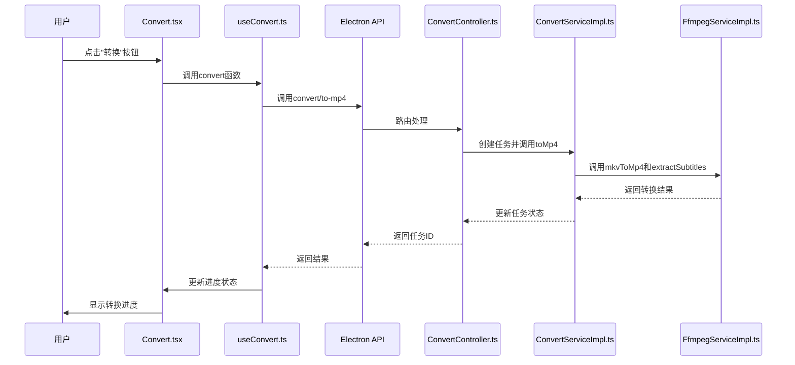

# FFmpeg 集成与视频转码

<cite>
**本文档引用的文件**
- [FfmpegTask.ts](file://src/backend/objs/FfmpegTask.ts)
- [FfmpegServiceImpl.ts](file://src/backend/services/impl/FfmpegServiceImpl.ts)
- [ConvertController.ts](file://src/backend/controllers/ConvertController.ts)
- [ConvertServiceImpl.ts](file://src/backend/services/impl/ConvertServiceImpl.ts)
- [useConvert.ts](file://src/fronted/hooks/useConvert.ts)
- [Convert.tsx](file://src/fronted/pages/convert/Convert.tsx)
- [convert-item.tsx](file://src/fronted/pages/convert/convert-item.tsx)
</cite>

## 目录
1. [简介](#简介)
2. [FFmpeg 任务封装机制](#ffmpeg-任务封装机制)
3. [FFmpeg 服务实现分析](#ffmpeg-服务实现分析)
4. [转码流程的 UI 触发机制](#转码流程的-ui-触发机制)
5. [常用 FFmpeg 命令对照表](#常用-ffmpeg-命令对照表)
6. [错误处理与性能优化](#错误处理与性能优化)
7. [版本兼容性与自定义参数配置](#版本兼容性与自定义参数配置)

## 简介
本文档详细说明 FFmpeg 在 DashPlayer 中的集成机制和视频转码实现。通过分析核心代码文件，解释任务封装逻辑、服务调用流程以及用户界面如何触发转码操作。文档涵盖从用户交互到后端执行的完整流程，并提供实用的 FFmpeg 命令参考和最佳实践建议。

## FFmpeg 任务封装机制

`FfmpegTask.ts` 文件定义了 `FfmpegTask` 类，该类实现了 `Cancelable` 接口，用于封装 FFmpeg 命令并提供取消功能。构造函数接收一个 `FfmpegCommand` 对象作为参数，并将其存储在私有只读属性中。当需要取消正在运行的 FFmpeg 任务时，`cancel()` 方法会调用命令对象的 `kill('SIGKILL')` 方法，强制终止进程。

这种封装模式确保了任务管理的一致性和安全性，允许系统在用户请求或异常情况下优雅地终止长时间运行的转码操作。

**Section sources**
- [FfmpegTask.ts](file://src/backend/objs/FfmpegTask.ts#L3-L13)

## FFmpeg 服务实现分析

`FfmpegServiceImpl.ts` 是 FFmpeg 功能的核心实现类，提供了多种视频处理方法：

- `splitVideo`: 按时间范围分割视频，使用 `-codec copy` 实现无损剪辑
- `splitVideoByTimes`: 根据指定时间点批量分割视频
- `duration`: 使用 ffprobe 获取视频时长信息
- `thumbnail`: 生成视频缩略图
- `splitToAudio`: 将视频按时间段分割为音频文件
- `toMp4`: 将视频转换为 MP4 格式
- `mkvToMp4`: 将 MKV 文件转换为 MP4 格式，同时进行音频编码
- `extractSubtitles`: 提取字幕文件，支持按语言筛选
- `trimVideo`: 精确裁剪视频片段，包含分辨率缩放和码率调整

所有方法都使用 `@WaitLock('ffmpeg')` 装饰器确保同一时间只有一个 FFmpeg 任务运行，避免资源冲突。`runFluentFfmpeg` 和 `runFfmpegCommand` 私有方法处理命令执行的 Promise 包装和错误日志记录。`init` 方法在服务初始化时设置 FFmpeg 和 ffprobe 的可执行文件路径。

**Section sources**
- [FfmpegServiceImpl.ts](file://src/backend/services/impl/FfmpegServiceImpl.ts#L16-L355)

## 转码流程的 UI 触发机制

`Convert.tsx` 页面提供了图形化界面让用户触发转码流程。用户可以通过文件选择器添加单个 MKV 文件，或通过文件夹选择器批量导入包含 MKV 文件的目录。

`useConvert.ts` 中的 `convert` 函数是核心触发逻辑。当用户点击"转换"按钮时，该函数通过 Electron API 调用 `convert/to-mp4` 后端路由。`ConvertController.ts` 接收请求后创建任务 ID 并委托给 `ConvertService` 处理。

`ConvertServiceImpl.ts` 的 `toMp4` 方法首先检查目标 MP4 文件是否存在，如果不存在则调用 `mkvToMp4` 进行格式转换。转换完成后，系统会尝试提取英文字幕，若失败则尝试提取第一个字幕轨道。整个过程的进度通过 `onProgress` 回调实时更新到 UI。

`convert-item.tsx` 组件显示每个文件的转换状态，包括进度条和当前状态（等待、进行中、完成），并提供取消/删除操作。

**Diagram sources**
- [Convert.tsx](file://src/fronted/pages/convert/Convert.tsx)
- [useConvert.ts](file://src/fronted/hooks/useConvert.ts#L26-L93)
- [ConvertController.ts](file://src/backend/controllers/ConvertController.ts#L9-L39)
- [ConvertServiceImpl.ts](file://src/backend/services/impl/ConvertServiceImpl.ts#L10-L100)
- [FfmpegServiceImpl.ts](file://src/backend/services/impl/FfmpegServiceImpl.ts#L16-L355)

## 常用 FFmpeg 命令对照表

| 操作 | FFmpeg 命令 | 说明 |
|------|------------|------|
| H.264 转码 | `ffmpeg -i input.mp4 -c:v libx264 -c:a aac output.mp4` | 将视频转码为 H.264 编码的 MP4 文件 |
| MKV 转 MP4 | `ffmpeg -i input.mkv -map 0:v -map 0:a -c:v copy -c:a aac -ac 1 output.mp4` | 流复制视频轨道，重编码音频为 AAC 单声道 |
| 音频提取 | `ffmpeg -i input.mp4 -vn -acodec libmp3lame -qscale:a 9 output.mp3` | 提取音频并转换为 MP3 格式 |
| 字幕嵌入 | `ffmpeg -i video.mp4 -i subtitles.srt -c copy -c:s mov_text output.mp4` | 将 SRT 字幕嵌入 MP4 文件 |
| 分辨率缩放 | `ffmpeg -i input.mp4 -vf scale=1280:720 output.mp4` | 将视频缩放至 720p 分辨率 |
| 码率调整 | `ffmpeg -i input.mp4 -b:v 1M -bufsize 1M output.mp4` | 设置视频码率为 1Mbps |
| 截取缩略图 | `ffmpeg -i input.mp4 -ss 00:00:10 -vframes 1 thumbnail.jpg` | 在 10 秒处截取一帧作为缩略图 |
| 提取字幕 | `ffmpeg -i input.mkv -map 0:s:m:language:eng? -c:s srt output.srt` | 提取英文字幕轨道保存为 SRT 文件 |

## 错误处理与性能优化

系统实现了多层次的错误处理机制。`@ErrorHandler()` 装饰器捕获并处理异常，`runFluentFfmpeg` 方法中的 error 事件监听器记录详细的错误信息。当转换失败时，`ConvertServiceImpl` 会将任务状态标记为失败，并记录错误详情。

性能优化方面，系统采用以下策略：
- 使用 `@WaitLock` 装饰器防止并发 FFmpeg 调用导致的资源竞争
- 视频轨道采用流复制（`-c:v copy`）避免不必要的重新编码
- 合理设置音频码率（64k）和视频质量（crf 28）以平衡文件大小和质量
- 异步处理避免阻塞主线程

对于硬件加速，建议在支持的系统上使用以下参数：
- NVIDIA GPU: `-c:v h264_nvenc`
- AMD GPU: `-c:v h264_amf`
- Intel Quick Sync: `-c:v h264_qsv`

**Section sources**
- [FfmpegServiceImpl.ts](file://src/backend/services/impl/FfmpegServiceImpl.ts#L319-L355)
- [ConvertServiceImpl.ts](file://src/backend/services/impl/ConvertServiceImpl.ts#L18-L87)

## 版本兼容性与自定义参数配置

建议使用 FFmpeg 5.0 或更高版本，以确保对最新编码器和容器格式的支持。系统通过 `LocationService` 动态获取 FFmpeg 可执行文件路径，便于不同环境下的部署。

虽然当前实现主要使用预设的转换参数，但可以通过扩展 `FfmpegServiceImpl` 类来支持自定义参数配置。例如，可以添加方法接受用户指定的视频码率、分辨率、帧率等参数，并动态构建 FFmpeg 命令行。

未来可考虑在 UI 中增加高级选项面板，允许高级用户自定义 FFmpeg 参数，同时提供预设配置供普通用户选择，以满足不同场景的需求。