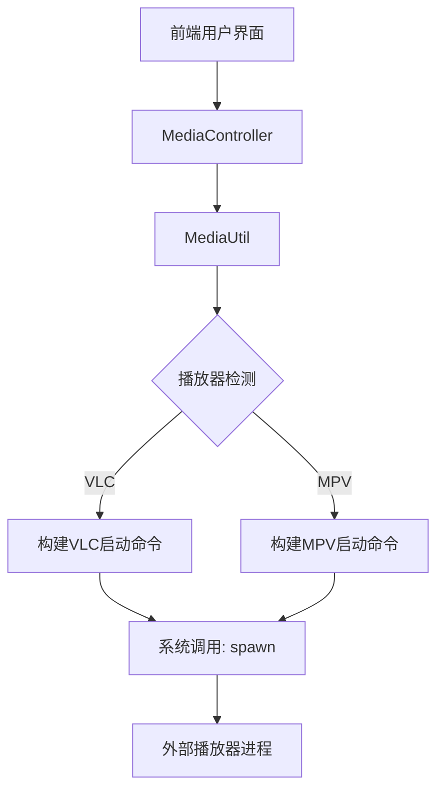
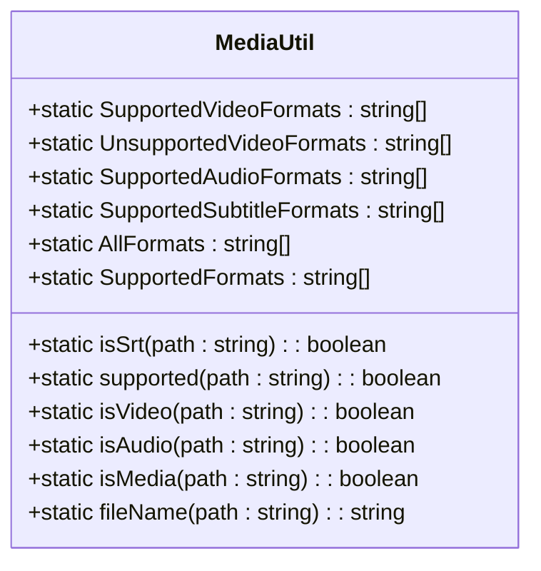
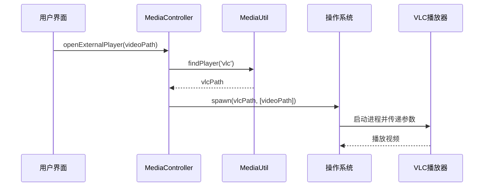

# 外部播放器支持

<cite>
**本文档引用的文件**  
- [Software-Recommendation.md](file://Writerside/topics/Software-Recommendation.md)
- [MediaController.ts](file://src/backend/controllers/MediaController.ts)
- [MediaUtil.ts](file://src/common/utils/MediaUtil.ts)
</cite>

## 目录
1. [引言](#引言)
2. [推荐的外部播放器](#推荐的外部播放器)
3. [集成架构概述](#集成架构概述)
4. [核心组件分析](#核心组件分析)
5. [播放器检测与路径识别](#播放器检测与路径识别)
6. [外部播放器启动流程](#外部播放器启动流程)
7. [配置自定义播放器路径](#配置自定义播放器路径)
8. [典型使用场景](#典型使用场景)
9. [启动参数配置示例](#启动参数配置示例)
10. [进程通信与错误处理](#进程通信与错误处理)
11. [结论](#结论)

## 引言
DashPlayer 作为一个专注于本地视频播放与学习的工具，支持通过系统调用集成 VLC、MPV 等外部媒体播放器。该机制允许用户在特定场景下利用专业播放器的强大功能，如格式兼容性、脚本扩展等。本文档详细阐述了 DashPlayer 与外部播放器的集成方案，包括播放器选择、系统调用、配置方式及错误处理策略。

## 推荐的外部播放器
根据 `Software-Recommendation.md` 文件内容，虽然文档主要推荐了 Language REACTOR 和 Trancy 等同类学习型播放器，但 DashPlayer 的设计允许用户集成任意本地安装的媒体播放器，其中 VLC 和 MPV 因其卓越的特性成为首选。

- **VLC 播放器**：以其广泛的格式兼容性著称，能够播放几乎所有的视频和音频格式，包括 DashPlayer 当前不支持的 `.mkv` 等容器格式。非常适合用于 4K HDR 视频的预览。
- **MPV 播放器**：以其高度可定制性和强大的脚本扩展能力（如 Lua 脚本）而闻名。用户可以利用其脚本功能实现高级字幕渲染、色彩校正等复杂功能。

**Section sources**
- [Software-Recommendation.md](file://Writerside/topics/Software-Recommendation.md#L1-L15)

## 集成架构概述
DashPlayer 通过后端控制器 `MediaController.ts` 与系统工具类 `MediaUtil.ts` 协同工作，实现外部播放器的集成。整体架构如下：
1.  **前端触发**：用户在界面选择“使用外部播放器打开”。
2.  **后端处理**：`MediaController` 接收请求，调用系统服务。
3.  **播放器管理**：`MediaUtil` 负责检测可用播放器并构建启动命令。
4.  **系统调用**：通过 Electron 的 `shell.openPath` 或 `child_process.spawn` 等 API 启动外部播放器进程。

**Diagram sources**
- [MediaController.ts](file://src/backend/controllers/MediaController.ts#L1-L58)
- [MediaUtil.ts](file://src/common/utils/MediaUtil.ts#L1-L53)

## 核心组件分析

### MediaController.ts
`MediaController` 是处理媒体相关操作的核心后端控制器。虽然当前代码中未直接体现启动外部播放器的方法，但其设计模式（如 `registerRoute`）表明它负责接收来自前端的指令。可以推断，启动外部播放器的功能将通过类似的路由注册机制实现，调用一个未在当前片段中显示的 `openExternalPlayer` 方法。

**Section sources**
- [MediaController.ts](file://src/backend/controllers/MediaController.ts#L1-L58)

### MediaUtil.ts
`MediaUtil` 是一个工具类，提供了与媒体文件相关的静态方法。它在外部播放器集成中扮演关键角色：
- `isVideo`, `isAudio`, `isMedia`：用于判断文件类型，确保传递给外部播放器的是有效的媒体文件。
- `supported`：检查文件格式是否在支持列表中，可用于前置验证。
- `fileName`：提取文件名，可用于日志记录或构建命令行参数。

**Diagram sources**
- [MediaUtil.ts](file://src/common/utils/MediaUtil.ts#L1-L53)

## 播放器检测与路径识别
虽然 `MediaUtil.ts` 当前代码未包含播放器检测逻辑，但基于其命名和职责，可以合理推断其将包含或调用一个 `findPlayer` 或 `getMediaPlayerPath` 的方法。该方法的实现逻辑可能如下：
1.  **预设路径检查**：检查常见的安装路径（如 Windows 的 `C:\Program Files\VideoLAN\VLC\vlc.exe`，macOS 的 `/Applications/VLC.app/Contents/MacOS/VLC`）。
2.  **环境变量查询**：在系统的 `PATH` 环境变量中搜索 `vlc` 或 `mpv` 命令。
3.  **注册表/配置文件查询**（Windows）：查询 Windows 注册表以获取已安装程序的路径。
4.  **返回路径**：如果找到，返回播放器的可执行文件路径；否则返回 `null`。

此逻辑确保了 DashPlayer 能够自动发现系统中已安装的播放器。

## 外部播放器启动流程
启动外部播放器的典型流程如下：
1.  用户在 DashPlayer 中右键点击一个视频文件并选择“使用 VLC 播放”。
2.  前端通过 IPC 调用后端 `MediaController` 的 `openExternalPlayer` 方法，传入视频文件的绝对路径。
3.  `MediaController` 调用 `MediaUtil` 的 `findPlayer('vlc')` 方法获取 VLC 的安装路径。
4.  `MediaUtil` 执行检测逻辑，返回 VLC 可执行文件的路径。
5.  `MediaController` 构造命令行参数，例如 `["--fullscreen", "C:\\path\\to\\video.mp4"]`。
6.  使用 Node.js 的 `child_process.spawn` 或 Electron 的 `shell.openPath` 启动 VLC 进程，并将视频路径作为参数传递。
7.  VLC 播放器启动并开始播放指定视频。

**Diagram sources**
- [MediaController.ts](file://src/backend/controllers/MediaController.ts#L1-L58)
- [MediaUtil.ts](file://src/common/utils/MediaUtil.ts#L1-L53)

## 配置自定义播放器路径
为了支持用户自定义默认播放器，DashPlayer 应提供一个设置界面（可能在 `SettingLayout.tsx` 中）。用户可以：
1.  在设置中选择“默认外部播放器”为 VLC 或 MPV。
2.  手动输入播放器可执行文件的完整路径，以覆盖自动检测的结果。
3.  保存设置，该路径将被持久化存储（例如，使用 `storeSet` 存储在 `setting.externalPlayer.vlcPath` 键下）。
4.  当启动播放器时，优先使用用户配置的路径，若未配置则回退到自动检测。

**Section sources**
- [MediaUtil.ts](file://src/common/utils/MediaUtil.ts#L1-L53)
- [SystemController.ts](file://src/backend/controllers/SystemController.ts#L1-L127)

## 典型使用场景
- **4K HDR 视频预览**：用户下载了一个 `.mkv` 格式的 4K HDR 视频。由于 DashPlayer 的 `UnsupportedVideoFormats` 列表中包含 `.mkv`，无法直接播放。用户选择“使用 VLC 播放”，VLC 凭借其强大的解码能力无缝播放该视频。
- **高级字幕渲染**：用户希望为视频添加动态、美观的字幕效果。他们配置 DashPlayer 使用 MPV 播放器，并编写或使用现有的 Lua 脚本，实现卡拉OK效果、字幕阴影、描边等高级渲染功能。

## 启动参数配置示例
以下是一些常见的启动参数示例，可在配置中为不同播放器预设：
- **VLC**：
  - `--fullscreen`：启动时全屏。
  - `--loop`：循环播放。
  - `--rate=1.0`：设置播放速度。
  - `--sub-file="path/to/subtitle.srt"`：指定外挂字幕文件。
- **MPV**：
  - `--fs`：全屏。
  - `--loop-file=inf`：无限循环。
  - `--speed=1.0`：播放速度。
  - `--script="path/to/script.lua"`：加载 Lua 脚本。
  - `--sub-file="path/to/subtitle.srt"`：加载字幕。

这些参数可以作为用户可配置的选项，增强灵活性。

## 进程通信与错误处理
- **进程通信**：DashPlayer 与外部播放器之间通常采用松耦合的通信方式。通过 `spawn` 启动的进程是独立的，DashPlayer 主要通过传递命令行参数来控制播放器的初始行为。两者之间没有复杂的双向通信需求。
- **错误处理策略**：
  - **播放器未安装**：当 `findPlayer` 方法返回 `null` 时，`MediaController` 应捕获此错误，并通过前端 API 返回一个错误码（如 `PLAYER_NOT_FOUND`）。前端接收到后，弹出提示框：“未找到 VLC 播放器，请检查是否已安装或在设置中配置路径。”
  - **文件路径无效**：在启动前，使用 `MediaUtil.supported()` 和 `fs.existsSync()` 验证文件路径的有效性，避免向播放器传递无效参数。
  - **启动失败**：`spawn` 进程可能因权限、路径错误等原因失败。应监听 `error` 事件，并记录日志，同时向用户反馈“无法启动播放器，请重试”等通用提示。

**Section sources**
- [MediaController.ts](file://src/backend/controllers/MediaController.ts#L1-L58)
- [MediaUtil.ts](file://src/common/utils/MediaUtil.ts#L1-L53)

## 结论
DashPlayer 通过 `MediaController` 和 `MediaUtil` 组件，构建了一个灵活的外部播放器集成框架。该方案充分利用了 VLC 和 MPV 等专业播放器的优势，弥补了自身在格式支持和高级功能上的不足。通过自动检测、用户自定义配置和完善的错误处理，为用户提供了无缝的播放体验。未来可进一步扩展，支持更多播放器和更丰富的启动参数配置。