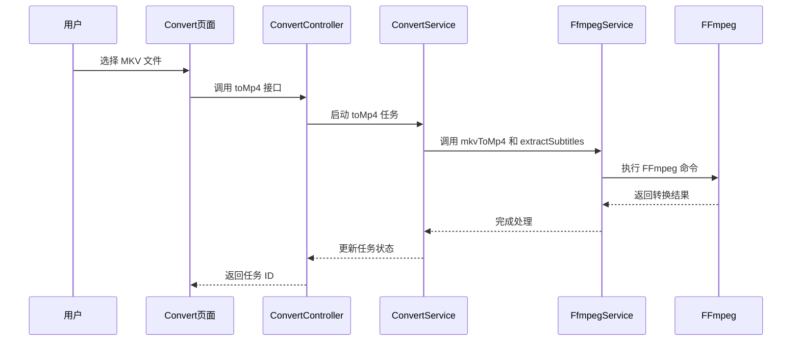
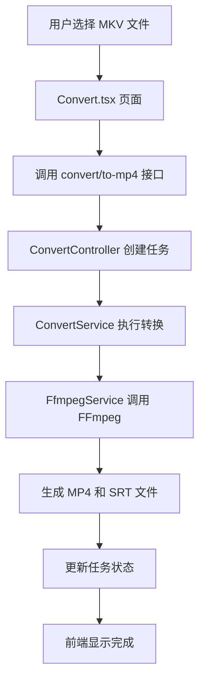

# 生态系统与配套软件

<cite>
**本文档中引用的文件**  
- [Software-Recommendation.md](file://Writerside/topics/Software-Recommendation.md)
- [FfmpegTask.ts](file://src/backend/objs/FfmpegTask.ts)
- [FfmpegServiceImpl.ts](file://src/backend/services/impl/FfmpegServiceImpl.ts)
- [ConvertServiceImpl.ts](file://src/backend/services/impl/ConvertServiceImpl.ts)
- [ConvertController.ts](file://src/backend/controllers/ConvertController.ts)
- [Convert.tsx](file://src/fronted/pages/convert/Convert.tsx)
- [LocationService.ts](file://src/backend/services/LocationService.ts)
</cite>

## 目录
1. [引言](#引言)
2. [推荐软件及其功能优势](#推荐软件及其功能优势)
3. [FFmpeg 的核心作用与集成方式](#ffmpeg-的核心作用与集成方式)
4. [格式转换功能实现流程](#格式转换功能实现流程)
5. [外部编辑器配置与字幕精细调整](#外部编辑器配置与字幕精细调整)
6. [版本兼容性与插件推荐](#版本兼容性与插件推荐)
7. [总结](#总结)

## 引言
DashPlayer 是一款专注于本地视频播放与语言学习的工具，支持字幕同步、片段收藏、AI翻译等功能。为了提升用户体验，系统集成了多种第三方工具，如 FFmpeg、VLC、Aegisub 等，分别用于视频转码、播放控制和字幕编辑。本文将详细介绍这些推荐软件的功能优势、安装指南以及它们在 DashPlayer 中的集成方式，帮助用户最大化利用生态系统提升学习效率。

## 推荐软件及其功能优势
根据 `Software-Recommendation.md` 文件内容，以下软件被推荐作为 DashPlayer 的补充工具：

### 桌面端工具
- **[Language REACTOR](https://www.languagereactor.com/)**：支持 Netflix、YouTube 等平台的双语字幕播放，适合在线学习场景。
- **[Trancy](https://www.trancy.org/)**：提供实时翻译、词汇高亮、句子收藏等功能，适用于多平台英语学习。

### 移动端工具
- **[雪球英语](https://bit.ly/m/snowball)**：移动端沉浸式英语学习应用，支持视频播放与词汇记忆。

此外，以下工具虽未在文档中列出，但在实际开发与使用中具有重要作用：
- **FFmpeg**：用于视频转码、格式转换、字幕提取等核心处理任务。
- **VLC 媒体播放器**：支持多种视频格式，可作为 DashPlayer 的备用播放器。
- **Aegisub**：专业的字幕编辑软件，支持时间轴调整、样式设置，适合对字幕进行精细编辑。

**Section sources**
- [Software-Recommendation.md](file://Writerside/topics/Software-Recommendation.md)

## FFmpeg 的核心作用与集成方式
FFmpeg 是 DashPlayer 实现视频处理功能的核心依赖，主要承担视频转码、格式转换、字幕提取等任务。

### FFmpeg 的功能实现
在 `FfmpegServiceImpl.ts` 中，`FfmpegServiceImpl` 类封装了多个关键方法，包括：
- `mkvToMp4()`：将 MKV 视频转换为 MP4 格式，保留音视频流并复制到新容器。
- `extractSubtitles()`：从视频文件中提取内嵌字幕，支持按语言（如英文）筛选。
- `toMp4()`：通用视频转码为 MP4 格式。
- `splitVideo()`：按时间范围裁剪视频片段。
- `duration()`：获取视频总时长，用于进度计算。

这些方法通过 `fluent-ffmpeg` 库调用 FFmpeg 命令，并通过 `spawn` 执行底层进程。

### FFmpeg 命令示例
以下是常用命令的实际应用示例：

| 功能 | FFmpeg 命令 |
|------|-----------|
| MKV 转 MP4 | `ffmpeg -i input.mkv -map 0:v -map 0:a -c:v copy -c:a aac -ac 1 output.mp4` |
| 提取英文字幕 | `ffmpeg -i "vid.mkv" -map 0:s:m:language:eng? -c:s srt "vid.srt"` |
| 视频截取 | `ffmpeg -y -ss 10 -t 30 -accurate_seek -i input.mp4 -codec copy output.mp4` |
| 视频转为 MP4 | `ffmpeg -i input.mp4 -c:v libx264 -c:a aac output.mp4` |

### FFmpeg 服务初始化
在 `FfmpegServiceImpl` 的 `@postConstruct` 方法中，通过 `LocationService.getThirdLibPath()` 动态设置 FFmpeg 和 FFprobe 的可执行文件路径，确保跨平台兼容性。

**Diagram sources**
- [FfmpegServiceImpl.ts](file://src/backend/services/impl/FfmpegServiceImpl.ts#L221-L252)
- [ConvertServiceImpl.ts](file://src/backend/services/impl/ConvertServiceImpl.ts#L15-L60)
- [ConvertController.ts](file://src/backend/controllers/ConvertController.ts#L20-L24)

**Section sources**
- [FfmpegServiceImpl.ts](file://src/backend/services/impl/FfmpegServiceImpl.ts)
- [FfmpegTask.ts](file://src/backend/objs/FfmpegTask.ts)
- [LocationService.ts](file://src/backend/services/LocationService.ts)

## 格式转换功能实现流程
DashPlayer 提供了图形化界面用于批量将 MKV 视频转换为 MP4 格式，并自动提取字幕。

### 前端页面：Convert.tsx
`Convert.tsx` 页面提供了文件选择器和转换按钮，用户可添加单个文件或整个文件夹进行批量处理。

关键逻辑包括：
- 调用 `convert/from-folder` 接口获取文件夹内所有 MKV 文件。
- 显示转换进度，通过 `taskStats` 监听任务状态。
- 支持取消或删除正在进行的转换任务。

### 后端服务调用链
1. 前端调用 `convert/to-mp4` 接口。
2. `ConvertController` 创建任务并调用 `ConvertService.toMp4()`。
3. `ConvertServiceImpl` 调用 `FfmpegService.mkvToMp4()` 和 `extractSubtitles()`。
4. FFmpeg 执行命令，完成后更新任务状态为“完成”。

**Diagram sources**
- [Convert.tsx](file://src/fronted/pages/convert/Convert.tsx)
- [ConvertController.ts](file://src/backend/controllers/ConvertController.ts)
- [ConvertServiceImpl.ts](file://src/backend/services/impl/ConvertServiceImpl.ts)

**Section sources**
- [Convert.tsx](file://src/fronted/pages/convert/Convert.tsx)
- [ConvertController.ts](file://src/backend/controllers/ConvertController.ts)
- [ConvertServiceImpl.ts](file://src/backend/services/impl/ConvertServiceImpl.ts)

## 外部编辑器配置与字幕精细调整
DashPlayer 支持将字幕文件导出后，使用外部编辑器（如 Aegisub）进行精细调整。

### 配置外部编辑器
1. 安装 Aegisub 或 VS Code（推荐安装 Subtitle Edit 插件）。
2. 在系统设置中将 `.srt` 文件默认打开方式设为 Aegisub。
3. 在 DashPlayer 中右键字幕文件，选择“打开外部编辑器”即可直接编辑。

### 字幕调整建议
- 使用 Aegisub 的时间轴工具精确对齐语音与字幕。
- 利用“音频波形”功能进行逐句校准。
- 保存后 DashPlayer 会自动检测文件变化并刷新显示。

此功能依赖于文件系统监听机制，确保修改后能即时生效。

**Section sources**
- [Software-Recommendation.md](file://Writerside/topics/Software-Recommendation.md)

## 版本兼容性与插件推荐
### 版本兼容性
- **FFmpeg**：建议使用 4.4 或以上版本，确保支持 HEVC、AAC 编码。
- **Node.js**：项目基于 TypeScript，需 Node.js 16+ 运行环境。
- **Electron**：当前使用 Electron 28+，兼容 Windows、macOS、Linux。

### 插件推荐
- **VS Code 插件**：
  - **Subtitle Edit**：支持 SRT 文件语法高亮与时间轴编辑。
  - **Prettier**：格式化代码与 JSON 配置文件。
- **Aegisub 模块**：
  - **AutoTrans**：自动翻译字幕。
  - **Karaoke Templater**：制作卡拉OK效果字幕。

合理配置插件可显著提升字幕编辑效率与准确性。

## 总结
DashPlayer 通过集成 FFmpeg、Aegisub 等工具，构建了一个完整的视频学习生态系统。FFmpeg 负责底层视频处理，Convert 页面提供用户友好的转换界面，外部编辑器支持高级字幕调整。结合推荐软件如 Language REACTOR 和 Trancy，用户可在不同场景下灵活切换，实现从在线到本地的无缝学习体验。未来可进一步集成 AI 字幕生成与语音识别功能，提升自动化水平。