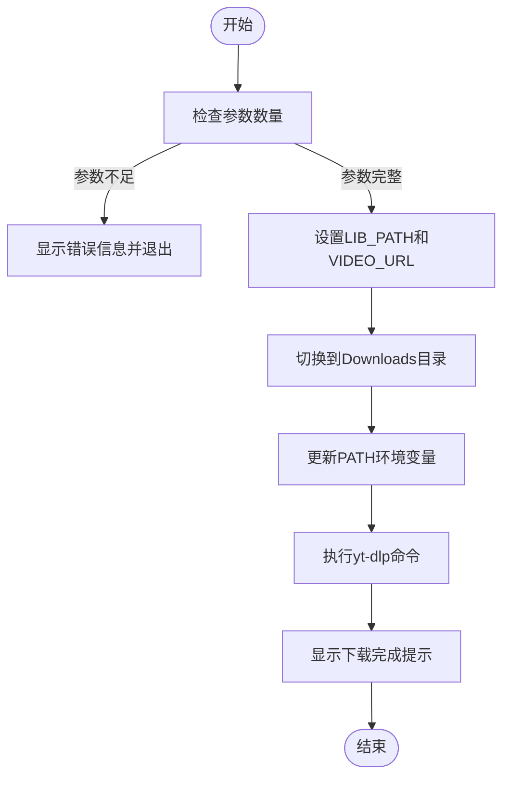
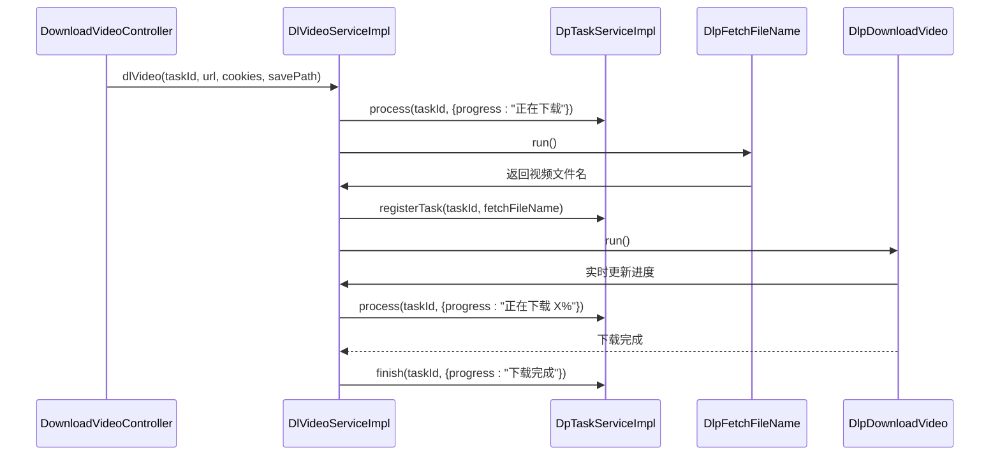
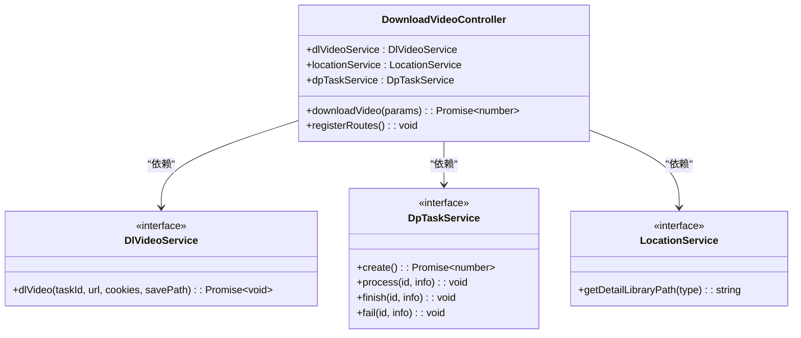

# 自动化脚本与批量操作

<cite>
**本文档引用文件**  
- [download_video.bat](file://scripts/download_video.bat)
- [download_video.sh](file://scripts/download_video.sh)
- [download.mjs](file://scripts/download.mjs)
- [DlVideoServiceImpl.ts](file://src/backend/services/impl/DlVideoServiceImpl.ts)
- [DlpDownloadVideo.ts](file://src/backend/objs/dl-video/DlpDownloadVideo.ts)
- [DlpFetchFileName.ts](file://src/backend/objs/dl-video/DlpFetchFileName.ts)
- [DownloadVideoController.ts](file://src/backend/controllers/DownloadVideoController.ts)
- [DpTaskServiceImpl.ts](file://src/backend/services/impl/DpTaskServiceImpl.ts)
- [LocationServiceImpl.ts](file://src/backend/services/impl/LocationServiceImpl.ts)
- [ChildProcessTask.ts](file://src/backend/objs/ChildProcessTask.ts)
- [DlVideoService.ts](file://src/backend/services/DlVideoService.ts)
- [DlVideoType.ts](file://src/common/types/DlVideoType.ts)
</cite>

## 目录
1. [引言](#引言)
2. [脚本参数与执行环境](#脚本参数与执行环境)
3. [核心下载逻辑解析](#核心下载逻辑解析)
4. [批量下载脚本编写](#批量下载脚本编写)
5. [IPC接口扩展自定义功能](#ipc接口扩展自定义功能)
6. [安全执行建议](#安全执行建议)
7. [常见错误排查](#常见错误排查)
8. [总结](#总结)

## 引言
本指南旨在帮助开发者充分利用项目内置的自动化脚本实现高效的大规模视频下载任务。通过深入分析 `download_video.bat`、`download_video.sh` 和 `download.mjs` 等脚本，结合后端服务 `DlVideoServiceImpl.ts` 的实现逻辑，全面展示如何构建稳定、可扩展的批量下载系统。同时，提供错误重试、日志记录、任务队列管理等高级功能的实现方法，并强调安全执行策略以避免服务封禁。

## 脚本参数与执行环境

### 批处理脚本参数机制
`download_video.bat` 和 `download_video.sh` 是为 Windows 和 Linux/macOS 平台分别提供的命令行入口脚本，用于快速启动视频下载任务。

- **参数传递**：两个脚本均接受两个必填参数：
  - 第一个参数为应用库路径（`LIB_PATH`），用于定位 `ffmpeg`、`ffprobe` 和 `yt-dlp` 等工具。
  - 第二个参数为视频 URL（`VIDEO_URL`），指定要下载的视频地址。
- **环境配置**：脚本会将 `LIB_PATH` 添加到系统 `PATH` 环境变量中，确保 `yt-dlp` 能够调用所需的第三方工具。
- **工作目录**：默认将用户下载目录（`%USERPROFILE%\Downloads` 或 `$HOME/Downloads`）设为工作目录，所有下载文件将保存于此。



**图示来源**  
- [download_video.bat](file://scripts/download_video.bat)
- [download_video.sh](file://scripts/download_video.sh)

**本节来源**  
- [download_video.bat](file://scripts/download_video.bat)
- [download_video.sh](file://scripts/download_video.sh)

## 核心下载逻辑解析

### 下载流程控制
`DlVideoServiceImpl.ts` 是视频下载的核心服务类，负责协调整个下载流程，包括任务状态管理、文件名获取和视频下载。



**图示来源**  
- [DlVideoServiceImpl.ts](file://src/backend/services/impl/DlVideoServiceImpl.ts)
- [DlpFetchFileName.ts](file://src/backend/objs/dl-video/DlpFetchFileName.ts)
- [DlpDownloadVideo.ts](file://src/backend/objs/dl-video/DlpDownloadVideo.ts)
- [DpTaskServiceImpl.ts](file://src/backend/services/impl/DpTaskServiceImpl.ts)

### 文件名获取组件
`DlpFetchFileName` 类通过调用 `yt-dlp --get-filename` 命令预先获取目标视频的文件名，以便在任务管理界面中显示。

- **构造函数**：从 `LocationService` 获取 `yt-dlp` 和 `ffmpeg` 的可执行文件路径。
- **日志回调**：通过 `setOnLog` 注册日志监听器，将 `yt-dlp` 的输出传递给上层服务用于状态更新。
- **异步执行**：使用 `spawn` 启动子进程，捕获标准输出并返回清理后的文件名。

**本节来源**  
- [DlpFetchFileName.ts](file://src/backend/objs/dl-video/DlpFetchFileName.ts)
- [LocationServiceImpl.ts](file://src/backend/services/impl/LocationServiceImpl.ts)

### 视频下载组件
`DlpDownloadVideo` 类封装了实际的视频下载过程，支持进度监控和取消操作。

- **参数配置**：设置视频格式为最高1080p，合并最佳音视频流，输出为MP4格式。
- **进度解析**：监听 `yt-dlp` 的标准输出，通过正则表达式 `/[download]\s+(\d+(\.\d+)?)%/` 提取下载百分比。
- **取消机制**：实现 `Cancelable` 接口，通过 `ChildProcessTask` 管理子进程，可在用户取消任务时终止 `yt-dlp` 进程。

**本节来源**  
- [DlpDownloadVideo.ts](file://src/backend/objs/dl-video/DlpDownloadVideo.ts)
- [ChildProcessTask.ts](file://src/backend/objs/ChildProcessTask.ts)

### 任务状态管理
`DpTaskServiceImpl` 负责管理所有后台任务的生命周期，包括创建、更新、完成和取消。

- **状态流转**：任务状态包括 `INIT`（初始化）、`IN_PROGRESS`（进行中）、`DONE`（完成）、`FAILED`（失败）和 `CANCELLED`（已取消）。
- **缓存机制**：使用 `LRUCache` 缓存最近的任务状态，提高查询效率。
- **异步更新**：修改操作先写入内存队列 `upQueue`，由定时器每3秒批量同步到数据库，减少I/O压力。

**本节来源**  
- [DpTaskServiceImpl.ts](file://src/backend/services/impl/DpTaskServiceImpl.ts)

## 批量下载脚本编写

### 批量下载批处理脚本示例
以下是一个 Windows 批处理脚本示例，用于从文件中读取多个URL并依次下载：

```batch
@echo off
setlocal enabledelayedexpansion

set "LIB_PATH=%~dp0..\lib"
set "URL_FILE=urls.txt"

if not exist "%URL_FILE%" (
    echo Error: URL file "%URL_FILE%" not found.
    exit /b 1
)

for /f "usebackq tokens=*" %%u in ("%URL_FILE%") do (
    echo Downloading: %%u
    call download_video.bat "%LIB_PATH%" "%%u"
    if errorlevel 1 (
        echo Warning: Failed to download %%u, retrying...
        timeout /t 5 >nul
        call download_video.bat "%LIB_PATH%" "%%u"
    )
)

echo All downloads completed.
pause
```

### 错误重试与日志记录
- **重试机制**：在脚本中加入 `if errorlevel 1` 判断，对失败任务进行有限次数的重试。
- **日志记录**：将每次下载的输出重定向到独立的日志文件，便于后续分析。

**本节来源**  
- [download_video.bat](file://scripts/download_video.bat)

## IPC接口扩展自定义功能

### 下载控制器接口
`DownloadVideoController.ts` 通过 `registerRoute` 暴露 `download-video/url` IPC 接口，允许前端或其他模块触发下载任务。

- **参数接收**：接收包含 `url` 和 `cookies` 的JSON对象。
- **任务创建**：调用 `DpTaskService.create()` 生成唯一任务ID。
- **路径获取**：通过 `LocationService.getDetailLibraryPath(LocationType.VIDEOS)` 获取视频存储目录。
- **异步执行**：启动 `dlVideoService.dlVideo` 后立即返回任务ID，实现非阻塞调用。



**图示来源**  
- [DownloadVideoController.ts](file://src/backend/controllers/DownloadVideoController.ts)
- [DlVideoService.ts](file://src/backend/services/DlVideoService.ts)
- [DpTaskService.ts](file://src/backend/services/DpTaskService.ts)
- [LocationService.ts](file://src/backend/services/LocationService.ts)

**本节来源**  
- [DownloadVideoController.ts](file://src/backend/controllers/DownloadVideoController.ts)

## 安全执行建议

### 并发控制
- **限制并发数**：避免同时发起过多下载请求，建议使用队列机制控制并发任务数量（如最多3-5个）。
- **添加延迟**：在批量脚本中使用 `timeout /t 10 >nul` 或 `sleep 10` 在任务间加入延迟，降低服务器压力。
- **使用代理**：通过 `HTTP_PROXY` 环境变量配置代理服务器，分散请求来源。

### 资源管理
- **定期清理**：及时清理已完成任务的缓存和临时文件，防止磁盘空间耗尽。
- **监控进程**：确保所有 `yt-dlp` 子进程都能被正确回收，避免僵尸进程累积。

## 常见错误排查

### 参数错误
- **错误信息**：`Error: No library path provided.` 或 `Error: No video URL provided.`
- **解决方案**：确认调用脚本时已正确传递两个参数，路径中不含特殊字符或空格。

### 工具缺失
- **错误信息**：`'yt-dlp' is not recognized as an internal or external command`
- **解决方案**：运行 `download.mjs` 脚本自动下载所需工具，或手动将 `lib` 目录加入系统PATH。

### 下载失败
- **错误信息**：`yt-dlp process exited with code 1`
- **可能原因**：
  - 视频URL无效或已失效
  - 目标平台反爬虫机制触发
  - 网络连接问题
- **排查方法**：尝试在浏览器中直接访问该URL，或使用 `--verbose` 参数查看详细日志。

**本节来源**  
- [download_video.bat](file://scripts/download_video.bat)
- [download_video.sh](file://scripts/download_video.sh)
- [DlpDownloadVideo.ts](file://src/backend/objs/dl-video/DlpDownloadVideo.ts)

## 总结
本文详细解析了 DashPlayer 项目中自动化视频下载的完整实现机制。从批处理脚本的参数传递，到核心服务的异步任务管理，再到 IPC 接口的扩展能力，构建了一个功能完整、易于维护的下载系统。开发者可基于此框架编写高效的批量下载脚本，并通过合理的并发控制和错误处理策略确保系统的稳定运行。未来可进一步集成下载队列管理、断点续传和多平台适配等高级功能。