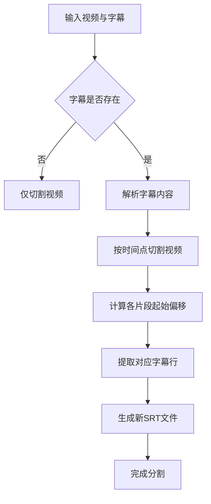

# 高级使用

<cite>
**本文档中引用的文件**  
- [Use-Bluetooth-Game-Controller.md](file://Writerside/topics/Use-Bluetooth-Game-Controller.md)
- [Theory.md](file://Writerside/topics/Theory.md)
- [analyze-word.ts](file://src/backend/services/prompts/analyze-word.ts)
- [SplitVideoServiceImpl.ts](file://src/backend/services/impl/SplitVideoServiceImpl.ts)
- [FfmpegServiceImpl.ts](file://src/backend/services/impl/FfmpegServiceImpl.ts)
- [download_video.bat](file://scripts/download_video.bat)
- [download_video.sh](file://scripts/download_video.sh)
- [Software-Recommendation.md](file://Writerside/topics/Software-Recommendation.md)
- [SettingType.ts](file://src/common/types/SettingType.ts)
</cite>

## 目录
1. [蓝牙手柄控制播放](#蓝牙手柄控制播放)
2. [技术原理详解](#技术原理详解)
3. [推荐配套软件](#推荐配套软件)
4. [批量视频下载脚本使用](#批量视频下载脚本使用)
5. [性能优化技巧](#性能优化技巧)
6. [自动化脚本开发建议](#自动化脚本开发建议)

## 蓝牙手柄控制播放

DashPlayer 支持通过蓝牙游戏手柄进行播放控制，特别适合需要频繁操作快捷键的用户。该功能通过将手柄模拟为键盘输入来实现，用户可将手柄按键映射为播放器的快捷键。

支持任意具备“键盘模式”的蓝牙手柄，以八位堂（8bitdo）的 Micro 和 Zero2 手柄为例，其体积小巧、握持舒适，非常适合单手操作。

### 配置步骤

1. 将蓝牙手柄切换至键盘模式并连接至电脑
2. 打开 DashPlayer 设置界面，进入“快捷键设置”
3. 点击目标功能的快捷键输入框
4. 按下希望绑定的手柄按键
5. 重复上述步骤完成所有快捷键设置
6. 保存配置

> 多个按键可绑定至同一功能，使用英文逗号 `,` 分隔即可。

**Section sources**
- [Use-Bluetooth-Game-Controller.md](file://Writerside/topics/Use-Bluetooth-Game-Controller.md)
- [SettingType.ts](file://src/common/types/SettingType.ts#L6-L59)

## 技术原理详解

### 音频处理流程

DashPlayer 的音频处理依赖于 FFmpeg 工具链，通过 `FfmpegServiceImpl` 类封装了多种音视频操作。核心功能包括：
- 视频切割与分段
- 音频提取（支持按时间段分割）
- 格式转换（如 MKV 转 MP4）
- 字幕提取与时间轴调整

所有操作均通过调用本地 FFmpeg 可执行文件完成，确保高效稳定的媒体处理能力。

### AI 提示词工程

DashPlayer 集成了 AI 辅助学习功能，其核心在于精心设计的提示词（prompt）系统。位于 `src/backend/services/prompts/` 目录下的各类提示词模板，用于指导 AI 模型完成特定任务。

以单词分析为例，`analyze-word.ts` 文件定义了如下提示词模板：

```typescript
const analyzeWordsPrompt = (s: string): string =>
`从句子中找出中等英文水平的人可能不懂的单词, 并给出对应的中文翻译.

${s}
`
```

该提示词引导 AI 模型识别句子中的难点词汇并提供翻译，帮助用户精准学习。

### 视频切割算法

视频切割功能由 `SplitVideoServiceImpl` 类实现，其核心逻辑如下：

1. 用户提供视频文件路径、字幕文件路径及章节划分信息
2. 系统创建输出文件夹，并基于视频哈希值生成临时文件名前缀
3. 调用 `FfmpegServiceImpl.splitVideoByTimes()` 方法，使用 FFmpeg 的 segment 功能按时间点切割视频
4. 对应生成的每个视频片段，系统会从原始字幕中提取时间范围内的字幕行，并重新生成独立的 SRT 文件
5. 最终完成视频与字幕的同步分割

该算法确保了视频与字幕的时间轴精确对齐，便于用户分段学习。



**Diagram sources**
- [SplitVideoServiceImpl.ts](file://src/backend/services/impl/SplitVideoServiceImpl.ts#L17-L113)
- [FfmpegServiceImpl.ts](file://src/backend/services/impl/FfmpegServiceImpl.ts#L16-L355)

**Section sources**
- [Theory.md](file://Writerside/topics/Theory.md)
- [analyze-word.ts](file://src/backend/services/prompts/analyze-word.ts)
- [SplitVideoServiceImpl.ts](file://src/backend/services/impl/SplitVideoServiceImpl.ts)
- [FfmpegServiceImpl.ts](file://src/backend/services/impl/FfmpegServiceImpl.ts)

## 推荐配套软件

为提升 DashPlayer 的使用体验，推荐搭配以下工具：

### 桌面端辅助工具

- **FFmpeg**：用于高级音视频处理，如格式转换、批量提取音频等
- **Language REACTOR**：在线视频双语学习插件，适合 YouTube 等平台
- **Trancy**：另一款优秀的双语字幕播放器，支持在线内容

### 移动端学习应用

- **雪球英语**：移动端英语学习应用，支持离线播放与复习

### 键盘映射软件

若需将手柄用于其他软件控制，推荐使用：
- **Windows**：[PowerToys](https://github.com/microsoft/PowerToys)
- **macOS**：[Karabiner-Elements](https://karabiner-elements.pqrs.org/)

**Section sources**
- [Software-Recommendation.md](file://Writerside/topics/Software-Recommendation.md)

## 批量视频下载脚本使用

DashPlayer 提供了 `download_video.bat`（Windows）和 `download_video.sh`（macOS/Linux）两个脚本，用于批量下载网络视频。

### 使用方法

#### Windows
```bat
download_video.bat "C:\path\to\lib" "https://example.com/video"
```

#### macOS/Linux
```bash
./download_video.sh "/path/to/lib" "https://example.com/video"
```

### 参数说明

- 第一个参数：第三方库路径（包含 yt-dlp、ffmpeg 等工具）
- 第二个参数：目标视频的 URL

脚本会自动将视频下载至用户 Downloads 目录，并优先选择 1080p 分辨率和最佳格式。

**Section sources**
- [download_video.bat](file://scripts/download_video.bat)
- [download_video.sh](file://scripts/download_video.sh)

## 性能优化技巧

### 缓存策略调整

DashPlayer 使用 `CacheService` 接口管理运行时缓存，开发者可通过实现该接口来自定义缓存行为。建议在处理大型视频库时：
- 增加内存缓存大小
- 启用磁盘缓存以减少重复解析开销
- 定期清理过期缓存项

### 大型视频库管理

- 将视频文件按主题或难度分类存储
- 使用 `Split-Long-Video.md` 中介绍的功能将长视频分段
- 为常用视频预生成缩略图，提升加载速度
- 定期清理未使用的缓存和临时文件

**Section sources**
- [CacheService.ts](file://src/backend/services/CacheService.ts#L6-L11)

## 自动化脚本开发建议

开发者可基于 DashPlayer 提供的后端服务接口，编写自动化脚本扩展功能。建议方向包括：

1. **批量处理脚本**：结合 Node.js 调用 `FfmpegService` 实现视频批量转码或音频提取
2. **AI 批量分析**：利用 `AiService` 对大量字幕文件进行词汇、语法分析
3. **智能分类系统**：根据视频内容自动打标签并归类
4. **学习进度同步**：开发插件同步观看历史与学习记录至云端

通过继承 `DpTaskService` 并注册自定义任务，可无缝集成新功能至 DashPlayer 任务系统。

**Section sources**
- [FfmpegServiceImpl.ts](file://src/backend/services/impl/FfmpegServiceImpl.ts)
- [SettingServiceImpl.ts](file://src/backend/services/impl/SettingServiceImpl.ts#L9-L21)