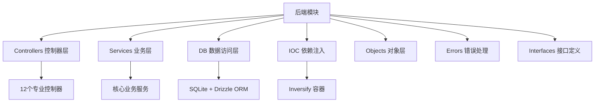

[根目录](../../CLAUDE.md) > [src](../) > **backend**

# 后端模块文档

## 模块职责

后端模块负责 DashPlayer 的核心业务逻辑，采用分层架构设计，提供视频处理、AI 集成、数据持久化等关键功能。

## 架构设计



## 入口与启动

### 核心入口文件
- **主调度器**: `dispatcher.ts` - 注册所有路由和初始化系统
- **IOC 配置**: `ioc/inversify.config.ts` - 依赖注入容器配置
- **数据库迁移**: `db/migrate.ts` - 数据库初始化和迁移

### 启动流程
1. `main.ts` 创建 Electron 主窗口
2. 调用 `dispatcher.ts` 注册所有控制器路由
3. 执行数据库迁移
4. 初始化 IOC 容器和依赖关系

## 对外接口

### API 控制器列表

| 控制器 | 路由前缀 | 主要功能 | 关键方法 |
|--------|----------|----------|----------|
| SystemController | `system/*` | 系统管理 | 文件选择、窗口管理、更新检查 |
| MediaController | `split-video/*` | 视频处理 | 视频分割、缩略图生成、时长获取 |
| SubtitleController | `subtitle/*` | 字幕处理 | 字幕解析、时间轴调整 |
| AiFuncController | `ai-func/*` | AI 功能 | 单词分析、语法讲解 |
| AiTransController | `ai-trans/*` | AI 翻译 | 文本翻译服务 |
| ConvertController | `convert/*` | 格式转换 | 视频字幕转换 |
| DpTaskController | `dp-task/*` | 任务管理 | 后台任务处理 |
| FavoriteClipsController | `favorite-clips/*` | 收藏管理 | 视频片段收藏 |
| TagController | `tag/*` | 标签管理 | 标签 CRUD 操作 |
| WatchHistoryController | `watch-history/*` | 观看历史 | 播放记录管理 |
| StorageController | `storage/*` | 存储管理 | 应用配置存储 |

### API 通信模式
- **注册方式**: `registerRoute('path', handler)`
- **通信协议**: Electron IPC (ipcMain.handle)
- **错误处理**: 统一异常捕获和渲染器通知
- **日志记录**: 所有 API 调用自动记录

## 关键依赖与配置

### 核心依赖

#### 外部服务集成
- **OpenAI**: GPT 模型集成，支持文本分析和翻译
- **有道翻译**: 中文翻译服务
- **腾讯云**: 备用翻译服务
- **FFmpeg**: 视频处理和转换
- **yt-dlp**: 视频下载功能

#### 数据存储
- **SQLite**: 本地数据库存储
- **Drizzle ORM**: 类型安全的数据库操作
- **Electron Store**: 应用配置持久化

#### 进程管理
- **子进程**: FFmpeg、yt-dlp 等外部工具调用
- **任务队列**: 后台任务处理机制

### 配置管理
- **数据库配置**: `drizzle.config.ts`
- **日志系统**: `ioc/logger.ts`
- **类型定义**: `ioc/types.ts`

## 数据模型

### 核心数据表

#### 视频片段表 (videoClip)
```typescript
{
  key: string;          // 主键
  video_name: string;   // 视频名称
  srt_clip: string;     // 收藏的字幕片段
  srt_context: string;  // 上下文字幕
  created_at: string;   // 创建时间
  updated_at: string    // 更新时间
}
```

#### 标签表 (tag)
```typescript
{
  id: number;           // 自增主键
  name: string;         // 标签名称 (唯一)
  created_at: string;   // 创建时间
  updated_at: string    // 更新时间
}
```

#### 其他重要表
- **watchHistory**: 观看历史记录
- **words**: 单词学习记录
- **stems**: 词根分析
- **sentenceTranslates**: 句子翻译
- **subtitleTimestampAdjustment**: 字幕时间轴调整
- **dpTask**: 后台任务队列

### 数据关系
- 视频片段与标签多对多关系
- 用户收藏片段关联标签分类
- 观看历史与视频文件关联

## 测试与质量

### 当前测试状况
- ❌ **单元测试**: 未配置测试框架
- ❌ **集成测试**: 缺失服务层测试
- ❌ **API测试**: 缺失控制器测试
- ❌ **数据库测试**: 缺失数据访问层测试

### 代码质量工具
- **TypeScript**: 严格模式 + 类型检查
- **ESLint**: 代码规范检查
- **装饰器支持**: Inversify 依赖注入

### 错误处理机制
- **统一错误处理**: `errors/` 目录定义专用错误类型
- **AssertionError**: 断言错误
- **CancelByUserError**: 用户取消操作错误
- **渲染器通知**: 错误自动推送到前端界面

## 服务架构详解

### 核心服务分类

#### AI 服务层
- **AiServiceImpl**: AI 功能统一入口
- **OpenAiService**: OpenAI API 集成
- **WhisperService**: 语音转文字服务
- **ChatService**: 对话功能管理

#### 媒体处理层
- **FfmpegService**: FFmpeg 操作封装
- **SplitVideoService**: 视频分割功能
- **MediaService**: 媒体文件处理
- **DlVideoService**: 视频下载管理

#### 数据服务层
- **SubtitleService**: 字幕处理逻辑
- **TagService**: 标签管理
- **FavouriteClipsService**: 收藏管理
- **WatchHistoryService**: 观看历史

#### 系统服务层
- **SystemService**: 系统级操作
- **SettingService**: 应用配置
- **CacheService**: 缓存管理
- **LocationService**: 路径管理

### 服务实现模式
- **接口定义**: 每个服务都有对应接口
- **实现类**: `impl/` 目录存放具体实现
- **单例模式**: 通过 Inversify 管理生命周期
- **依赖注入**: 构造函数注入依赖

## 常见问题 (FAQ)

### Q: 如何添加新的翻译 Provider？
A: 1. 在 `services/impl/clients/` 创建新的 Provider 实现
   2. 实现 `ClientProviderService` 接口
   3. 在 `inversify.config.ts` 中注册依赖

### Q: 如何扩展数据库表结构？
A: 1. 在 `db/tables/` 定义新表结构
   2. 运行 `drizzle-kit generate` 生成迁移文件
   3. 执行迁移更新数据库

### Q: 如何添加新的 AI 功能？
A: 1. 创建对应的 Service 和 Controller
   2. 在 `services/prompts/` 添加 AI 提示模板
   3. 注册到 IOC 容器和路由系统

### Q: 如何处理长时间运行的任务？
A: 使用 `DpTaskService` 管理后台任务，支持进度回调和取消操作

## 相关文件清单

### 目录结构
```
backend/
├── controllers/          # API 控制器 (12个)
├── services/            # 业务服务 (30+个)
│   ├── impl/           # 服务实现类
│   ├── prompts/        # AI 提示模板
│   └── clients/        # 外部服务客户端
├── db/                 # 数据库相关
│   ├── tables/         # 数据表定义 (10个)
│   └── migrate.ts      # 迁移脚本
├── ioc/                # 依赖注入配置
├── objects/            # 业务对象
├── errors/             # 错误类型定义
└── interfaces/         # 接口定义
```

### 关键文件
- `dispatcher.ts` - 路由注册入口
- `ioc/inversify.config.ts` - 依赖注入配置
- `ioc/types.ts` - 类型定义
- `db/db.ts` - 数据库连接
- `interfaces/controller.ts` - 控制器接口

## 变更记录 (Changelog)

### 2025-11-20 - 模块文档创建
- ✨ 创建后端模块详细文档
- 📊 分析 12个控制器和 30+个服务
- 🔍 识别核心数据模型和API架构
- 📋 生成服务依赖关系图
- ⚠️ 发现测试覆盖率严重不足，建议补充测试

---
*最后更新: 2025-11-20 09:17:47*