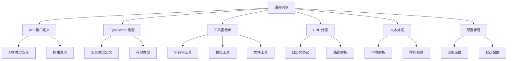

[根目录](../../CLAUDE.md) > [src](../) > **common**

# 通用模块文档

## 模块职责

通用模块提供前后端共享的类型定义、工具函数、API 接口规范和基础设施代码，确保整个应用的类型安全和一致性。

## 架构设计



## API 接口定义

### 核心类型系统
- **API 定义**: `api/api-def.ts` - 完整的 API 类型定义
- **API 映射**: `api/api-map.ts` - API 路由映射关系
- **注册系统**: `api/register.ts` - 路由注册机制

### 类型安全的 IPC 通信
```typescript
// API 调用类型定义
export type ApiDefinitions = {
  'system/info': () => Promise<SystemInfo>;
  'media/thumbnail': (params: ThumbnailParams) => Promise<string>;
  'subtitle/parse': (params: SubtitleParams) => Promise<SubtitleResult>;
  // ... 更多 API 定义
};

// 自动类型推导
export type ApiMap = {
  [K in keyof ApiDefinitions]: ApiDefinitions[K];
};
```

### 路由注册机制
- **统一注册**: `registerRoute()` 函数
- **自动日志**: 所有 API 调用自动记录
- **错误处理**: 统一的异常捕获和传播
- **类型推导**: TypeScript 自动推导参数和返回类型

## TypeScript 类型系统

### 业务实体类型
- **ChapterResult**: 视频章节解析结果
- **SentenceC**: 句子和字幕相关类型
- **Types.ts**: 通用类型定义 (Nullable, WindowState 等)
- **store_schema.ts**: 应用配置和存储类型

### 存储类型定义
```typescript
// 应用设置键值
export type SettingKey =
  | 'appearance.theme'
  | 'ai.openai.api_key'
  | 'translate.youdao.app_key'
  | 'storage.cache_path'
  | // ... 更多设置项

// 设置键值对象
export const SettingKeyObj = {
  'appearance.theme': 'appearance.theme',
  'ai.openai.api_key': 'ai.openai.api_key',
  // ...
} as const;
```

### 字幕和时间类型
- **时间轴相关**: 字幕时间戳、时间调整类型
- **字幕内容**: 字幕文本、翻译、注释类型
- **视频信息**: 视频元数据、章节信息类型

## 工具函数库

### 字符串工具 (`utils/str-util.ts`)
```typescript
class StrUtil {
  static isBlank(str: string): boolean;
  static isNotBlank(str: string): boolean;
  static truncate(str: string, length: number): string;
  static escapeHtml(str: string): string;
  // ... 更多字符串操作
}
```

### 数组工具 (`utils/array-util.ts`)
```typescript
class ArrayUtil {
  static unique<T>(arr: T[]): T[];
  static groupBy<T, K>(arr: T[], keyFn: (item: T) => K): Map<K, T[]>;
  static chunk<T>(arr: T[], size: number): T[][];
  // ... 更多数组操作
}
```

### 文件工具 (`utils/file-util.ts`)
```typescript
class FileUtil {
  static getFileExtension(filePath: string): string;
  static getFileName(filePath: string): string;
  static isValidVideoFile(filePath: string): boolean;
  static isValidSubtitleFile(filePath: string): boolean;
  // ... 更多文件操作
}
```

## URL 处理系统

### 自定义协议 (`utils/UrlUtil.ts`)
```typescript
// DashPlayer 自定义文件协议
export const DP = 'dp';
export const DP_FILE = 'dp-file';

// 协议注册和解析
export function registerFileProtocol(): void;
export function parseDpUrl(url: string): string;
export function createDpUrl(filePath: string): string;
```

### 路径处理
- **相对路径转换**: 跨平台路径处理
- **URL 编码**: 安全的文件路径编码
- **协议支持**: 支持 dp:// 和 dp-file:// 协议

## 文本处理

### 字幕解析 (`utils/srt-parser.ts`)
```typescript
class SrtParser {
  static parse(srtContent: string): SrtEntry[];
  static toString(entries: SrtEntry[]): string;
  static adjustTimestamps(entries: SrtEntry[], offset: number): SrtEntry[];
  // ... 更多字幕处理
}
```

### 时间处理 (`utils/time-util.ts`)
```typescript
class TimeUtil {
  static parseSrtTimestamp(timestamp: string): number; // 转为毫秒
  static formatSrtTimestamp(ms: number): string;
  static formatDuration(ms: number): string;
  static addTimeOffset(timestamp: string, offset: number): string;
  // ... 更多时间操作
}
```

### 文本分析 (`utils/text-util.ts`)
- **单词分割**: 智能英文单词分割
- **句子分析**: 句子边界检测
- **语言检测**: 文本语言识别
- **清理和格式化**: 文本标准化

## 配置管理

### 默认配置
- **应用设置**: 默认的应用配置值
- **路径配置**: 默认的文件路径配置
- **服务配置**: 外部服务的默认配置

### 配置验证
- **类型检查**: 配置值的类型验证
- **范围检查**: 数值范围验证
- **格式验证**: 路径、URL 等格式验证

## 错误处理

### 通用错误类型
- **业务错误**: 特定业务场景的错误
- **验证错误**: 数据验证失败错误
- **网络错误**: API 调用失败错误
- **文件错误**: 文件操作失败错误

### 错误传播机制
- **统一格式**: 标准化的错误信息格式
- **错误链**: 错误堆栈追踪和传播
- **用户友好**: 错误信息本地化和用户友好提示

## 常用常量

### 文件类型
```typescript
export const VIDEO_EXTENSIONS = ['.mp4', '.mkv', '.avi', '.mov', '.wmv'];
export const SUBTITLE_EXTENSIONS = ['.srt', '.vtt', '.ass'];
export const SUPPORTED_FORMATS = {
  video: VIDEO_EXTENSIONS,
  subtitle: SUBTITLE_EXTENSIONS,
  // ...
};
```

### 应用常量
- **版本信息**: 应用版本和构建信息
- **路径常量**: 默认路径和目录结构
- **UI 常量**: 界面相关的常量值

## 性能优化

### 缓存机制
- **解析缓存**: 字幕解析结果缓存
- **计算缓存**: 复杂计算结果缓存
- **文件缓存**: 文件内容缓存

### 内存管理
- **对象池**: 重复使用对象减少 GC 压力
- **流式处理**: 大文件流式读取
- **资源释放**: 及时释放不需要的资源

## 测试支持

### 测试工具
- **Mock 工具**: API 和文件系统 Mock
- **测试数据**: 标准测试数据集
- **断言工具**: 自定义断言函数

### 类型验证
- **运行时验证**: TypeScript 类型在运行时验证
- **数据生成**: 测试数据自动生成
- **边界测试**: 边界条件测试工具

## 常见问题 (FAQ)

### Q: 如何扩展 API 类型定义？
A: 1. 在 `api/api-def.ts` 中添加新的 API 定义
   2. 在对应控制器中实现处理函数
   3. 使用 `registerRoute()` 注册路由

### Q: 如何添加新的工具函数？
A: 1. 在 `utils/` 目录创建对应文件
   2. 实现静态方法或独立函数
   3. 添加完整的 TypeScript 类型
   4. 编写单元测试

### Q: 如何处理不同平台的路径问题？
A: 使用 `path` 模块和 `UrlUtil.ts` 中的工具函数，确保跨平台兼容性

### Q: 如何扩展字幕格式支持？
A: 在 `utils/` 目录添加新的解析器，并在 `FileUtil.ts` 中添加格式检测

## 相关文件清单

### 目录结构
```
common/
├── api/                 # API 接口定义
│   ├── api-def.ts      # API 类型定义
│   ├── api-map.ts      # API 路由映射
│   └── register.ts     # 路由注册
├── types/               # TypeScript 类型定义
│   ├── Types.ts        # 通用类型
│   ├── store_schema.ts # 存储类型
│   ├── ChapterResult.ts # 章节结果类型
│   └── SentenceC.ts    # 句子类型
├── utils/               # 工具函数库
│   ├── str-util.ts     # 字符串工具
│   ├── array-util.ts   # 数组工具
│   ├── file-util.ts    # 文件工具
│   ├── time-util.ts    # 时间工具
│   ├── srt-parser.ts   # 字幕解析
│   └── UrlUtil.ts      # URL 处理
└── constants/           # 常量定义
```

### 关键文件
- `api/api-def.ts` - API 类型系统核心
- `types/store_schema.ts` - 应用配置类型
- `utils/UrlUtil.ts` - 自定义协议处理
- `utils/srt-parser.ts` - 字幕解析核心
- `utils/str-util.ts` - 字符串处理工具

## 技术特点

### 类型安全
- **端到端类型**: 从 API 到组件的完整类型安全
- **编译时检查**: TypeScript 编译时类型检查
- **运行时验证**: 关键数据的运行时类型验证

### 跨平台兼容
- **路径处理**: 统一的跨平台路径处理
- **协议支持**: 自定义文件协议支持
- **编码处理**: 多语言编码支持

### 可扩展性
- **模块化设计**: 工具函数按功能分类
- **插件化**: 支持功能插件化扩展
- **配置驱动**: 通过配置文件控制行为

## 变更记录 (Changelog)

### 2025-11-20 - 通用模块文档创建
- ✨ 创建通用模块详细文档
- 📊 分析 API 类型系统和工具函数库
- 🔍 识别字幕解析、URL 处理等核心功能
- 📋 生成模块依赖关系图
- ⚠️ 建议补充工具函数的单元测试

---
*最后更新: 2025-11-20 09:17:47*