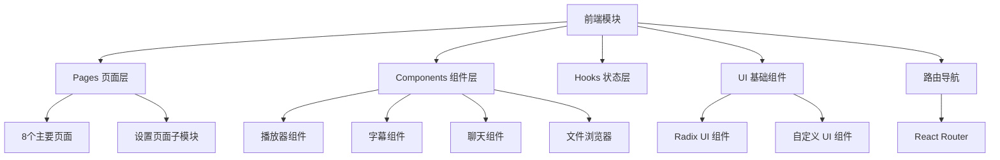

[根目录](../../CLAUDE.md) > [src](../) > **fronted**

# 前端模块文档

## 模块职责

前端模块负责 DashPlayer 的用户界面展示和交互逻辑，采用 React + TypeScript 技术栈，提供现代化的桌面应用体验。

## 架构设计



## 入口与启动

### 核心入口文件
- **应用根组件**: `app.tsx` - React 应用入口和路由配置
- **页面布局**: `pages/Layout.tsx` - 主布局容器
- **标题栏**: `pages/TieleBarLayout.tsx` - 自定义标题栏

### 路由结构
```typescript
/                    - 首页 (HomePage)
/home              - 首页
/player/:videoId    - 视频播放页面
/transcript         - 字幕转写页面
/favorite          - 收藏管理页面
/split             - 视频分割页面
/download          - 视频下载页面
/convert           - 格式转换页面
/about             - 关于页面
/settings/*        - 设置页面组
  /shortcut        - 快捷键设置
  /you-dao         - 有道翻译设置
  /tenant          - 租户设置
  /open-ai         - OpenAI 设置
  /storage         - 存储设置
  /update          - 更新设置
  /appearance      - 外观设置
```

## 对外接口

### 状态管理
- **全局状态**: Zustand (`hooks/useSetting.ts`)
- **设置管理**: 应用配置的响应式管理
- **组件状态**: React Hooks + Context API

### API 通信
- **Electron API**: 通过 `window.electron` 与后端通信
- **类型安全**: 使用 TypeScript 类型定义确保 API 调用安全
- **错误处理**: 统一的错误提示和状态反馈

## 页面组件详解

### 主要功能页面

#### 1. 播放器页面 (`PlayerWithControlsPage.tsx`)
- **功能**: 核心视频播放功能
- **特性**: 自定义控制面板、字幕显示、快捷键支持
- **组件**: `Player.tsx`, `PlayerControlPanel.tsx`, `ControlBox.tsx`

#### 2. 字幕转写页面 (`Transcript.tsx`)
- **功能**: 字幕内容查看和编辑
- **组件**: `TranscriptTable.tsx`, `TranscriptFile.tsx`
- **特性**: 表格展示、搜索过滤、批量操作

#### 3. 收藏管理页面 (`Favorite.tsx`)
- **功能**: 视频片段收藏和标签管理
- **组件**: `FavouriteItem.tsx`, `FavouritePlayer.tsx`, `TagSelector.tsx`
- **特性**: 标签分类、片段预览、批量管理

#### 4. 视频分割页面 (`Split.tsx`)
- **功能**: 按章节分割视频
- **组件**: `SplitFile.tsx`, `split-preview.tsx`
- **特性**: 章节解析、预览、批量分割

#### 5. 设置页面组 (`setting/`)
- **快捷键设置**: `ShortcutSetting.tsx`
- **翻译服务设置**: `YouDaoSetting.tsx`, `OpenAiSetting.tsx`
- **存储管理**: `StorageSetting.tsx`
- **外观配置**: `AppearanceSetting.tsx`

## 核心组件库

### 播放器组件族
- **Player.tsx**: 主播放器组件，基于 React Player
- **PlayerControlPanel.tsx**: 播放控制面板
- **ControlButton.tsx**: 标准控制按钮
- **VolumeSlider.tsx**: 音量控制滑块
- **PlaySpeedToaster.tsx**: 播放速度调节

### 字幕组件族
- **Subtitle.tsx**: 字幕显示组件
- **MainSubtitle.tsx**: 主字幕区域
- **PlayerSubtitle.tsx**: 播放器字幕
- **PlayerSubtitleControlPannel.tsx**: 字幕控制面板
- **srt-cops/**: 字幕编辑相关组件

### 聊天组件族 (`chat/`)
- **Chat.tsx**: AI 对话主界面
- **ChatCenter.tsx**: 对话中心区域
- **ChatLeftWords.tsx**: 左侧单词分析
- **ChatRightSentences.tsx**: 右侧句子分析
- **message/**: 消息组件类型

### 文件浏览器组件族 (`fileBowser/`)
- **FileSelector.tsx**: 文件选择器
- **FolderSelector.tsx**: 文件夹选择器
- **VideoItem2.tsx**: 视频项目展示
- **project-list-**: 项目列表相关组件

### 设置组件族 (`setting/`)
- **SettingInput.tsx**: 设置输入框
- **SliderInput.tsx**: 滑块输入
- **Combobox.tsx**: 下拉选择框
- **Header.tsx**, `Title.tsx**: 设置页面布局

### UI 基础组件 (`ui/`)
基于 Radix UI 构建的设计系统：
- **button.tsx**: 按钮组件
- **dialog.tsx**: 对话框组件
- **dropdown-menu.tsx**: 下拉菜单
- **toast.tsx**: 通知提示
- **card.tsx**: 卡片容器
- **slider.tsx**: 滑块组件
- **select.tsx**: 选择器组件

## 状态管理架构

### Zustand Store 设计
```typescript
// 全局设置状态
interface SettingState {
  init: boolean;
  values: Map<SettingKey, string>;
  setSetting: (key: SettingKey, value: string) => void;
  setting: (key: SettingKey) => string;
}
```

### 自定义 Hooks
- **useSetting**: 全局设置管理
- **useSystem**: 系统状态同步
- 各种业务逻辑 hooks

### 主题系统
- **支持**: 明暗主题切换
- **实现**: Tailwind CSS + next-themes
- **响应式**: 自动应用主题类名

## 样式系统

### Tailwind CSS 配置
- **基础配置**: `tailwind.config.js`
- **扩展插件**: `@tailwindcss/typography`, `tailwind-scrollbar`
- **自定义主题**: 颜色、字体、间距等设计令牌

### 组件样式策略
- **原子化**: 使用 Tailwind 原子类
- **组件封装**: 通过 `className` 组合
- **响应式**: 移动端适配
- **主题适配**: 自动主题切换

### 特殊样式功能
- **滚动条美化**: 自定义滚动条样式
- **全屏模式**: 播放器全屏适配
- **无边框窗口**: Electron 自定义标题栏样式

## 常见问题 (FAQ)

### Q: 如何添加新页面？
A: 1. 在 `pages/` 目录创建页面组件
   2. 在 `app.tsx` 中添加路由配置
   3. 如需布局，使用 `Layout.tsx` 或 `TitleBarLayout.tsx`

### Q: 如何复用 UI 组件？
A: 优先使用 `ui/` 目录下的 Radix UI 组件，或扩展现有组件

### Q: 如何管理复杂状态？
A: 使用 Zustand 创建全局状态，或 React Context 进行组件级状态管理

### Q: 如何添加主题定制？
A: 在 `tailwind.config.js` 中扩展主题配置，或使用 CSS 变量

## 相关文件清单

### 目录结构
```
fronted/
├── pages/               # 页面组件
│   ├── setting/        # 设置页面子模块
│   ├── transcript/     # 字幕转写
│   ├── favourite/      # 收藏管理
│   ├── split/          # 视频分割
│   ├── convert/        # 格式转换
│   └── fileBowser/     # 文件浏览器
├── components/          # 通用组件
│   ├── ui/            # 基础 UI 组件
│   ├── chat/          # AI 聊天组件
│   ├── playerSubtitle/ # 播放器字幕
│   ├── srt-cops/      # 字幕编辑
│   ├── query/         # 查询过滤
│   └── setting/       # 设置专用组件
├── hooks/              # 自定义 Hooks
└── styles/             # 样式文件 (如需要)
```

### 关键文件
- `app.tsx` - 应用入口和路由
- `hooks/useSetting.ts` - 全局状态管理
- `pages/Layout.tsx` - 主布局
- `pages/HomePage.tsx` - 首页
- `components/Player.tsx` - 播放器组件

## 技术特点

### 现代化开发体验
- **TypeScript**: 完整类型安全
- **React 18**: 最新 React 特性
- **Vite**: 快速开发和构建
- **ESLint**: 代码质量检查

### 组件化设计
- **高复用性**: 统一的组件库
- **一致性**: 设计系统约束
- **可维护性**: 清晰的组件分层

### 性能优化
- **懒加载**: 路由级别的代码分割
- **虚拟化**: 长列表虚拟滚动 (react-virtuoso)
- **缓存**: SWR 数据缓存
- **优化渲染**: React.memo 和 useMemo

## 变更记录 (Changelog)

### 2025-11-20 - 前端模块文档创建
- ✨ 创建前端模块详细文档
- 📊 分析 8个主要页面和 50+个组件
- 🔍 识别 React + Zustand 状态管理架构
- 📋 生成组件依赖关系图
- ⚠️ 发现组件测试缺失，建议补充组件测试

---
*最后更新: 2025-11-20 09:17:47*